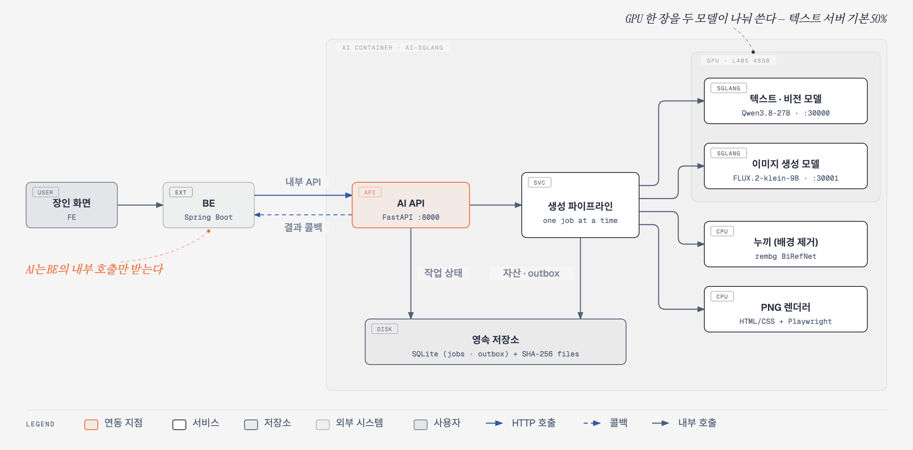

# 🏺 AI 상세페이지 생성 (page_generation)

<p align="center">
  
</p>

<h3 align="center">장인의 사진과 글을, 지어내지 않은 상세페이지로</h3>

<p align="center">
  장인이 올린 상품 사진과 제작 이야기를 읽어 <strong>상세페이지 초안</strong>을 만들고,<br>
  장인이 승인하면 <strong>원본을 보존한 제품 사진 · 섹션 PNG · FE용 <code>react_document</code></strong>를 만들어 BE로 넘기는 AI 서비스입니다.
</p>

<p align="center">
  <strong>FastAPI · Qwen3.8-27B · FLUX.2-klein-9B · rembg BiRefNet · SGLang · MLX Serve · SQLite · Playwright</strong>
</p>

---

## 📑 목차

1. [한눈에 보기](#overview)
2. [시스템 구성](#architecture)
3. [처리 흐름](#flow)
4. [사진 처리 정책](#photos)
5. [문구 안전 정책](#copy-safety)
6. [레이아웃과 `react_document`](#layout)
7. [API](#api)
8. [영속성과 전달 보장](#persistence)
9. [모델과 런타임](#runtime)
10. [실행 방법](#getting-started)
11. [설정값](#configuration)
12. [운영과 관측](#operations)
13. [테스트와 평가](#quality)
14. [프로젝트 구조](#structure)
15. [문서 안내](#docs)
16. [알려진 제한](#limits)

<br>

<a id="overview"></a>

## 🧭 한눈에 보기

| 항목 | 내용 |
|---|---|
| 입력 | 상품 사진 1~12장, 상품명 · 제작 과정 · 관리 방법(`user_hints`) |
| 출력 | 초안(JSON draft + `react_document`), 승인 후 제품 사진 · 섹션 PNG · 전체 PNG · `react_document` |
| 호출 구조 | `FE → BE → AI → BE → FE`. AI는 **BE의 내부 호출만** 받습니다 |
| 응답 방식 | 비동기. 작업 접수(202) → 상태 조회 → 승인 후 렌더 → BE로 결과 콜백 |
| 모델 | 텍스트·비전 Qwen3.8-27B, 이미지 FLUX.2-klein-9B, 누끼 rembg BiRefNet. 모두 자체 호스팅 |
| 외부 호출 | 없음. 검색엔진 · 클라우드 모델 API · 클라우드 자격 증명을 쓰지 않습니다 |

이 서비스가 지키는 원칙은 세 가지입니다.

1. **원본 제품 사진은 다시 그리지 않습니다.** 대표 사진은 촬영 원본 그대로 쓰고, 생성 모델은 연출·보조 컷에만 씁니다.
2. **없는 사실을 지어내지 않습니다.** 사진에서 보이지 않고 장인이 쓰지도 않은 내용은 고객용 문구에 넣지 않습니다.
3. **장인이 승인한 것만 최종 결과가 됩니다.** 초안 단계에서는 PNG를 만들지 않고, 승인 때 한 번만 렌더합니다.

<br>

<a id="architecture"></a>

## 🏗️ 시스템 구성

<p align="center">
  
</p>

- 장인 화면은 BE만 호출하고, AI는 **BE의 내부 호출만** 받습니다.
- AI 컨테이너 하나에 API · 텍스트 서버 · 이미지 서버가 함께 뜨고, GPU 한 장을 두 모델이 나눠 씁니다.
- 작업은 한 번에 하나씩 처리하고, 결과는 디스크에 먼저 저장한 뒤 BE로 보냅니다.

요청 순서, 단계별 상태, 전달 보장, 배포 구성까지 그림 다섯 장으로 정리한 문서는 [`system-architecture.md`](docs/common/system-architecture.md)입니다.

<br>

<a id="flow"></a>

## 🔄 처리 흐름

작업은 **초안 단계**와 **승인 후 렌더 단계**로 나뉩니다. 두 단계 사이에서 장인이 문구를 고치고 승인합니다.

```text
[1단계 · 초안]                                   상태
BE → AI  사진 + user_hints 접수 (202)              QUEUED
  → 원본 파일 저장 + SHA-256
  → 사진 분석 · 카피 초안 (Qwen3.8-27B)             ANALYZING
  → 원본에서 쓸 사진 영역 결정                       EXTRACTING
  → draft + react_document 조립 · 검증              DRAFT_READY
BE ← AI  상태 조회로 초안 수령 → FE에서 장인이 확인 · 수정

[2단계 · 승인 후 렌더]
BE → AI  승인된 draft + 원본 사진
  → rembg 누끼 (실패 · 품질 미달이면 원본으로 대체)
  → 연출 배경 · 보조 컷 생성 (FLUX.2-klein-9B)      GENERATING_BACKGROUNDS
  → 원본 RGB + 배경 합성 (Pillow, 결정적)            COMPOSING
  → 원본 해시 · crop · 합성 픽셀 보존 검증            VERIFYING
  → 승인 draft로 react_document 재조립 · 검증
  → HTML/CSS + Playwright로 전체 · 섹션 PNG          RENDERING
  → 결과를 outbox에 저장하고 BE로 전달                DELIVERING
                                                    COMPLETED | FAILED
```

- 2단계에서는 **분석 모델을 다시 부르지 않습니다.** 승인된 draft가 그대로 결과의 기준이 됩니다.
- 장인이 문구만 고쳐 저장할 때(`PUT …/draft`)는 모델 호출도, PNG 생성도 하지 않습니다.
- 생성 작업은 **한 번에 하나씩** 처리합니다. 동시에 들어온 작업은 대기하며, 1초 이상 기다리면 로그에 남깁니다(`job … waited …s for the previous job`).

<br>

<a id="photos"></a>

## 🖼️ 사진 처리 정책

### 사진 역할

| 역할 | 만드는 방법 | `asset_mode` · `fidelity_status` |
|---|---|---|
| `hero` | 촬영 원본 그대로 | `source_original` · `VERIFIED` |
| `packshot` | rembg 누끼 + 흰 배경 합성. 실패하면 원본 | `source_composite` 또는 `source` · `FALLBACK` |
| `detail` | 원본의 실제 영역 크롭 | 원본 보존 |
| `lifestyle` | 제공 사진을 먼저 배정하는 활용 장면 | 제공 사진이면 원본 보존 |
| `lifestyle-02` | 원본을 참조한 FLUX 보조 생성 장면 | `generated_scene` · `product_generated=true` |
| `generated_view` | FLUX 보조 디테일 컷 | `product_generated=true` |
| `alternate` | 역할 수를 넘는 제공 사진 보존 슬롯 | 원본 보존 |
| `scale` | `PRODUCT_PHOTO_SHOTS`에 명시했을 때만 | — |

- 제공 사진을 역할 목록 앞에서부터 먼저 배정하고, **채우지 못한 역할만** 생성합니다.
- FE가 `product_images`로 보낸 사진은 한 장도 버리지 않습니다. 남는 사진은 `alternate`로 보존합니다.
- 존재하지 않는 뒷면 · 측면은 만들지 않습니다.
- 보조 생성 컷은 한 세트에 최대 `MAX_GENERATED_PHOTOS`장(기본 5, 0이면 생성 안 함)입니다.
- 생성 컷은 `product_generated=true`와 원본 해시로 구분하며, **상품 근거로 승격하지 않습니다.** 화면에 별도 '참고용' 표시는 붙이지 않습니다.

### 누끼(배경 제거)

`src/detail_page_ai/source_photos.py`가 rembg `birefnet-general`(rembg 2.0.69, ONNX)로 처리합니다.

- 누끼 결과가 제품을 깎아 먹었는지(보존율), 배경이 남았는지(잔존)를 게이트로 검사합니다.
- 실패하거나 게이트를 통과하지 못하면 원본으로 되돌립니다(`FALLBACK`). 제품 RGB를 생성 모델로 메우지 않습니다.
- **기본은 CPU에서 실행**합니다. GPU에서 돌리려면 `REMBG_USE_CUDA=1`을 줍니다.
- 누끼 세션은 프로세스에서 하나를 공유하고, 같은 원본(SHA-256 기준)의 결과는 최근 8개까지 캐시합니다. 실패한 결과는 캐시하지 않습니다.

`PRODUCT_PHOTO_GENERATION`은 `source`만 허용합니다. 제품 전체를 생성 모델로 다시 그리는 설정은 제공하지 않습니다.

<br>

<a id="copy-safety"></a>

## ✍️ 문구 안전 정책

분석 모델은 **입력 사진과 BE가 전달한 `user_hints`만** 봅니다. 제작자 · 원산지 · 진품성 · 정확한 소재 · 성능 · 가격을 스스로 확정하지 않습니다. 출처가 필요한 내용은 BE가 검수해 `user_hints`로 넘겨야 합니다.

```text
모델 출력의 특징 · 카피마다 근거 표시
  image-visible  사진에서 보임
  inferred       추정
  unknown        알 수 없음

렌더 전 정리 (validation.sanitize_profile_for_render)
  → 고객용 features · copy_sections 는 image-visible 만 통과
  → 나머지는 "검증되지 않은 AI 추정 문구 제외: …"로 기록
  → 그 기록과 불확실 정보는 user_hints 로 확인되지 않을 때만 '확인 필요' 항목(최대 12개)으로 남김
```

- `user_hints`(상품명 · 제작 과정 · 관리 방법)는 상품별 문구의 1차 근거이며, 사진 관찰보다 우선합니다.
- 장인이 쓴 문장이 그대로, 또는 "부채는 …"처럼 짧은 주어를 앞에 붙여 들어간 경고는 확인된 것으로 보고 '확인 필요'에서 뺍니다.
- 모델은 임의의 JSX · HTML · CSS를 반환하지 않습니다. 화면 구조는 서버가 검증된 draft에서 결정적으로 조립합니다.

<br>

<a id="layout"></a>

## 🧱 레이아웃과 `react_document`

### 레이아웃

레이아웃은 사용자가 고르는 템플릿이 아니라, 사진 분석이 추천하는 `layout_id`를 씁니다.

| `layout_id` | 쓰는 경우 |
|---|---|
| `editorial-split` | 공예 · 장식품. 판단이 불확실할 때의 기본값 |
| `image-first` | 이미지 중심 제품 |
| `catalog-grid` | 소형 제품 · 세트류 |

페이지는 블록(`page_plan`)의 나열입니다.

- **블록 종류(13):** `hero`, `statement`, `feature_grid`, `detail_split`, `wide_image`, `gallery`, `usage_scene`, `scale_reference`, `palette`, `recommendation`, `info_table`, `notice`, `closing`
- **블록 변형(8):** `paper`, `light`, `sand`, `dark`, `image-left`, `image-right`, `full-bleed`, `compact`

스타일은 `assets/references/detail-page-guide/`의 색 · 타이포 · 이미지 무드 가이드를 `src/detail_page_ai/reference_guide.py`에 버전 고정해 반영합니다. 가이드는 방향으로만 쓰고, 샘플 문구 · 상품명 · 화면을 복사하지 않습니다.

### `react_document`

FE가 **자체 컴포넌트 허용 목록으로만** 그리는 제한형 JSON 문서(AST)입니다. 실행 가능한 JSX나 HTML이 아닙니다.

- 형식: `schemaVersion: "2.0"`, `canvasWidth`, `root[]`
- 이미지 노드는 URL 대신 `props.imageId`로 자산을 가리킵니다. BE · FE가 자산 목록으로 실제 URL을 채웁니다.
- 허용 태그, 부모 · 자식 관계, 링크 · 이미지 참조, 구조화된 style · layout, 노드 수 · 깊이를 서버 Pydantic DTO가 검증합니다.
- FE는 `dangerouslySetInnerHTML`, 이벤트 핸들러, 원시 CSS · JSX 문자열을 쓰지 않습니다.
- 섹션 색은 PNG 렌더(`web/detail_page.css`)와 같은 디자인 토큰을 씁니다.

| 변형 | 배경 / 글자 |
|---|---|
| `paper`, `image-left`, `image-right`, `compact` | `#FFFFFF` / `#121B29` |
| `light` | `#FAFBFC` / `#121B29` |
| `sand` | `#EFF1F1` / `#121B29` |
| `dark`, `full-bleed` | `#121B29` / `#FFFFFF` |
| `feature_grid` (light · sand 제외) | `#C6D9DC` / `#121B29` |

같은 문서를 세 곳에 담습니다: 초안 응답 `draft.react_document`, 최종 결과 `result.detail_page.react_document`, BE 콜백 `detailPage.reactDocument`.

내부 HTML/CSS는 FE가 그리는 계약이 아니라, 승인 후 PNG를 만들기 위한 AI 내부 렌더러 입력입니다. 구현은 [`react_document.py`](src/detail_page_ai/react_document.py)(DTO)와 [`react_document_builder.py`](src/detail_page_ai/react_document_builder.py)(조립), 상세 계약은 [`react-json-output-contract.md`](docs/phase3/api/react-json-output-contract.md)에 있습니다.

<br>

<a id="api"></a>

## 🔌 API

내부 API는 헤더 `X-AI-Internal-Token: <AI_INTERNAL_AUTH_TOKEN>`으로 인증합니다. 토큰이 틀리면 `401`입니다.

| Method | Endpoint | 역할 |
|---|---|---|
| `POST` | `/internal/v1/ai/detail-page-jobs` | 생성 작업 접수. `202` + `job_id`, `status_url` |
| `GET` | `/internal/v1/ai/detail-page-jobs/{job_id}` | 상태 · 진행률 · 초안 · 결과 조회 |
| `PUT` | `/internal/v1/ai/detail-page-jobs/{job_id}/draft` | 장인이 고친 초안 저장 (모델 · PNG 호출 없음) |
| `POST` | `/internal/v1/ai/detail-page-renders` | 승인된 초안으로 최종 사진 · PNG 생성, BE로 콜백 |
| `GET` | `/health` | 생존 확인. 인증 없이 `200` |
| `GET` | `/health/ready` | 준비 확인. 텍스트 · 이미지 모델 서버까지 확인해 `200` 또는 `503` |
| `GET` | `/metrics` | Prometheus 지표 |

### 작업 접수 (`POST /internal/v1/ai/detail-page-jobs`)

`multipart/form-data`입니다.

| 파트 | 내용 |
|---|---|
| `product_image` | 대표 원본 사진 (필수) |
| `product_images` | 추가 원본 사진. 여러 번 반복 |
| `metadata` | 아래 JSON |

```json
{
  "product_id": "63",
  "source_asset_id": "optional",
  "request_id": "optional",
  "idempotency_key": "필수 · 같은 요청은 한 번만 처리",
  "template_id": "default-long-detail-page",
  "locale": "ko-KR",
  "user_hints": {
    "product_name": "전주 합죽선 · 매화선",
    "making_method": "담양 왕대를 3년 건조해 …",
    "care_guide": "펼칠 때는 아래에서 위로 …"
  },
  "options": {}
}
```

| 응답 코드 | 뜻 |
|---|---|
| `202` | 접수됨 |
| `400` | 지원하지 않는 `template_id` · `locale`, 잘못된 옵션 · 메모 · 이미지 · 초안 |
| `401` | 내부 토큰 불일치 |
| `409` | 같은 `idempotency_key`를 다른 내용의 요청에 다시 썼거나, 헤더의 멱등 키와 본문의 키가 다름. 같은 키 · 같은 요청이면 기존 작업을 그대로 돌려줌 |
| `413` | 사진이 너무 많거나(`MAX_SOURCE_IMAGES`) 큼(`MAX_IMAGE_BYTES`, `MAX_REQUEST_BYTES`) |
| `503` | 모델 서버를 쓸 수 없음 |

### BE로 보내는 결과 콜백

렌더가 끝나면 AI가 `BACKEND_URL` + `BACKEND_CALLBACK_PATH`(기본 `/internal/generations/{generation_id}/completion`)로 `multipart/form-data`를 보냅니다. 인증은 `Authorization: Bearer <BACKEND_AUTH_TOKEN>`입니다.

| 파트 | 내용 |
|---|---|
| `metadata` | JSON. **camelCase**: `generationId`, `jobId`, `requestId`, `idempotencyKey`, `productId`, `userHints`, `detailPage`(`reactDocument` 포함) |
| `detail_page_image` | 전체 상세페이지 PNG |
| `detail_page_section_NN` | 섹션별 PNG |
| `product_photo_NN` | 제품 사진(원본 보존 컷과 생성 컷) |

`react_document`의 `imageId`는 같은 콜백의 사진 ID와 대응하므로, BE가 저장한 사진 URL로 바꿔 FE에 내려줍니다.

로컬 데모 화면은 BE가 없어 `/api/v1/ai/*` 경로를 호환용으로 씁니다. 이 경로는 `ENABLE_LEGACY_DEMO_API=true`일 때만 열립니다(기본 꺼짐).

DTO 전체는 [`ai-dto-contract.md`](docs/phase3/api/ai-dto-contract.md), FE 화면 명세는 [`ai-fe-io-spec.md`](docs/phase3/api/ai-fe-io-spec.md), BE와 주고받은 요청 기록은 [`docs/phase3/be-handoffs/`](docs/phase3/be-handoffs)에 있습니다.

<br>

<a id="persistence"></a>

## 💾 영속성과 전달 보장

생성에 수 분이 걸리므로, 중간에 프로세스가 죽거나 BE가 잠깐 응답하지 않아도 결과를 잃지 않게 합니다.

| 저장 대상 | 위치 |
|---|---|
| 원본 · 결과 자산 | `ASSET_STORE_DIR`. SHA-256 내용 주소 파일 저장소 |
| 작업 상태 · BE outbox | `SQLITE_PATH` |

- 렌더 전에 고정 `generation_id`와 전체 결과를 **outbox에 먼저 저장**합니다.
- BE 전달이 실패하면 같은 `generation_id`로 다시 보냅니다(최대 `MAX_DELIVERY_ATTEMPTS`회, 기본 8). 재시작 뒤에도 이어서 보냅니다.
- 다시 보낼 때도 BE 계약 형식(camelCase 필드)을 그대로 유지합니다. outbox에는 별칭 이름으로 저장하고, 예전 형식으로 저장된 행도 같은 DTO로 복원합니다.
- SQLite lease(점유 · 하트비트 · 소유자 확인)로 같은 작업 · 같은 전달이 동시에 실행되거나, 오래된 워커가 결과를 덮어쓰는 것을 막습니다.
- 재시작 시 중단된 작업은 `QUEUED`로 복구하고, 워커가 죽은 `DELIVERING` 항목은 lease가 만료되면 다시 전달합니다.
- URL을 주는 자산 저장소를 쓰는 환경에서는 `RESPONSE_ASSET_MODE=url`로 Base64 중복을 없앱니다.

<br>

<a id="runtime"></a>

## ⚙️ 모델과 런타임

| | Mac 로컬 개발 | 서버 (AWS EKS Stage) |
|---|---|---|
| 모델 서버 | MLX Serve (`127.0.0.1:11234`) | SGLang 텍스트 `:30000`, 이미지 `:30001` |
| 텍스트 · 비전 | `ddalcu/Qwen3.8-27B-MLX-Serve-4bit` | `cyankiwi/Qwen3.8-27B-AWQ-INT4` → `qwen-text` |
| 이미지 | `mlx-community/flux2-klein-9b-4bit` | `circulus/FLUX.2-klein-9B-bnb-4bit` → `flux-klein` |
| 누끼 | rembg BiRefNet (CPU) | rembg BiRefNet (CPU) |
| provider 설정 | `mlx` | `sglang` |
| GPU | Apple Silicon 통합 메모리 | NVIDIA L40S 48GB 한 장 |

### 서버 구성

- **EKS (현재 Stage):** 컨테이너 하나에 SGLang 텍스트 · SGLang 이미지 · FastAPI를 함께 띄웁니다. `deploy/sglang/Dockerfile`, `deploy/sglang/entrypoint.sh`.
- **단일 호스트:** Docker Compose로 `detail-page-ai`(8000), `sglang-text`(30000), `sglang-image`(30001) 세 서비스를 띄웁니다. `deploy/docker-compose.yml`.

### GPU 한 장을 나눠 쓰는 방식

L40S 한 장에 두 모델이 상주하므로, Stage에서 겪은 문제를 바탕으로 다음과 같이 정했습니다.

| 결정 | 이유 |
|---|---|
| 텍스트 서버 GPU 메모리 기본 50% (`TEXT_MEM_FRACTION=0.50` → `--mem-fraction-static`) | 이미지 모델이 쓸 자리를 남김 |
| 텍스트 컨텍스트 16,384 토큰 (`TEXT_CONTEXT_LENGTH`) | 여러 장 사진 분석에 필요한 길이 |
| `--disable-prefill-cuda-graph`, `--image-processor-backend pil` | 두 모델 공존 시 GPU 메모리 부족 오류를 줄임 |
| 누끼는 CPU | GPU에서 돌리면 onnxruntime이 큰 메모리 덩어리를 잡아 생성과 충돌 |
| 생성 작업은 한 번에 하나 | 두 모델의 순간 메모리가 겹치지 않게 |
| 이미지 서버 `--output-path ""`, `--input-save-path ""` | 읽기 전용 루트 파일시스템에서 업로드 · 결과를 임시 폴더에 쓰도록 |
| 모델 프로세스가 죽으면 API도 종료 코드 1로 종료 (`MODEL_FAILURE_MARKER`) | 컨테이너가 재시작되어, 죽은 모델 뒤에서 요청을 받지 않게 |

Stage 실측(2026-10-01, Grafana 기준): L40S 사용 가능 44.39GiB 중 두 모델 상주만으로 39~41GiB를 쓰고, 렌더 중 컨테이너 RAM은 약 22GiB까지 오릅니다. 배포 절차와 측정 방법은 [`aws-deployment.md`](docs/phase4/operations/aws-deployment.md)에 있습니다.

<br>

<a id="getting-started"></a>

## ▶️ 실행 방법

### Mac 로컬 (MLX Serve)

```bash
cp local.env.example .env
python3.13 -m venv .venv
source .venv/bin/activate
python -m pip install -e '.[dev]'
npm install
npx playwright install chromium
```

모델 서버를 먼저 띄웁니다. Qwen과 FLUX를 같은 MLX Serve 인스턴스에서 제공해야 합니다.

```bash
"/Applications/MLX Core.app/Contents/MacOS/mlx-serve" serve \
  --model ~/.mlx-serve/models/ddalcu/Qwen3.8-27B-MLX-Serve-4bit \
  --host 127.0.0.1 \
  --port 11234
```

그다음 AI 서버를 띄웁니다.

```bash
serve-ai          # http://127.0.0.1:8000/docs
```

서버 없이 사진 한 장으로 전체 파이프라인을 돌려 볼 수도 있습니다. 결과 폴더에 `detail_page.png`, `sections/`, `photos/`, `react_document.json`이 생깁니다.

```bash
PYTHONPATH=src python scripts/runtime/run_local_detail_page.py \
  --image assets/samples/najeon-box.jpeg \
  --product-name "나전칠기 보석함" \
  --making-method "자개를 한 조각씩 붙이고 옻칠을 여러 번 올렸습니다." \
  --care-guide "마른 천으로 닦고 직사광선을 피해 보관하세요." \
  --output-dir generated/runs/local_detail_page
```

기존 `.env`에 클라우드 provider 설정이 남아 있으면 `ANALYSIS_PROVIDER=local`로 정리합니다. 로컬 모델 설정은 [`local-llm.md`](docs/phase4/operations/local-llm.md)를 따릅니다.

### 서버 (SGLang)

```bash
cp .env.example .env            # 모델 경로 · 토큰 · BACKEND_URL 채우기
docker compose -f deploy/docker-compose.yml up -d
curl http://127.0.0.1:8000/health/ready
```

기동 순서 · 헬스체크 · 메모리 예산은 [`ubuntu-deployment.md`](docs/phase4/operations/ubuntu-deployment.md), EKS 배포와 실측은 [`aws-deployment.md`](docs/phase4/operations/aws-deployment.md)를 따릅니다. GPU 메모리는 `scripts/runtime/measure_vram.sh`로 잽니다.

### HTML/CSS → PNG 렌더만 따로

```bash
PYTHONPATH=src python scripts/runtime/build_detail_page_html.py \
  --image assets/samples/najeon-box.jpeg \
  --profile generated/samples/najeon_box_profile.json \
  --output generated/verified/source_safe_detail_page.html

npm run render:detail-page -- \
  generated/verified/source_safe_detail_page.html \
  generated/verified/source_safe_detail_page.png \
  --sections generated/verified/source_safe_sections
```

사진 역할은 명시적으로 대응합니다: hero → `hero`, wide view → `packshot`, detail · gallery → `detail`, usage → `lifestyle`, scale reference → `scale`. 역할이 없으면 대표 원본을 쓰며 `alternate`를 대신 쓰지 않습니다.

<br>

<a id="configuration"></a>

## 🔧 설정값

`.env` 또는 환경변수로 줍니다. 서버용 전체 목록은 `.env.example`, 로컬용은 `local.env.example`에 있습니다.

### 모델 연결

| 변수 | 기본값(로컬) | 설명 |
|---|---|---|
| `ANALYSIS_PROVIDER` | `local` | 분석 경로. 자체 호스팅만 지원 |
| `LOCAL_TEXT_PROVIDER` / `LOCAL_TEXT_URL` / `LOCAL_TEXT_MODEL` | `mlx` / `http://127.0.0.1:11234` / Qwen3.8-27B | 텍스트 · 비전 모델 서버 |
| `LOCAL_IMAGE_PROVIDER` / `LOCAL_IMAGE_URL` / `LOCAL_IMAGE_MODEL` | `mlx` / `http://127.0.0.1:11234` / flux2-klein-9b | 이미지 모델 서버. `none`이면 생성 안 함 |
| `LOCAL_TEXT_TIMEOUT` / `LOCAL_IMAGE_TIMEOUT` | `300` / `300` | 모델 호출 제한 시간(초) |
| `BACKGROUND_PROVIDER` | `mlx` | 배경 · 연출 컷 생성 경로. `none`이면 중립 배경만 |

### 생성 정책

| 변수 | 기본값 | 설명 |
|---|---|---|
| `PRODUCT_PHOTO_GENERATION` | `source` | `source`만 허용 (제품을 다시 그리지 않음) |
| `PRODUCT_PHOTO_SHOTS` | `hero,packshot,detail,lifestyle` | 만들 사진 역할 |
| `MAX_GENERATED_PHOTOS` | `5` | 보조 생성 컷 최대 장수 (0~12) |
| `CRAFT_CONFIDENCE_THRESHOLD` | `0.65` | 공예 종류 판정 신뢰도 기준 |
| `DETAIL_PAGE_RENDERER` | `html` | PNG 렌더러 |
| `PROMPT_VERSION` | — | 프롬프트 버전 표시 |
| `REMBG_USE_CUDA` | 꺼짐 | `1`이면 누끼를 GPU에서 실행 |

### BE 연동과 한도

| 변수 | 기본값 | 설명 |
|---|---|---|
| `AI_INTERNAL_AUTH_TOKEN` | — | BE → AI 호출 인증 토큰 |
| `BACKEND_URL` / `BACKEND_CALLBACK_PATH` | — / `/internal/generations/{generation_id}/completion` | 결과 콜백 주소 |
| `BACKEND_AUTH_TOKEN` / `BACKEND_TIMEOUT_SECONDS` | — / `60` | 콜백 인증 토큰 · 제한 시간 |
| `MAX_SOURCE_IMAGES` | `12` | 요청당 원본 사진 수 |
| `MAX_IMAGE_BYTES` / `MAX_REQUEST_BYTES` | — / `125829120` | 사진 한 장 · 요청 전체 크기 |
| `MAX_PENDING_GENERATIONS` | `100` | 대기 작업 수 |
| `MAX_DELIVERY_ATTEMPTS` | `8` | BE 전달 재시도 횟수 |
| `ASSET_STORE_DIR` / `SQLITE_PATH` | `.local/detail-page-ai/…` | 자산 · 상태 저장 위치 |
| `RESPONSE_ASSET_MODE` | `base64` | 응답에 자산을 담는 방식 (`base64` / `url`) |
| `ENABLE_LEGACY_DEMO_API` | `false` | 로컬 데모용 `/api/v1/ai/*` 경로 |

서버 컨테이너(`entrypoint.sh`) 전용: `TEXT_MODEL_PATH`, `TEXT_MODEL_REVISION`, `TEXT_SERVED_MODEL_NAME`, `TEXT_MEM_FRACTION`, `TEXT_CONTEXT_LENGTH`, `IMAGE_MODEL_PATH`, `IMAGE_MODEL_REVISION`, `IMAGE_SERVED_MODEL_NAME`, `TEXT_READY_TIMEOUT`, `MODEL_FAILURE_MARKER`.

<br>

<a id="operations"></a>

## 🩺 운영과 관측

- **준비 확인:** `/health/ready`는 텍스트 · 이미지 모델 서버의 `/v1/models`까지 확인합니다. 하나라도 응답하지 않으면 `503`과 함께 어느 쪽이 문제인지 돌려줍니다.
- **지표:** `/metrics`(prometheus-fastapi-instrumentator)로 요청 수 · 지연 · 오류를 냅니다.
- **모델 서버 감시:** 컨테이너의 `entrypoint.sh`가 두 SGLang 프로세스를 지켜보다가 하나라도 죽으면 API를 내려 컨테이너를 재시작시킵니다.

### Stage에서 겪은 문제와 대응

| 증상 | 원인 | 대응 |
|---|---|---|
| 분석 · 생성 중 GPU 메모리 오류 | 누끼(onnxruntime)가 GPU 메모리를 크게 잡아 두 모델과 충돌 | 누끼를 CPU로, 작업을 한 번에 하나로 |
| 모델이 죽었는데 Pod가 그대로 살아 있음 | API(PID 1)가 강제 종료 신호를 무시하고 종료 코드 0으로 끝남 | 실패 표식 파일을 남기고 API가 종료 코드 1로 끝나게 |
| 사진 생성이 전부 500 | 이미지 서버가 읽기 전용 작업 폴더에 업로드 · 결과를 쓰려 함 | 임시 폴더를 쓰도록 경로 옵션을 비움 |
| 렌더가 6분 넘게 걸림 | 같은 원본의 누끼를 렌더마다 여러 번 다시 계산 | 원본 해시 기준으로 누끼 결과 캐시 |
| 컨테이너 RAM이 계속 늘어남 | 누끼 세션을 두 곳에서 따로 만듦 | 세션 하나를 공유 |
| FE 섹션 배경이 베이지로 나옴 | `react_document` 색표가 PNG와 달랐음 | PNG와 같은 디자인 토큰으로 통일 |
| BE 콜백 재전송이 계속 500 | outbox에서 꺼낸 요청의 camelCase 필드 이름이 빠짐 | 별칭 이름으로 저장하고 같은 DTO로 복원 |


<br>

<a id="quality"></a>

## ✅ 테스트와 평가

```bash
uv run pytest -q
# 또는
.venv/bin/python -m pytest -q
```

**536개 테스트**가 외부 모델 호출 없이 통과합니다(2026-10-05). 검증 범위는 다음과 같습니다.

- 요청 · 응답 DTO와 API 인증 · 오류 코드
- 작업 상태 전이, SQLite lease 점유 · 재시작 복구, outbox 선저장 · 멱등 재전송 · 별칭 보존
- 원본 해시, crop · 합성 픽셀 출처, 누끼 세션 공유와 캐시, CPU 기본 · CUDA 선택
- 근거 없는 문구 제외와 '확인 필요' 판정
- `react_document` 스키마 · 안전성 · camelCase 직렬화 · 섹션 색
- 모델 서버 기동 스크립트(옵션, 모델 종료 시 API 종료)

### 평가 파이프라인

| 항목 | 내용 |
|---|---|
| 데이터셋 | [`data/evaluation/cma_real_v1`](data/evaluation/cma_real_v1) — 클리블랜드 미술관 공개(CC0) 소장품 사진, 6개 분류 × 10점 = 60점 |
| 파일럿 실행 | `scripts/run_eval_pilot.py` — 분류당 1점씩 6점을 정해진 순서로 실행 |
| 누끼 보존 게이트 | `scripts/check_cutout_fidelity.py` — 심각한 손실이나 산출물 누락이 있으면 종료 코드 1 |
| 연출 방향 게이트 | `scripts/check_scene_direction_coverage.py` — 분류별 배경 연출이 기본값 · 오분류면 종료 코드 1 |
| 회귀 비교 | `scripts/compare_cutout_regression.py`, 기준선 [`cutout-ground-truth.md`](docs/phase4/evaluation/cutout-ground-truth.md) |
| 사람 검수 | `scripts/build_review_sheet.py`로 4개 축(사실성 · 명료성 · 상품성 · 시각 품질) 검수 시트 생성. 기준은 [`human-review-guide.md`](docs/phase2/human-review-guide.md) |

- 60점 전체 실행은 60/60 완주했습니다(건당 약 227초). 기록은 [`full60-runs.md`](docs/phase4/evaluation/full60-runs.md).
- 텍스트 7종 · 이미지 3종 모델 비교와 현재 구성을 고른 근거는 [`model-selection-2026-09-30.md`](docs/phase4/evaluation/model-selection-2026-09-30.md).
- **자동 지표가 좋아져도 사람이 눈으로 확인하기 전에는 채택하지 않습니다.** 누끼 개선안이 지표로는 나아졌지만 육안 검수에서 되돌린 사례가 `full60-runs.md`에 있습니다.

<br>

<a id="structure"></a>

## 🗂️ 프로젝트 구조

```text
page_generation/
├── src/detail_page_ai/
│   ├── app.py                     # FastAPI 앱 · 내부 API · 헬스 · /metrics
│   ├── service.py                 # 작업 접수 · 상태 · 승인 처리
│   ├── pipeline.py                # 분석 → 사진 → 합성 → 검증 → 렌더 (작업 한 번에 하나)
│   ├── prompts.py                 # 분석 · 카피 · 연출 프롬프트
│   ├── validation.py              # 입력 사진 · 프로필 검증, 근거 없는 문구 제외
│   ├── source_photos.py           # 누끼 · crop · 합성 · 픽셀 보존 검증 · 캐시
│   ├── photo_slots.py             # 블록별 사진 슬롯 규칙
│   ├── layout_archetypes.py       # 레이아웃 카탈로그
│   ├── reference_guide.py         # 디자인 가이드에서 뽑은 규칙
│   ├── react_document.py          # react_document DTO (허용 태그 · 구조 검증)
│   ├── react_document_builder.py  # 승인 draft → react_document 조립
│   ├── html_renderer.py           # 내부 HTML/CSS 조립 (PNG 렌더 입력)
│   ├── persistence.py             # SQLite 작업 상태 · lease · outbox
│   ├── backend_client.py          # BE 콜백 (multipart)
│   ├── assets.py                  # SHA-256 자산 저장소
│   ├── dto.py · ai_dto.py · fe_dto.py   # 공통 · BE↔AI · FE용 DTO
│   └── config.py                  # 환경변수 설정
├── src/local_detail_page_ai/      # MLX · SGLang 모델 서버 어댑터
├── web/                           # 상세페이지 HTML/CSS 템플릿, 로컬 데모 화면
├── scripts/
│   ├── runtime/                   # 로컬 실행 · HTML 조립 · PNG 렌더 · VRAM 측정
│   └── *.py                       # 평가 · 품질 게이트 · 검수 시트
├── deploy/
│   ├── docker-compose.yml         # 단일 호스트 3서비스 구성
│   └── sglang/                    # EKS용 단일 컨테이너 이미지 (Dockerfile · entrypoint.sh)
├── assets/                        # 입력 샘플 · 디자인 가이드 · 레퍼런스
├── data/evaluation/               # 평가 데이터셋
├── tests/                         # 단위 · 계약 테스트
├── docs/                          # Phase 1~4 산출물 · 계약 · 운영 문서
├── .env.example · local.env.example
└── pyproject.toml                 # Python 3.13, `serve-ai` 실행 명령
```

실행으로 만들어지는 파일은 `generated/`, 모델과 로컬 상태는 `.local/`에 두며 둘 다 Git에 넣지 않습니다.

<br>

<a id="docs"></a>

## 📚 문서 안내

| 주제 | 문서 |
|---|---|
| 문서 전체 안내 | [`docs/README.md`](docs/README.md) |
| 설계 · 평가 · 안전 기준 | [`docs/common/ai-architecture-and-safety.md`](docs/common/ai-architecture-and-safety.md) |
| BE ↔ AI DTO 계약 | [`docs/phase3/api/ai-dto-contract.md`](docs/phase3/api/ai-dto-contract.md) |
| FE용 React JSON 계약 | [`docs/phase3/api/react-json-output-contract.md`](docs/phase3/api/react-json-output-contract.md) |
| FE 화면 입출력 명세 | [`docs/phase3/api/ai-fe-io-spec.md`](docs/phase3/api/ai-fe-io-spec.md) |
| 로컬 모델 실행 | [`docs/phase4/operations/local-llm.md`](docs/phase4/operations/local-llm.md) |
| 서버 배포 (Ubuntu · SGLang) | [`docs/phase4/operations/ubuntu-deployment.md`](docs/phase4/operations/ubuntu-deployment.md) |
| AWS 배포와 실측 | [`docs/phase4/operations/aws-deployment.md`](docs/phase4/operations/aws-deployment.md) |
| QA 점검표 | [`docs/phase4/operations/qa-checklist.md`](docs/phase4/operations/qa-checklist.md) |
| 모델 선정 근거 | [`docs/phase4/evaluation/model-selection-2026-09-30.md`](docs/phase4/evaluation/model-selection-2026-09-30.md) |

<br>

<a id="limits"></a>

## ⚠️ 알려진 제한

- **처리 시간:** 분석 · 생성 · 렌더가 GPU 한 장에서 순서대로 돌아 건당 수 분이 걸립니다. 동시에 들어온 작업은 차례를 기다립니다.
- **정보가 없을 때의 문구:** 장인이 관리 방법 같은 정보를 주지 않으면, 초안 본문에 "확인 필요" 식의 문구가 남을 수 있습니다. 승인 전에 장인이 고쳐야 하며, 본문에서 자동으로 빼는 개선이 남아 있습니다.
- **FLUX 라이선스:** 이미지 모델 원본이 비상업 라이선스(FLUX NCL) 계열이라 상업 이용 범위를 확인해야 합니다.
- **메모리:** 렌더 중 컨테이너 RAM이 약 22GiB까지 오르므로 Pod 메모리 한도를 그 이상으로 둡니다.
- **지원 범위:** `locale`은 `ko-KR`, `template_id`는 `default-long-detail-page`만 받습니다.
