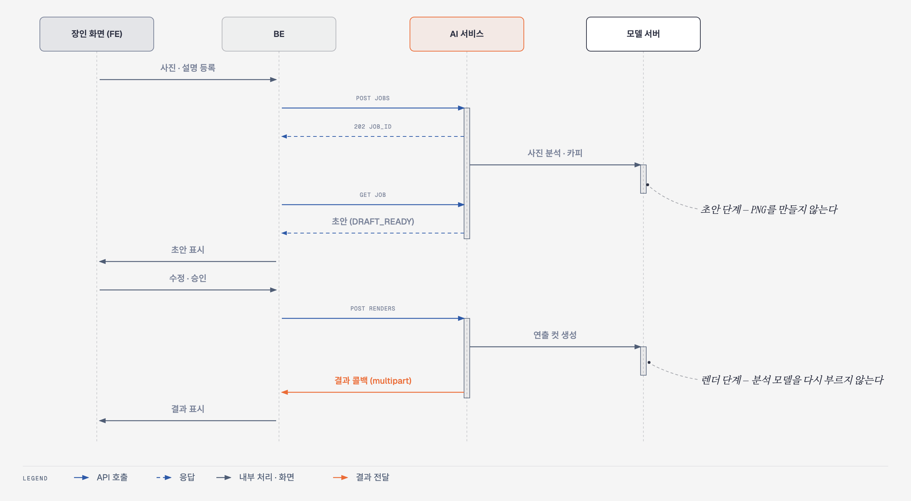
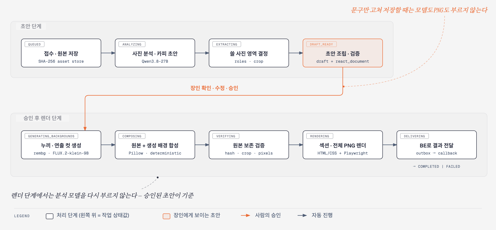
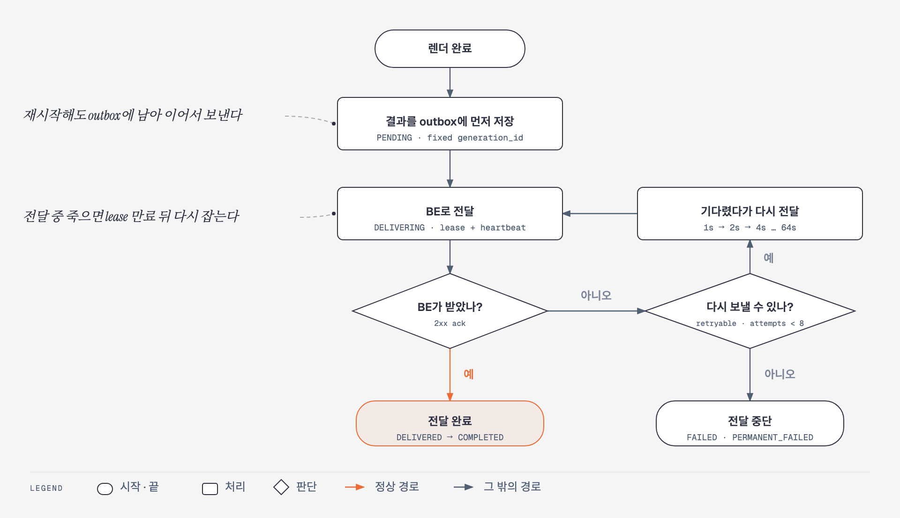
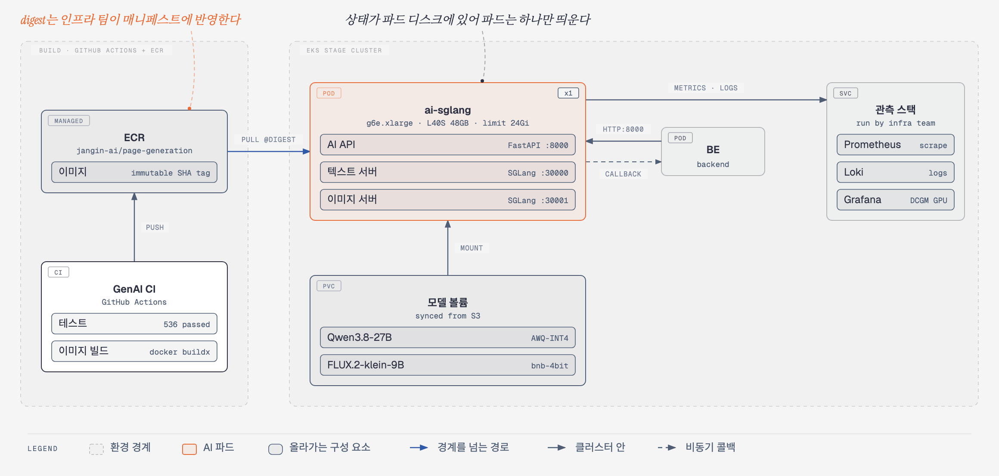

# 시스템 아키텍처 — 지금 돌아가는 구성

상세페이지 생성 서비스가 **현재 어떻게 구성되어 동작하는지**를 그림 다섯 장으로 정리한 문서입니다.
설계 단계의 검토 내용은 [`ai-architecture-design.md`](../phase2/ai-architecture-design.md)에,
안전성 정책은 [`ai-architecture-and-safety.md`](ai-architecture-and-safety.md)에 있고, 이 문서는 코드와 Stage 배포를 기준으로 한 현재 모습만 다룹니다.

- 기준: 2026-10-06, `deploy/ubuntu` 브랜치와 AWS EKS Stage
- 그림: [`architecture/`](architecture/)에 원본(HTML)과 이미지(PNG)가 함께 있습니다

## 목차

1. [시스템 구성](#1-시스템-구성)
2. [요청이 오가는 순서](#2-요청이-오가는-순서)
3. [생성 단계와 상태](#3-생성-단계와-상태)
4. [결과 전달 보장](#4-결과-전달-보장)
5. [배포 구성](#5-배포-구성)
6. [코드에서 찾아보기](#6-코드에서-찾아보기)
7. [그림을 고치는 방법](#7-그림을-고치는-방법)

## 1. 시스템 구성


장인 화면은 BE만 호출하고, AI는 **BE의 내부 호출만** 받습니다. AI 안에서는 API가 작업을 받아 파이프라인에 넘기고, 파이프라인이 모델 서버 두 개와 CPU 작업 두 가지를 차례로 씁니다.

| 구성 요소 | 하는 일 | 실행 위치 |
| --- | --- | --- |
| AI API | 작업 접수, 상태 조회, 초안 저장, 승인 처리, 헬스 체크, 지표 노출 | FastAPI, 포트 8000 |
| 생성 파이프라인 | 분석 → 사진 처리 → 합성 → 검증 → 렌더 → 전달을 순서대로 실행 | API와 같은 프로세스의 작업 스레드 |
| 텍스트 · 비전 모델 | 사진을 읽고 문구 초안과 페이지 구성을 만든다 | SGLang, 포트 30000, GPU |
| 이미지 생성 모델 | 연출 배경과 보조 컷을 만든다 | SGLang, 포트 30001, GPU |
| 누끼 | 원본 사진에서 제품만 잘라낸다 | rembg BiRefNet, CPU |
| PNG 렌더러 | 조립한 HTML/CSS를 섹션별 · 전체 PNG로 찍는다 | Playwright(Chromium), CPU |
| 영속 저장소 | 작업 상태, BE로 보낼 결과(outbox), 원본 · 결과 파일 | SQLite 파일과 SHA-256 파일 저장소 |

구성에서 눈여겨볼 점은 세 가지입니다.

- **컨테이너 하나에 다 들어 있습니다.** Stage에서는 API, 텍스트 서버, 이미지 서버가 한 컨테이너에서 함께 뜹니다. 서버끼리는 `127.0.0.1`로 통신합니다.
- **GPU 한 장을 두 모델이 나눠 씁니다.** 텍스트 서버가 기본 50%를 잡고(`TEXT_MEM_FRACTION`), 누끼는 GPU 메모리 충돌을 피하려고 CPU에서 돕니다.
- **작업은 한 번에 하나씩 처리합니다.** 파이프라인이 잠금을 잡고 실행하므로, 동시에 들어온 작업은 앞 작업이 끝날 때까지 기다립니다. 두 모델의 순간 메모리 사용이 겹치지 않게 하려는 것입니다.

## 2. 요청이 오가는 순서



응답은 비동기입니다. BE는 작업을 맡기고 바로 `202`를 받은 뒤 상태를 조회하고, 최종 결과는 AI가 BE로 따로 보냅니다.

| 순서 | 호출 | 설명 |
| ---: | --- | --- |
| 1 | 장인 → BE | 상품 사진(1~12장)과 상품명 · 제작 과정 · 관리 방법을 등록 |
| 2 | BE → AI `POST /internal/v1/ai/detail-page-jobs` | 작업 접수. 사진은 multipart로 함께 보낸다 |
| 3 | AI → BE `202` | `job_id`와 상태 조회 주소를 돌려준다 |
| 4 | AI → 텍스트 모델 | 사진 분석과 문구 초안 |
| 5 | BE → AI `GET …/detail-page-jobs/{job_id}` | 상태 조회. BE가 주기적으로 부른다 |
| 6 | AI → BE | 상태가 `DRAFT_READY`가 되면 초안과 `react_document`가 함께 내려간다 |
| 7 ~ 8 | BE ↔ 장인 | 장인이 초안을 보고 문구를 고친 뒤 승인 |
| 9 | BE → AI `POST /internal/v1/ai/detail-page-renders` | 승인된 초안과 원본 사진으로 최종 렌더 요청 |
| 10 | AI → 이미지 모델 | 연출 배경 · 보조 컷 생성 |
| 11 | AI → BE 콜백 | 전체 PNG, 섹션 PNG, 제품 사진, `react_document`를 multipart로 전달 |
| 12 | BE → 장인 | 결과 표시 |

- 내부 API는 헤더 `X-AI-Internal-Token`으로 인증합니다. 콜백은 `Authorization: Bearer`를 씁니다.
- 접수와 렌더 요청에는 멱등성 키(`Idempotency-Key`)가 붙습니다. 같은 키로 같은 요청이 다시 오면 새 작업을 만들지 않고 기존 작업을 돌려줍니다.
- 장인이 문구만 고쳐 저장할 때(`PUT …/draft`)는 모델도 PNG 렌더도 부르지 않습니다.
- 초안 단계에서는 PNG를 만들지 않습니다. 렌더는 승인 뒤에 한 번만 합니다.

엔드포인트와 필드 전체는 [README의 API 절](../../README.md#api)과 [`ai-dto-contract.md`](../phase3/api/ai-dto-contract.md)에 있습니다.

## 3. 생성 단계와 상태



작업은 **초안 단계**와 **승인 후 렌더 단계**로 나뉘고, 그 사이에 사람의 승인이 있습니다. 각 상자 왼쪽 위의 글자가 그 단계에서 조회되는 작업 상태값입니다.

| 상태 | 하는 일 | 쓰는 것 |
| --- | --- | --- |
| `QUEUED` | 요청을 받아 원본 사진을 저장하고 내용 해시를 남긴다 | 파일 저장소 |
| `ANALYZING` | 사진을 읽어 상품 정보와 문구 초안을 만든다 | 텍스트 · 비전 모델 |
| `EXTRACTING` | 사진마다 역할을 정하고 원본에서 쓸 영역을 정한다 | 코드 |
| `DRAFT_READY` | 초안과 `react_document`를 조립해 검증한다. 장인에게 보이는 상태 | 코드 |
| `GENERATING_BACKGROUNDS` | 제품을 잘라내고 연출 배경 · 보조 컷을 만든다 | 누끼(CPU), 이미지 생성 모델 |
| `COMPOSING` | 원본 제품 픽셀 위에 생성한 배경을 합친다. 같은 입력이면 같은 결과가 나온다 | Pillow |
| `VERIFYING` | 원본 해시, 잘라낸 영역, 합성 뒤 제품 픽셀이 보존됐는지 확인한다 | 코드 |
| `RENDERING` | 승인된 초안으로 HTML/CSS를 만들어 섹션별 · 전체 PNG를 찍는다 | PNG 렌더러 |
| `DELIVERING` | 결과를 outbox에 저장하고 BE로 보낸다 | 저장소, BE 콜백 |
| `COMPLETED` / `FAILED` | 끝 | |

- 렌더 단계에서는 **분석 모델을 다시 부르지 않습니다.** 장인이 승인한 초안이 그대로 결과의 기준이 됩니다.
- 누끼가 실패하거나 품질이 기준에 못 미치면 원본 사진으로 대신합니다. 작업을 실패시키지 않습니다.
- 모델 호출 한 번의 제한 시간은 텍스트 · 이미지 각각 300초입니다(`LOCAL_TEXT_TIMEOUT`, `LOCAL_IMAGE_TIMEOUT`).

## 4. 결과 전달 보장



생성에 수 분이 걸리므로, 프로세스가 죽거나 BE가 잠깐 응답하지 않아도 결과를 잃지 않게 합니다. 핵심은 **보내기 전에 먼저 저장한다**는 것입니다.

| outbox 상태 | 뜻 |
| --- | --- |
| `PENDING` | 결과가 저장됐고 아직 보내지 않음 |
| `DELIVERING` | 보내는 중. 한 워커가 점유(lease)하고 주기적으로 갱신한다 |
| `DELIVERED` | BE가 받음. 작업은 `COMPLETED`가 된다 |
| `FAILED` | 전달 실패. 다시 보낼 수 있다 |
| `PERMANENT_FAILED` | 다시 보내도 소용없는 오류. 더 시도하지 않는다 |

- **재시도 조건:** 다시 보낼 수 있는 오류이고 시도 횟수가 `MAX_DELIVERY_ATTEMPTS`(기본 8) 미만일 때만 다시 보냅니다.
- **재시도 간격:** 실패할 때마다 두 배로 늘립니다. 1초, 2초, 4초 순으로 최대 64초까지 벌어집니다.
- **같은 ID로 다시 보냅니다.** `generation_id`를 렌더 전에 고정하므로, BE는 같은 결과가 두 번 와도 한 건으로 처리할 수 있습니다.
- **재시작 복구:** 다시 뜨면 중단된 작업은 `QUEUED`로 되돌리고, 보내다 만 결과는 점유 기한이 지난 뒤 다른 워커가 이어서 보냅니다.
- **형식 유지:** 다시 보낼 때도 BE 계약 형식(camelCase 필드)을 그대로 씁니다.
- BE 콜백 한 번의 제한 시간은 60초입니다(`BACKEND_TIMEOUT_SECONDS`).

## 5. 배포 구성



| 항목 | 내용 |
| --- | --- |
| 빌드 | `Jangingmall/GenAI`의 CI가 테스트와 이미지 빌드를 거쳐 ECR `jangin-ai/page-generation`에 올린다 |
| 이미지 태그 | 소스 커밋 SHA 태그. 한 번 올린 태그는 덮어쓰지 않는다 |
| 배포 | **자동이 아니다.** CI가 낸 digest를 인프라 팀이 매니페스트에 반영해야 Stage가 바뀐다 |
| 파드 | `ai-sglang` 한 개. GPU 노드 `g6e.xlarge`(NVIDIA L40S 48GB), 메모리 한도 24Gi |
| 파드 안 | AI API(8000), 텍스트 서버(30000), 이미지 서버(30001)가 한 컨테이너에서 실행 |
| 모델 | S3에서 받아 둔 볼륨을 파드가 읽는다. 이미지에는 모델을 넣지 않는다 |
| BE 연동 | BE가 8000 포트로 호출하고, AI가 결과를 BE로 콜백한다 |
| 관측 | `/metrics`를 Prometheus가 수집하고 로그는 Loki로 간다. Grafana에서 GPU(DCGM)와 함께 본다 |

**파드가 하나인 이유.** 작업 상태와 결과 파일이 파드의 디스크(SQLite와 파일 저장소)에 있습니다. 파드를 여러 개로 늘리려면 상태 저장을 PostgreSQL로, 파일 저장을 S3로 옮겨야 합니다.

**기동 순서.** 컨테이너가 뜨면 다음 순서로 올라옵니다.

1. 텍스트 서버를 먼저 띄우고 준비될 때까지 기다린다(최대 `TEXT_READY_TIMEOUT`, 기본 1800초).
2. 텍스트 서버가 준비되면 이미지 서버를 띄운다. 두 모델이 동시에 GPU 메모리를 잡다가 실패하지 않게 하려는 순서다.
3. API는 처음부터 떠 있지만, `/health/ready`는 두 모델 서버가 모두 응답할 때까지 `503`을 준다.
4. 모델 프로세스가 죽으면 API도 종료 코드 1로 끝나 컨테이너가 다시 시작된다. 죽은 모델 뒤에서 요청을 받지 않게 하려는 것이다.

GPU를 나눠 쓰기 위한 설정값과 Stage에서 겪은 문제는 [README의 모델과 런타임 절](../../README.md#runtime)과 [`aws-deployment.md`](../phase4/operations/aws-deployment.md)에 있습니다.

## 6. 코드에서 찾아보기

| 그림의 요소 | 파일 |
| --- | --- |
| AI API | `src/detail_page_ai/app.py` |
| 작업 접수 · 승인 · 재시도 예약 | `src/detail_page_ai/service.py` |
| 생성 파이프라인 | `src/detail_page_ai/pipeline.py` |
| 프롬프트, 입력 · 문구 검증 | `src/detail_page_ai/prompts.py`, `validation.py` |
| 누끼 · 사진 영역 · 합성 · 보존 검증 | `src/detail_page_ai/source_photos.py` |
| `react_document` 조립 · 검증 | `src/detail_page_ai/react_document_builder.py`, `react_document.py` |
| HTML/CSS 조립과 PNG 렌더 호출 | `src/detail_page_ai/html_renderer.py`, `scripts/runtime/render_detail_page.mjs` |
| 작업 상태 · lease · outbox | `src/detail_page_ai/persistence.py`, `leases.py` |
| 파일 저장소 | `src/detail_page_ai/assets.py` |
| BE 콜백 | `src/detail_page_ai/backend_client.py` |
| 모델 서버 연결(MLX · SGLang) | `src/local_detail_page_ai/clients.py`, `factory.py` |
| 컨테이너 기동 순서 | `deploy/sglang/entrypoint.sh` |
| 컨테이너 이미지 | `deploy/sglang/Dockerfile` |

## 7. 그림을 고치는 방법

그림은 diagram-design 스킬의 기본 스킨으로 그렸습니다. 한 장마다 노드 9개 이하, 강조색 2곳 이하로 맞췄습니다.

- **원본:** `architecture/*.html`. 파일 하나에 SVG가 들어 있어 브라우저에서 바로 열립니다.
- **이미지:** `architecture/*.png`. 원본의 SVG를 2배 해상도로 찍은 것입니다.
- **생성 스크립트:** [`architecture/generate.py`](architecture/generate.py). 좌표와 문구가 여기에 있습니다. 고친 뒤 아래처럼 다시 만듭니다.

```bash
python3 docs/common/architecture/generate.py docs/common/architecture
```

PNG는 HTML을 브라우저(Playwright 등)로 열어 `<svg>` 요소를 캡처하면 됩니다.
