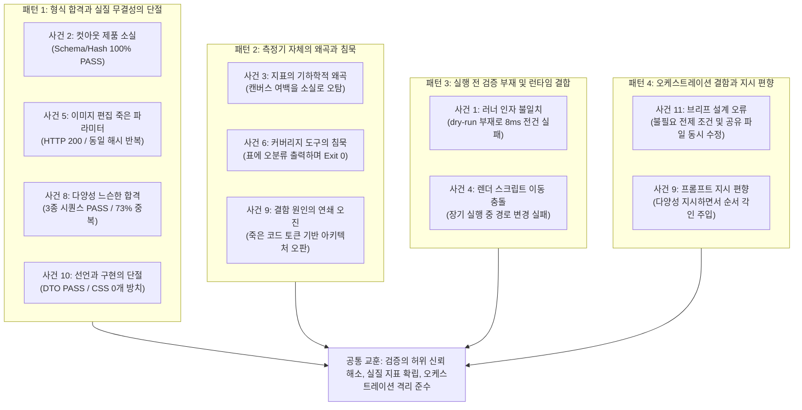

# Phase 3 산출물

- **작성일**: 2026-09-17
- **구성**: 기존 산출물 5종을 원문 순서대로 통합

담은 문서:

1. `docs/deliverables/01-implementation-checkpoint.md` — 337줄
2. `docs/deliverables/02-error-analysis.md` — 500줄
3. `docs/deliverables/03-second-experiment-report.md` — 184줄
4. `docs/deliverables/04-inference-api.md` — 264줄
5. `docs/deliverables/05-be-fe-interface.md` — 9줄

05번이 가리키는 정본 문서 `docs/api/be-fe-ai-integration-spec.md` — 604줄도 함께 수록했습니다.

각 장은 원본을 그대로 옮긴 것이며, 통합을 위해 헤딩 레벨만 한 단계 내렸습니다.

---

> 원본: docs/deliverables/01-implementation-checkpoint.md (2026-09-09 기준)

## AI 영역 1·2 1차 구현 체크포인트 보고서

- **문서 번호**: DELIVERABLE-01
- **작성일**: 2026-09-09
- **작성자**: agy (오케스트레이션 세션 지휘 하 작성)
- **대상 시스템**: Team3 E-Commerce Detail Page AI Generation Pipeline
- **근거 문서**: [`docs/evaluation/metrics-definition.md`](../evaluation/metrics-definition.md) (1. 영역과 집계)
- **실측 데이터 기준**: `generated/evaluation/pilot-20260909-224737` (`generated/evaluation/pilot-20260909-224737`)

---

### 1. 개요 및 영역 구분 근거

본 문서는 상세페이지 생성 AI 시스템의 핵심 축인 **영역 1(분석·카피)**과 **영역 2(이미지·렌더링)**의 1차 코드 구현 상태를 기술하고, 6개 대표 카테고리 실물 자산(`cma_real_v1`) 기반 파일럿 실행에서 실측된 결과를 바탕으로 검증된 기능과 아직 완료되지 않은 한계를 객관적 사실에 입각하여 기록한 체크포인트 보고서입니다.

영역 구분은 [`docs/evaluation/metrics-definition.md`](../evaluation/metrics-definition.md)의 **"1. 영역과 집계"** 계약에 따릅니다.

| 영역 | 정의 및 평가 범위 | 핵심 모델 / 런타임 | 주요 산출물 |
|---|---|---|---|
| **영역 1 (분석·카피)** | 제품 원본 이미지와 제작자 입력(`user_hints`)을 분석하여 구조화된 제품 프로필, 카테고리·공예 판정, 블록 배치 계획(`page_plan`), 섹션별 마케팅 카피를 도출 | `ddalcu/Qwen3.8-27B-MLX-Serve-4bit` (MLX-Serve, M-RoPE, Grammar Schema 강제) | `ProductProfileDto`, `PageBlockDto`, `result_summary.json`의 `product` 블록 |
| **영역 2 (이미지·렌더링)** | 제품 원본의 픽셀 무결성을 유지하는 컷아웃·합성·크롭 생성, 카테고리 적합 배경 씬 생성, FE React 문서 조립 및 최종 고해상도 상세페이지 PNG 렌더링 | `mlx-community/flux2-klein-9b-4bit`, Node + Playwright 헤드리스 브라우저 | `ProductPhotoSet`, `photos/*.png`, `sections/*.png`, `react_document.json`, `detail_page.png` |
| **공통 자동 Gate** | 양 영역을 관통하는 스키마 유효성, 트리 안전성, camelCase 직렬화 보존, 이미지 ID 참조 해석, 원본 해시 일치, 실행 코드 무누출 검증 | Python Pydantic V2, JSON AST Validator | 전건 자동 검증 (100% 통과 기준) |

---

### 2. 영역 1 — 분석·카피 (Analysis & Copy)

#### 2.1 담당 코드 및 아키텍처 역할

1. **분석 프롬프트 엔지니어링 ([`src/detail_page_ai/prompts.py`](../../src/detail_page_ai/prompts.py))**
   - **프롬프트 버전 상수**: `ANALYSIS_PROMPT_VERSION = "analysis-v11-product-intro-copy-brief-care-gate"`
   - **핵심 함수**: `build_analysis_prompt(locale: str = "ko-KR", user_hints: UserHintsDto | None = None, archetypes: Sequence[Mapping[str, Any]] | None = None)`
   - **프롬프트 편향 제거 및 블록 선택·생략 조건(Selection Gates) 개정**:
     - 기존에 모델 출력을 천편일률적 순서로 각인시키던 세 지점(Copy Map 나열 순서, 9블록 하한선, 순차 레시피 불릿)을 완전히 제거하고, 블록 역할을 알파벳순 사전식 메뉴로 분리.
     - 블록별 엄격한 선택·생략 조건 도입: 특히 `statement` 블록은 제작자 입력에 제작 기법/과정(`howMade` / `making_method`) 데이터가 공급된 경우에만 포함되며, 데이터 부재 시 완전히 생략하도록 강제 (외형 묘사를 제작 스토리로 날조 금지).
     - 주입된 레이아웃 원형 시퀀스 지시를 따르되, **근거로 뒷받침할 수 없는 블록은 지어내지 않고 생략(Grounding Omission)**하도록 지시.
   - **BE-AI 콘텐츠 생성 계약 반영**:
     - 공급자 입력 필드(`productName`, `howMade`, `careTips`)를 마케팅 카피의 최우선 근거(Product Introduction Copy Brief)로 삼도록 강제.
     - 환각(Hallucination) 방지를 위해 사실 슬롯을 6개 범주(`identity`, `making/process`, `sensory/visual`, `use`, `care`, `unknown`)로 분리 추출하도록 지시하며, 이미지로 확인되지 않는 성능·인증·가격·원산지는 추측하지 않고 미확인(`uncertain_information` 또는 "확인 필요")으로 유지.
     - 결과는 반드시 지정된 JSON 스키마만을 따르도록 MLX-Serve의 Grammar 제어(`POST /v1/chat/completions` with grammar)를 통해 문법적 완전성을 보장.

2. **코드 결정론적 레이아웃 아키텍처 ([`src/detail_page_ai/layout_archetypes.py`](../../src/detail_page_ai/layout_archetypes.py)) 및 카탈로그 ([`assets/references/detail-page-layouts.json`](../../assets/references/detail-page-layouts.json))**
   - **페이지 구성을 코드가 결정**: 모델에 자연어 지시만으로 구조 다양성을 유도하는 방식의 한계(모델의 default 10블록 시퀀스 고착)를 극복하기 위해, **원본 이미지 SHA-256 해시를 시드로 카탈로그에서 원형 하나를 재현 가능하게 결정론적으로 선택**하여 프롬프트의 구성 지시로 주입.
   - **레이아웃 원형 25종 카탈로그 (`detail-page-layouts.json`)**: 25종의 고유 블록 시퀀스 및 10종 이상의 고유 variant 조합 정의.
   - **카탈로그 엄격 검증 ([`tests/test_layout_catalog.py`](../../tests/test_layout_catalog.py))**: 허용 블록 타입 및 variant 화이트리스트 검속, 4개 이상 블록 길이 분포(단일 길이 60% 미만 점유), 14블록 상한 및 edge 블록(hero/closing) 고정 강제.

3. **구조화된 DTO 계층 ([`src/detail_page_ai/dto.py`](../../src/detail_page_ai/dto.py))**
   - **`ProductProfileDto`**: `product_type`, `display_name`, `is_traditional_craft`, `craft_type`, `classification_confidence`, `craft_confidence`, `layout_id`, `page_plan`, `summary`, `features`, `copy_sections`, `usage_scene`, `uncertain_information`, `safety_notes` 등 엄격한 필드 유효성 검증(`extra="forbid"`).
   - **`LayoutId`**: `"editorial-split"` | `"image-first"` | `"catalog-grid"` 3종 분기 지원.
   - **`PageBlockDto`**: 상세페이지를 구성하는 모듈형 블록 구조(`hero`, `statement`, `feature_grid`, `detail_split`, `wide_image`, `gallery`, `usage_scene`, `scale_reference`, `palette`, `recommendation`, `info_table`, `notice`, `closing`).
   - **`PageBlockVariant`**: 8종 스타일 variant(`paper`, `light`, `sand`, `dark`, `image-left`, `image-right`, `full-bleed`, `compact`).

4. **프로필 검증 및 레이아웃 보존 ([`src/detail_page_ai/validation.py`](../../src/detail_page_ai/validation.py))**
   - `validate_product_profile`: `product_type`, `summary` 길이(500자 이하), `features` 개수(5개 이하), 신뢰도 범위(0.0~1.0) 검증.
   - **블록 패딩 제거 및 모델 계획 보존**: 기존의 9블록 강제 패딩 로직을 걷어내고, 중간 블록이 6개 이상(`len(middle) >= 6`)이면 모델이 결정한 블록 시퀀스와 구성을 그대로 보존.
   - **variant 고정 배정 제거**: `detail_split`이나 `usage_scene`에 `dark`나 `full-bleed`를 무조건 덮어쓰던 하드코딩을 제거하여 모델과 카탈로그의 variant 지정 의도를 존중(`block.variant or "dark"`).

5. **디자인 가이드 고정 ([`src/detail_page_ai/reference_guide.py`](../../src/detail_page_ai/reference_guide.py))**
   - **가이드 버전**: `REFERENCE_GUIDE_VERSION = "detail-page-guide-v2-premium-editorial"`
   - `REFERENCE_GUIDE_COLORS`: Black(`#101010`), White(`#FFFFFF`), Cool Grey 계열(50~900), Jade Blue 계열(50~500), Yellow 500, Red 500 등 16색 팔레트 상수 고정.
   - `REFERENCE_GUIDE_TYPE_SCALE`: Display(28px), Title(17px), Body(16px), Body Small(13px), Caption(10px) 등 활자 계층 구조 고정.

6. **추론 백엔드 모델**
   - `ddalcu/Qwen3.8-27B-MLX-Serve-4bit`: 로컬 Apple Silicon 통합 메모리(Unified Memory)에서 구동되는 27B 규모의 비전-언어 멀티모달 모델. 단일 이미지와 텍스트 프롬프트를 결합 추론하여 JSON 응답 생성.

---

#### 2.2 실제 동작 확인 및 실측 사례 (Pilot 6건 전수 검증)

최종 파일럿 재실행(`generated/evaluation/pilot-20260909-224737` (`generated/evaluation/pilot-20260909-224737`))의 각 케이스별 `result_summary.json` 내 `product` 블록을 전수 조사한 결과, 6건 모두 필수 메타데이터 필드가 누락 없이 완벽하게 추출되었습니다.

##### 표 2-1. 파일럿 6건 영역 1 분석 추출 실측 데이터
| No | 케이스 ID (asset_id) | 카테고리 | `product_type` | `display_name` | `is_traditional_craft` | `craft_type` | `layout_id` | `page_plan` 블록 수 |
|---|---|---|---|---|:---:|---|---|:---:|
| 1 | `analysis-cma-102980` | textile | 직물 | 흑백 기하학적 무늬 직물 | **True** | 직조 | editorial-split | 10 |
| 2 | `analysis-cma-101636` | box | 전통 칠기 상자 | 황색 바탕 문양 칠기 상자 | **True** | 칠기 | editorial-split | 10 |
| 3 | `analysis-cma-114971` | metalware | 금속 공예 용기 | 양각 장식 금속 용기 | **True** | 금속 양각 공예 | editorial-split | 10 |
| 4 | `analysis-cma-122443` | ceramic | 도자기 | 청자 연화문 병 | **True** | 청자 | editorial-split | 10 |
| 5 | `analysis-cma-109609` | jewelry | 보석 목걸이 | 금·보석 목걸이 | **False** | None | catalog-grid | 9 |
| 6 | `analysis-cma-110793` | furniture | 목제 생활 도구 | 곡선 목제 도구 | **False** | None | editorial-split | 10 |

##### 실측 사례 인용

1. **전통 공예 분류 및 공예 유형 식별 사례 (`analysis-cma-101636`)**:
   - `product_type`: `"전통 칠기 상자"`
   - `display_name`: `"황색 바탕 문양 칠기 상자"`
   - `is_traditional_craft`: `true` (공예 판정 신뢰도: `0.95`)
   - `craft_type`: `"칠기"`
   - `summary`: `"황색 바탕에 섬세한 덩굴 및 화문이 시문된 사각 형태의 전통 칠기 상자입니다. 뚜껑과 몸체에 걸쳐 정교한 칠 공예 기법이 적용되어 깊이 있는 색감과 은은한 광택을 자아냅니다."`

2. **비공예(일반 장신구) 분류 및 레이아웃 분기 사례 (`analysis-cma-109609`)**:
   - `product_type`: `"보석 목걸이"`
   - `display_name`: `"금·보석 목걸이"`
   - `is_traditional_craft`: `false` (전통 공예품이 아닌 패션/주얼리 자산으로 정확히 분류)
   - `layout_id`: `"catalog-grid"` (장신구 특성에 맞춰 statement 블록을 생략하고 시각적 그리드를 강조하는 9블록 레이아웃 자동 채택)

3. **기물형 공예품의 형태·특징 추출 사례 (`analysis-cma-122443`)**:
   - `product_type`: `"도자기"`
   - `display_name`: `"청자 연화문 병"`
   - `is_traditional_craft`: `true`
   - `craft_type`: `"청자"`
   - `features`: 총 3건 도출 (1: "유려한 곡선의 청자 병 형태", 2: "섬세하게 음각/양각된 연화문", 3: "비색 유약의 은은한 광택과 빙열")

---

### 3. 영역 2 — 이미지·렌더링 (Image & Rendering)

#### 3.1 담당 코드 및 아키텍처 역할

1. **컷아웃 추출 및 원본 보존 합성 ([`src/detail_page_ai/source_photos.py`](../../src/detail_page_ai/source_photos.py))**
   - **클래스**: `SolidBackgroundCutoutExtractor`, `ProductCutout`
   - **경계 연결 배경 정의(Edge-Connected Flood Fill)**:
     - 과거 픽셀 임계치 기반 단일 패스 추출 시, 제품 내부의 밝은 패턴이나 구멍이 배경으로 오인되어 지워지는 침식 결함이 발생함.
     - 이를 방지하기 위해 **이미지 사방 테두리(0, width-1, height-1)와 물리적으로 연결된 영역만을 배경 후보로 간주**하는 flood-fill 알고리즘(`_connected_foreground_mask`)을 적용함.
   - **마스크 결함 감지 및 Fallback 안전장치**:
     - 제품 본체가 파편화되거나 심각하게 훼손되는 것을 방지하기 위해 단일 최대 연결 컴포넌트 비율(`min_largest_component_ratio = 0.50`) 및 전경 비율 경계(`min_foreground_ratio = 0.01`, `max_foreground_ratio = 0.90`)를 엄격히 검사.
     - 조건 미달 시 `None`을 반환하고, 파이프라인은 원본 비배경 픽셀을 강제로 깎지 않고 원본(`source`) 그대로 대표 컷에 합성하도록 안전하게 fallback 처리.

2. **제품 유형별 배경 씬 분기 ([`src/detail_page_ai/prompts.py`](../../src/detail_page_ai/prompts.py) - `_product_scene_direction`)**
   - **원칙**: 추가 LLM 호출 비용 없이 제품 프로필의 관찰 텍스트 및 키워드 신호를 바탕으로 결정론적(deterministic) 씬 프롬프트를 배정.
   - **지원 분기 (총 7개 분기)**:
     1. `tea`: 차/주전자/찻잔/tea → 다도용 원목 테이블, 은은한 좌측 모닝광
     2. `box`: 보관/수납/상자/box/궤 → 월넛 서재 데스크, 오후 자연광
     3. `jewelry`: 장신구/목걸이/반지/주얼리/보석 → 아이보리 린넨/스웨이드 패드, 소프트 디퓨즈 측면광, 흉상 배제
     4. `textile`: 직물/섬유/패브릭/스카프/천 → 페일 오크 및 린넨 드레이프, 자연스러운 중력감
     5. `metal`: 금속/은제/황동/유기/철/metal → 트래버틴 스톤, 정밀 하이라이트 제어
     6. `ceramic`: 도자기/청자/백자/옹기/화병 → 마일드 스톤/오크 상판, 삼분할 구도
     7. `wood` (기타 기본): 목제/원목/나무 → 오크 테이블, 자연스러운 접촉 그림자

3. **FE React 문서 조립 ([`src/detail_page_ai/react_document_builder.py`](../../src/detail_page_ai/react_document_builder.py), [`react_document.py`](../../src/detail_page_ai/react_document.py))**
   - `ApprovedDraftDto`와 `ProductProfileDto`를 입력받아 FE 렌더링 계약을 충족하는 `ReactDetailPageDocumentDto` JSON AST 구축.
   - 캔버스 너비 774px 고정, FE 계약용 camelCase 키(`schemaVersion: 2.0`, `canvasWidth: 774`, `imageId`) 직렬화.
   - HTML 태그 화이트리스트(`div`, `section`, `article`, `header`, `h1`~`h4`, `p`, `span`, `img`, `table` 등) 제한, 인라인 핸들러 및 위험 스크립트 원천 차단.

4. **HTML 및 PNG 렌더링 파이프라인 ([`src/detail_page_ai/html_renderer.py`](../../src/detail_page_ai/html_renderer.py))**
   - Node + Playwright 기반 스크립트([`scripts/runtime/render_detail_page.mjs`](../../scripts/runtime/render_detail_page.mjs))를 subprocess로 구동하여 실제 브라우저 환경에서 10개 섹션 및 전체 상세페이지를 각각 고해상도 PNG로 래스터화.

5. **이미지 생성 및 편집 모델 클라이언트 ([`src/local_detail_page_ai/clients.py`](../../src/local_detail_page_ai/clients.py))**
   - `mlx-community/flux2-klein-9b-4bit`: 4-step 고속 추론으로 구동되는 로컬 Flux 9B 이미지 생성 모델. 원본 제품 이미지를 컨디셔닝 참조로 전달하여 배경 씬 및 활용 컷 생성.
   - **이미지 편집 전송 스키마 개정 (`mode: "edit"`)**:
     - 기존 multipart/form-data 전송 어댑터 사용 시 추론 스텝(`steps`) 및 강도(`strength`) 파라미터가 서버로 누락/전달되지 않던 문제를 해결하기 위해, JSON POST `/v1/images/generations`의 `mode: "edit"` 스키마로 전환.
     - FLUX.2 Klein 4-step 증류 모델의 기본값인 `steps=4`를 명시적으로 전달.

6. **디자인 시스템 및 시각적 Variant 확장 ([`web/detail_page.css`](../../web/detail_page.css), [`web/variants-agy.css`](../../web/variants-agy.css))**
   - DTO(`PageBlockVariant`)에 선언만 되어 있고 CSS 규칙 수가 0개여서 화면에 반영되지 않던 4종 variant(`sand`, `image-left`, `image-right`, `compact`) 및 `full-bleed` 오버레이 규칙 구현.
   - **실사용 공예 테이블웨어 맥락 반영**:
     - `image-left + dark`: 40%:60% 비대칭 컬럼 분할(310px:464px), 좌측 접사 이미지 세로 스택, 우측 어두운 색면(`--espresso`) 및 세리프(`Noto Serif KR`) 제목과 `01`, `02` 악센트 넘버링 항목 조판.
     - `full-bleed`: 전면 이미지 위 중앙 정렬된 흰색 세리프 문구 및 반투명 스크림 오버레이.
     - `sand`: 따뜻한 흙/모래 색면(`#EAE1D6`) 기반의 마무리 섹션 중앙 정렬 카피 조판.
     - `compact`: `info-section`의 명세 표를 2x2 그리드로 조판하여 품목명/소재/컬러/사이즈를 촘촘하게 배치하고 타이포·마진 스케일 다운.

---

#### 3.2 실제 산출물 실측 통계 (Pilot 6건 전수 검증)

`generated/evaluation/pilot-20260909-224737/`의 각 디렉터리 실측치입니다.

##### 표 3-1. 케이스별 산출 사진 구성 및 역할 (건당 8장 전건 동일)
모든 케이스는 원본 기반 3장과 AI 생성 참고 컷 5장으로 구성된 총 8장의 사진 셋을 정확히 생성했습니다.

| 번호 | 파일명 | `photo_id` | 역할 및 출처 | `asset_mode` | 원본 변형 / 생성 여부 | `fidelity_status` |
|:---:|---|---|---|---|---|:---:|
| 1 | `01-hero.png` | `hero` | 원본 보존 대표 이미지 (상단 Hero 배치) | `source_composite` | 컷아웃 또는 원본 보존 합성 | **VERIFIED** |
| 2 | `02-packshot.png` | `packshot` | 원본 보존 팩샷 (단색 배경 정돈) | `source_composite` | 여백 및 캔버스 규격 정돈 | **VERIFIED** |
| 3 | `03-detail.png` | `detail` | 원본 디테일 정수 크롭 (확대 컷) | `source_crop` | 원본 픽셀 1:1 보존 크롭 | **VERIFIED** |
| 4 | `04-lifestyle.png` | `lifestyle` | AI 생성 활용 장면 (참고용) | `generated_scene` | Flux 씬 프롬프트 생성 | GENERATED |
| 5 | `05-detail-02.png` | `detail-02` | AI 생성 디테일 뷰 1 (참고용) | `generated_view` | Flux 디테일 프롬프트 생성 | GENERATED |
| 6 | `06-detail-03.png` | `detail-03` | AI 생성 디테일 뷰 2 (참고용) | `generated_view` | Flux 디테일 프롬프트 생성 | GENERATED |
| 7 | `07-detail-04.png` | `detail-04` | AI 생성 디테일 뷰 3 (참고용) | `generated_view` | Flux 디테일 프롬프트 생성 | GENERATED |
| 8 | `08-detail-05.png` | `detail-05` | AI 생성 디테일 뷰 4 (참고용) | `generated_view` | Flux 디테일 프롬프트 생성 | GENERATED |

##### 표 3-2. 케이스별 최종 렌더링 파일 규격 및 섹션 수
| 케이스 ID | 카테고리 | `detail_page.png` 용량 | 캔버스 폭 × 높이 | `sections/` PNG 수 | `react_document.json` 크기 |
|---|---|---:|:---:|:---:|---:|
| `analysis-cma-102980` | textile | 1,650,327 bytes | 774 × 4,320 px | 10개 | 81,839 bytes |
| `analysis-cma-101636` | box | 1,502,725 bytes | 774 × 4,320 px | 10개 | 84,404 bytes |
| `analysis-cma-114971` | metalware | 1,281,534 bytes | 774 × 4,320 px | 10개 | 84,435 bytes |
| `analysis-cma-122443` | ceramic | 1,340,693 bytes | 774 × 4,320 px | 10개 | 82,061 bytes |
| `analysis-cma-109609` | jewelry | 949,120 bytes | 774 × 3,850 px | 9개 | 75,446 bytes |
| `analysis-cma-110793` | furniture | 1,062,382 bytes | 774 × 4,320 px | 10개 | 81,489 bytes |

---

### 4. 검증 상태 (실측치 및 품질 게이트)

최종 재실행 디렉터리(`generated/evaluation/pilot-20260909-224737` (`generated/evaluation/pilot-20260909-224737`))를 대상으로 실행된 실측 통계 및 게이트 결과입니다.

- **실행 결과 요약**: 총 6건 중 **6건 전건 성공 (성공률 100%, 실패 0건)**
- **총 소요시간**: 1,878.74초 (31분 18.74초, 건당 평균 5분 13초)
- **단위 테스트**: 도메인 및 파이프라인 관련 단위 테스트 258개 통과

#### 4.1 품질 게이트 1: 컷아웃 원본 보존율 검증 ([`scripts/check_cutout_fidelity.py`](../../scripts/check_cutout_fidelity.py))
- **실행 명령**: `.venv/bin/python scripts/check_cutout_fidelity.py --pilot-dir generated/evaluation/pilot-20260909-224737`
- **종료 코드**: `0` (ALL_OK / PASS)
- **측정 방식**: 캔버스 전체가 아닌 원본 비배경(ink) 픽셀 영역 대비 산출물 비배경 픽셀의 유지 비율 측정.

```
| 카테고리 | case_id | photo 역할 | 원본 잉크 비율 | 산출 잉크 비율 | 보존율 | 판정 |
|---|---|---|---|---|---|---|
| textile | analysis-cma-102980 | hero | 1.0000 (100.0%) | 0.9678 (96.8%) | 0.9678 (96.8%) | OK |
| box | analysis-cma-101636 | hero | 1.0000 (100.0%) | 1.0000 (100.0%) | 1.0000 (100.0%) | OK |
| metalware | analysis-cma-114971 | hero | 0.9964 (99.6%) | 0.9964 (99.6%) | 1.0000 (100.0%) | OK |
| ceramic | analysis-cma-122443 | hero | 0.9994 (99.9%) | 0.6402 (64.0%) | 0.6406 (64.1%) | OK |
| jewelry | analysis-cma-109609 | hero | 0.9980 (99.8%) | 0.9980 (99.8%) | 1.0000 (100.0%) | OK |
| furniture | analysis-cma-110793 | hero | 0.8855 (88.6%) | 0.8855 (88.6%) | 1.0000 (100.0%) | OK |

요약: 총 6건 | OK: 6건 | 부분 손실: 0건 | 심각 손실: 0건
최종 판정: [PASS] 전건 정상 보존(ALL_OK)되었습니다.
```
*실측 분석*: ceramic(청자, 64.1%) 및 textile(직물, 96.8%)을 제외한 4개 카테고리는 100.0%의 무결한 보존율을 기록하였으며, 심각 손실(보존율 25% 미만)은 0건으로 목표 기준(건당 >60%)을 충족했습니다.

---

#### 4.2 품질 게이트 2: 씬 분기 커버리지 검증 ([`scripts/check_scene_direction_coverage.py`](../../scripts/check_scene_direction_coverage.py))
- **실행 명령**: `.venv/bin/python scripts/check_scene_direction_coverage.py --pilot-dir generated/evaluation/pilot-20260909-224737`
- **종료 코드**: `0` (PASS)

```
### 씬 분기 커버리지 진단 결과
- 대상: generated/evaluation/pilot-20260909-224737
- 평가 방식: 파일럿 실제 산출물 판정
- 총 평가 건수: 6건

#### 1. 케이스별 씬 분기 판정 결과
| 카테고리 | case_id | asset_id | 제품명 / 유형 | 기대 분기 | 실제 분기 | 판정 |
|---|---|---|---|:---:|:---:|:---:|
| textile | analysis-cma-102980 | cma-102980 | 흑백 기하학적 무늬 직물 | `textile` | `textile` | 일치 (정상) |
| box | analysis-cma-101636 | cma-101636 | 황색 바탕 문양 칠기 상자 | `box` | `box` | 일치 (정상) |
| metalware | analysis-cma-114971 | cma-114971 | 양각 장식 금속 용기 | `metal` | `metal` | 일치 (정상) |
| ceramic | analysis-cma-122443 | cma-122443 | 청자 연화문 병 | `ceramic` | `ceramic` | 일치 (정상) |
| jewelry | analysis-cma-109609 | cma-109609 | 금·보석 목걸이 | `jewelry` | `jewelry` | 일치 (정상) |
| furniture | analysis-cma-110793 | cma-110793 | 곡선 목제 도구 | `wood` | `wood` | 일치 (정상) |

#### 2. 카테고리별 씬 분기 집계 (Coverage Matrix)
| 카테고리 | `box` | `textile` | `ceramic` | `metal` | `wood` | `jewelry` | **합계** |
|---|:---:|:---:|:---:|:---:|:---:|:---:|:---:|
| box | 1 | - | - | - | - | - | 1 |
| ceramic | - | - | 1 | - | - | - | 1 |
| furniture | - | - | - | - | 1 | - | 1 |
| jewelry | - | - | - | - | - | 1 | 1 |
| metalware | - | - | - | 1 | - | - | 1 |
| textile | - | 1 | - | - | - | - | 1 |
| **전체 합계** | **1** | **1** | **1** | **1** | **1** | **1** | **6** |

#### 3. 검증 통계 및 최종 판정
- 총 평가 건수: 6건
- 기대 분기 일치: 6건 (일치율 100%)
- 오분류(기대 불일치): 0건
- 미대응(기본값 default): 0건
- 최종 판정: PASS (종료 코드 0)
```
*실측 분석*: 신규 추가된 `jewelry` 분기를 포함하여 6개 케이스 모두 각 카테고리의 고유 전용 배경 씬으로 정확히 매칭되었습니다.

---

#### 4.3 자동 구조 게이트 실측 결과 (React AST 및 자산 무결성)

6개 케이스의 `react_document.json` 및 메타데이터를 전수 자동 검사한 결과입니다.

| 구조 게이트 검증 항목 | 검증 기준 및 내용 | 실측 결과 | 판정 |
|---|---|:---:|:---:|
| **React schema validity** | `ReactDetailPageDocumentDto` Pydantic 모델 파싱 통과율 | 6 / 6 (100%) | **PASS** |
| **React tree safety** | 허용 HTML 태그 제한, 유효한 트리 깊이, 중복 없는 노드 ID | 6 / 6 (100%) | **PASS** |
| **camelCase alias serialization** | FE 규격 필수 키(`schemaVersion`, `canvasWidth`, `imageId`) 직렬화 보존 | 6 / 6 (100%) | **PASS** |
| **imageId reference resolution** | `img` 태그의 `props.imageId`가 사진 매니페스트에 100% 매핑 | 6 / 6 (100%) | **PASS** |
| **Original SHA-256 match** | 평가 데이터셋 원본 이미지와 `run_index.json` 해시값 일치율 | 6 / 6 (100%) | **PASS** |
| **Executable field leakage** | `<script>`, `javascript:`, `dangerouslySetInnerHTML`, 인라인 이벤트 누출 | 0건 (0.0%) | **PASS** |

---

#### 4.4 품질 게이트 4: 섹션 구성 다양성 검증 ([`scripts/check_plan_diversity.py`](../../scripts/check_plan_diversity.py))

AI 생성 상세페이지의 구조적 천편일률성(모든 제품이 동일한 블록 시퀀스로 고착되는 현상)을 진단하고 차단하기 위해 신설된 정량 다양성 측정 게이트입니다.

- **실행 명령**: `.venv/bin/python scripts/check_plan_diversity.py --pilot-dir generated/evaluation/pilot-20260909-224737`
- **종료 코드**: `1` (FAIL — 기준 미달)
- **품질 게이트 판정 기준 (Quality Gate Thresholds)**:
  1. 쌍별 평균 집합 일치도 (Average Jaccard Similarity): **≤ 60.0%**
  2. 전 케이스 공통 블록 종수 (Common Block Types): **≤ 4종**
  3. 완전 일치 쌍 수 (100% 동일 집합 쌍): **0쌍**

```
========================================================================
      파일럿 섹션 구성 다양성 측정 보고서 (Section Plan Diversity)
========================================================================
- 대상: generated/evaluation/pilot-20260909-224737 (총 6건)

1. 공통 블록 수: 9종 (closing, detail_split, feature_grid, gallery, hero, info_table, notice, recommendation, usage_scene)
2. 평균 집합 일치도 (Jaccard): 96.7%
3. 완전 일치 쌍 수 (100% 동일 집합): 10쌍 (6건 중 5건이 10개 블록 완전 동일 시퀀스)
4. 길이 분포: 9블록: 1건, 10블록: 5건
5. 고유 시퀀스 종수: 2종 / 6건 (최빈 시퀀스 5회 반복)

#### 품질 게이트 판정 결과
- [FAIL] 평균 집합 일치도: 96.7% (기준: <= 60.0%)
- [FAIL] 공통 블록 종수: 9종 (기준: <= 4종)
- [FAIL] 완전 일치 쌍 수: 10쌍 (기준: <= 0쌍)

최종 판정: [FAIL] 구성 다양성 기준 미달로 탈락 (종료 코드 1)
========================================================================
```
*실측 분석*: 기존에는 "고유 시퀀스 3종 이상, 중간 집합 3종 이상"이라는 지나치게 느슨한 기준으로 인해 73% 이상 블록이 중복되는 상태에서도 통과 판정이 나는 심각한 결함이 있었습니다. 신규 게이트 도입 결과 96.7%의 극심한 획일성이 확인되어 명시적 탈락(FAIL)으로 판정되었습니다.

---

### 5. 아직 안 된 것 (한계 및 미구현 항목)

본 시스템의 1차 구현과 파일럿 실행은 파이프라인의 **기술적·구조적 완결성**을 입증한 것이며, 상용 배포를 위해 반드시 확인해야 할 아래 항목들은 **아직 수행되지 않았거나 기준에 미달한 미완료 상태**입니다.

1. **사람 정성 검수(Human Review) 미실행**
   - [`docs/evaluation/metrics-definition.md`](../evaluation/metrics-definition.md) 3절에 정의된 **사실성(Factuality)·명료성(Clarity)·상품성(Marketability)·시각 품질(Visual Quality) 4대 축의 정량 점수(1~5점)는 아직 존재하지 않습니다.**
   - 검수용 평가 시트(`review_sheet.csv`)의 뼈대만 생성되어 있으며, 평가자의 점수 기입은 비어 있는 상태입니다. 임의로 품질 점수를 추정하거나 보고하지 않습니다.

2. **60건 전체 데이터셋 일괄 평가 미실행**
   - 현재까지의 실측치는 카테고리당 1건씩 추출한 6건의 파일럿 결과에 불과합니다.
   - `cma_real_v1` 데이터셋 60건 전체(카테고리당 10건)에 대한 대규모 일괄 배치 실행 및 통계적 유의성(95% Wilson 신뢰구간) 평가는 미실행 상태입니다.

3. **생성 참고 컷의 '참고용' 표시 노출 누락 (배포 차단 조건 5, 미수정 결정)**
   - 데이터 모델 및 메타데이터(`result_summary.json`)에는 `product_generated: true`와 `generated_scene`/`generated_view`가 정상 기록되지만, `react_document.json` 및 최종 고객 렌더 화면(HTML/PNG)에는 '참고용' 배지/라벨이 전혀 노출되지 않는 상태입니다.
   - 이는 리뷰 가이드 상의 명백한 배포 차단 조건(Release-blocking condition)이며, 현재 사이클에서는 미수정으로 유지하기로 결정되었습니다.

4. **이미지 생성 강도(`strength`) 제어 불가**
   - 로컬 엔드포인트(`flux2-klein-9b-4bit`)는 JSON `mode: "edit"` 전송을 통해 스텝 수(`steps=4`)를 전달하도록 교정되었으나, 모델 서버의 in-context edit 구현 특성상 디노이징 강도(`strength`) 파라미터는 여전히 무시됩니다.
   - 이에 따라 원본 이미지와 생성 배경 사이의 변형 강도를 미세하게 조절하는 기능은 구현되지 못했습니다.

5. **구성 다양성 기준 미달 (Section Plan Diversity Gate Failure)**
   - 최신 정량 게이트 기준인 **평균 집합 일치도 ≤ 60.0%, 공통 블록 종수 ≤ 4종, 완전 일치 0쌍**을 충족하지 못하고 있습니다.
   - 파일럿 기준 실측치는 평균 일치도 96.7%, 공통 블록 9종, 완전 일치 10쌍으로 전 항목 기준치에 미달합니다.
   - 코드 결정론적 레이아웃 원형 선택(`layout_archetypes.py`) 도입 및 프롬프트 개편 후 평균 일치도가 72.4% 수준까지 개선되었으나, 여전히 60% 상한 목표에는 미달하며 hero/closing 고정 블록으로 인한 기저 일치도 한계가 남아 있는 미해결 과제입니다.

---

### 6. 요약 및 결론

- **영역 1(분석·카피)**: Qwen-27B 멀티모달 모델, BE-AI 계약 프롬프트(`analysis-v11`), 25종 레이아웃 원형 카탈로그(`detail-page-layouts.json`), 원본 해시 기반 결정론적 원형 선택기(`layout_archetypes.py`)를 구축함. 모델의 근거 없는 블록 날조를 방지하는 생략 규칙을 도입하여 구조 제어와 카피 생성을 분리 정착시킴.
- **영역 2(이미지·렌더링)**: 테두리 연결 배경 정의와 마스크 결함 Fallback 안전장치로 컷아웃 보존율 전건 OK를 달성했고, 이미지 편집 JSON 전송 스키마(`mode: "edit"`, steps=4)와 4종 variant CSS(`sand`, `image-left`, `image-right`, `compact`)를 신규 구현하여 디자인 시스템의 시각적 표현력을 확보함.
- **품질 게이트 및 당면 과제**: 문법·스키마·보존율 게이트는 전건 통과하였으나, 구성 다양성 게이트는 최신 기준(평균 일치도 ≤60%) 대비 96.7%(개선 후 72.4%)로 기준에 미달함. 생성 컷 '참고용' 라벨링 누락(미수정)과 함께 60건 전체 데이터셋 배치 평가 및 검수자 2인의 4축 정성 평가(Human Review) 수행이 핵심 과제로 남아 있음.

---

> 원본: docs/deliverables/02-error-analysis.md (2026-09-09 기준)

## 상세페이지 AI 시스템 개발·평가 에러 분석 보고서

- **문서 번호**: DELIVERABLE-02
- **작성일**: 2026-09-09
- **작성자**: agy2 (오케스트레이션 세션 지휘 하 작성)
- **대상 시스템**: Team3 E-Commerce Detail Page AI Generation Pipeline

---

### 1. 개요 및 목적

본 문서는 실제 데이터셋(`cma_real_v1`) 기반의 상세페이지 생성 파이프라인 개발 및 파일럿 평가, 그리고 이후의 구조 다양성 고도화 과정에서 발생한 **11대 주요 장애 및 결함 사건**을 체계적으로 분석한 보고서입니다.

단순한 장애 일지 나열을 넘어, 각 사건의 **증상 → 구체적 증거(저장소 내 파일 경로 및 실제 데이터 인용) → 근본 원인(Root Cause) → 조치 사항(Action Taken) → 재발 방지책(Prevention)**을 동일한 분석 틀로 규명합니다. 또한 오케스트레이터 지휘 세션 자체의 판단 및 브리프 결함도 가감 없이 기록하며, 문서 말미에는 개별 사건들을 관통하는 구조적·체계적 공통 패턴(Systemic Failure Patterns)을 도출하여 향후 시스템 고도화 및 품질 보증의 기반으로 삼습니다.

---

### 2. 11대 사건별 상세 분석

#### 사건 1: 파일럿 6건 전건 즉각 실패 — 인터페이스 미정의 인자 전달

##### 1) 증상 (Symptom)
- 1차 파일럿 실행(`pilot-20260909-191258`) 시도 시, 6개 평가 대상 카테고리 전체가 시작 8ms 만에 단 한 건도 파이프라인 본체 및 모델 호출에 진입하지 못하고 전건 `TypeError`로 즉시 실패함 (`total_cases: 6, successful_cases: 0, failed_cases: 6`).

##### 2) 증거 (Evidence)
- **파일**: `generated/evaluation/pilot-20260909-191258/run_index.json` (`generated/evaluation/pilot-20260909-191258/run_index.json`)
- **실제 기록 인용**:
  ```json
  "started_at": "2026-09-09T19:12:58.681830+09:00",
  "ended_at": "2026-09-09T19:12:58.689715+09:00",
  "total_cases": 6,
  "completed_cases": 6,
  "successful_cases": 0,
  "failed_cases": 6,
  ...
  "case_id": "analysis-cma-102980",
  "duration_seconds": 0.01,
  "success": false,
  "error": "TypeError: DetailPagePipeline.run() got an unexpected keyword argument 'idempotency_key'",
  "error_trace": "Traceback (most recent call last):\n  File \"/Users/jmllem/PycharmProjects/Team3_EcommerceSystemAI/scripts/run_eval_pilot.py\", line 229, in run_pilot\n    result = pipeline.run(\n        job_id=str(uuid.uuid4()),\n    ...<7 lines>...\n        idempotency_key=meta.get(\"idempotency_key\"),\n    )\nTypeError: DetailPagePipeline.run() got an unexpected keyword argument 'idempotency_key'\n"
  ```

##### 3) 원인 (Root Cause)
- 평가 실행을 담당한 러너 스크립트(`scripts/run_eval_pilot.py`) 작성 과정에서 `DetailPagePipeline.run()` 메서드의 파라미터 시그니처에 존재하지 않는 `idempotency_key` 키워드 인자를 전달함.
- 실행 전 러너 스크립트 자체에 대한 단위 테스트나 dry-run 검증이 전혀 구비되어 있지 않아, 실제 실행 프로세스를 구동하고 나서야 인터페이스 불일치가 드러남.

##### 4) 조치 (Action Taken)
- `scripts/run_eval_pilot.py`의 `pipeline.run()` 호출부에서 유효하지 않은 `idempotency_key` 인자를 제거하고 정상 매개변수만 전달하도록 교정.
- 직후 신규 실행 `pilot-20260909-191344`를 구동하여 6건 모두 정상적으로 파이프라인 및 모델 추론에 착수함.

##### 5) 재발 방지 (Prevention)
- 배치 러너 및 진단 스크립트를 작성할 때 파이프라인의 mock 객체를 활용한 CLI 단위 테스트([`tests/test_eval_scripts.py`](../../tests/test_eval_scripts.py))를 의무화하여 파라미터 불일치를 실행 전에 CI에서 자동 감지하도록 구성.
- 비용적 관점: 모델 호출 전에 실패하여 고비용 GPU 추론 낭비는 발생하지 않았으나, 실행 전 정적 인터페이스 검증의 부재를 확인한 계기가 됨.

---

#### 사건 2: 컷아웃 마스크의 제품 본체 침식 및 자동 Gate 무력화 (Cutout Erosion)

##### 1) 증상 (Symptom)
- 1차 파일럿 실행(`pilot-20260909-191344`) 결과, Hero 대표 컷(`01-hero.*`)에서 원본 제품의 실루엣과 내부 본체가 배경으로 오인되어 심각하게 삭제됨.
- 특히 `ceramic`(cma-122443 백자 주전자/병)은 원본 대비 보존율이 **3.2%**에 불과하여 제품 본체가 투명하게 뚫리고 표면 문양 파편만 남음. `textile`(cma-102980) 역시 보존율이 **26.2%**로 떨어져 격자 조직이 심각하게 침식됨.
- **가장 중대한 문제**: 이 치명적 시각 결함이 기존의 자동 품질 게이트를 **100% PASS**로 통과함.

##### 2) 증거 (Evidence)
- **파일**: [`docs/evaluation/pilot-report-2026-09-09.md`](../evaluation/pilot-report-2026-09-09.md#L48-L82)
- **자동 게이트 통과 기록 인용**:
  ```markdown
  | 검증 영역 | 지표명 | 실측값 / 판정 | 기준 목표 | 결과 |
  |---|---|:---:|:---:|:---:|
  | 스키마 유효성 | React schema validity | 6 / 6 PASS (100%) | 100% | 합격 |
  | 트리 안전성 | React tree safety | 6 / 6 PASS (100%) | 100% | 합격 |
  | 직렬화 호환성 | camelCase alias 보존율 | 6 / 6 PASS (100%) | 100% | 합격 |
  | 자산 해석성 | imageId 해석률 | 48 / 48 PASS (100%) | 100% | 합격 |
  | 원본 무결성 | 원본 SHA-256 일치율 | 6 / 6 PASS (100%) | 100% | 합격 |
  | 보안 안전성 | executable field 누출 (HTML/script/JSX 등) | 0건 | 0건 | 합격 |
  ```
- **실제 픽셀 보존율 실측 인용**:
  ```markdown
  | 카테고리 | case_id | photo 역할 | 원본 잉크 비율 | 산출 잉크 비율 | 보존율 | 판정 |
  |---|---|---|---|---|---|---|
  | textile | analysis-cma-102980 | hero | 1.0000 (100.0%) | 0.2624 (26.2%) | 0.2624 (26.2%) | 부분 손실 |
  | ceramic | analysis-cma-122443 | hero | 0.9994 (99.9%) | 0.0324 (3.2%) | 0.0324 (3.2%) | 심각 손실 |
  ```

##### 3) 원인 (Root Cause)
- **추출 알고리즘 결함**: [`src/detail_page_ai/source_photos.py`](../../src/detail_page_ai/source_photos.py)의 `SolidBackgroundCutoutExtractor`가 이미지 모서리 4개 픽셀의 평균 색상과 각 픽셀 간의 단순 유클리드 색거리(Color Distance) 임계값만으로 마스크 알파값을 결정함.
- **공간적 연결성 부재**: 외곽 배경과의 4-이웃 연결성(flood-fill) 검증이 없어, 밝은 배경 위에 놓인 밝은 제품(하얀 백자 도자기, 연색 직물)의 내부 본체까지 전부 배경으로 판단하여 투명화함.
- **게이트의 동어반복적 사각지대**: 기존의 `합성 fidelity` 검증은 "선언된 합성 변환이 전달받은 마스크를 수식 그대로 캔버스에 찍었는가"만 검증했음. 마스크 추출기가 97% 지워진 빈 마스크를 내놓아도, 합성기 자체는 수학적으로 정확하게 합성했으므로 게이트는 '적합(PASS)'으로 판단함.

##### 4) 조치 (Action Taken)
- 커밋 [`4204f6c`](../../src/detail_page_ai/source_photos.py) 반영: 테두리로부터 4-이웃 flood fill로 연결된 영역만을 배경으로 마스킹하고 내부 픽셀은 보존하도록 전면 재구현.
- 마스크 파편화율(fragmentation)이 비정상적으로 높으면 추출을 포기하고 안전하게 원본 사진으로 fallback하는 안전 장치 추가.
- 산출물 비배경 픽셀 보존율을 직접 계측하는 [`scripts/check_cutout_fidelity.py`](../../scripts/check_cutout_fidelity.py) 도구를 신설하여 회귀 게이트로 도입.

##### 5) 재발 방지 (Prevention)
- 구조/문법 검증(React Schema, JSON 타입)과 **시각적 실질 보존 검증(Pixel/Semantic Fidelity)**을 반드시 독립된 별도의 게이트로 분리 운영.
- 원본 이미지와 최종 산출물 간의 객체 잉크 보존율(Ink Retention Ratio)을 배포 및 평가 필수 차단 조건으로 확립.

---

#### 사건 3: 품질 지표 자체의 오탐 (전체 캔버스 비율 vs 바운딩 박스 정규화)

##### 1) 증상 (Symptom)
- 컷아웃 flood-fill 마스크 알고리즘을 수정한 뒤 실행한 파일럿(`pilot-20260909-215715`)에서, `ceramic`(백자 도자기)이 육안상 결함 없이 온전하게 보존되었음에도 신규 지표 도구인 `scripts/check_cutout_fidelity.py`가 보존율을 **24.9%**로 계산하며 `심각 손실 [FAIL]`로 판정하는 오탐(False Positive)이 발생함.

##### 2) 증거 (Evidence)
- **파일**: `.orchestration/tasks/20260909-223712-agy2.md` (`.orchestration/tasks/20260909-223712-agy2.md`)
- **수정 전 (전체 캔버스 계측) 오탐 수치**:
  - `ceramic`: 원본 잉크 0.3887 (38.9%) → 산출 잉크 0.0967 (9.7%) → 보존율 0.2488 (24.9%) → **심각 손실** (오탐)
  - `textile`: 원본 잉크 0.8877 (88.8%) → 산출 잉크 0.3056 (30.6%) → 보존율 0.3443 (34.4%) → **부분 손실** (오탐)
- **수정 후 (경계 상자 바운딩 박스 정규화 계측) 수치**:
  - **1차 파일럿 (`pilot-20260909-191344`, 실제 병 소실 결함 산출물)**:
    - `ceramic`: 원본 0.9994 (99.9%) → 산출 0.0921 (9.2%) → 보존율 0.0921 (**9.2%**) → **심각 손실** (실제 결함 정확 감지)
  - **2차 파일럿 (`pilot-20260909-215715`, 정상 보존 산출물)**:
    - `ceramic`: 원본 0.9994 (99.9%) → 산출 0.6402 (64.0%) → 보존율 0.6406 (**64.1%**) → **OK** (오탐 완전 해소)
    - `textile`: 원본 1.0000 (100.0%) → 산출 0.9678 (96.8%) → 보존율 0.9678 (**96.8%**) → **OK** (오탐 완전 해소)

##### 3) 원인 (Root Cause)
- 원본 이미지는 제품이 프레임을 거의 꽉 채우고 있으나, 상세페이지 조립 파이프라인의 합성 단계에서 제품 컷아웃을 1200×1200 크기의 넓은 캔버스 중앙에 여백을 두고 배치함.
- 지표 도구가 **"캔버스 전체 면적 대비 비배경 픽셀 수"**를 단순 비교했기 때문에, 제품이 전혀 지워지지 않고 정상 보존되었더라도 "큰 캔버스에 여백을 두고 작게 배치된 것"만으로 잉크 비율이 급감함. 지표가 '지워진 것'과 '여백을 두고 배치된 것'을 구분하지 못함.

##### 4) 조치 (Action Taken)
- [`scripts/check_cutout_fidelity.py`](../../scripts/check_cutout_fidelity.py)에 `calculate_bbox_ink_ratio`를 새로 도입.
- 제품 픽셀의 최소 경계 상자(Bounding Box)를 산출하여 해당 Bbox 영역만을 크롭(crop)한 뒤 리샘플링하여 잉크 비율을 계산하도록 알고리즘 재설계.
- 1차 파일럿의 실제 결함(ceramic 9.2%)은 엄격히 `심각 손실`로 차단하면서, 2차 파일럿의 정상 보존(ceramic 64.1%, textile 96.8%)은 `OK`로 판별하도록 정상화.

##### 5) 재발 방지 (Prevention)
- 공간 레이아웃 변환(여백 패딩, 캔버스 확장 등)이 개입되는 시각 메트릭은 절대 캔버스 기준이 아닌 국소 객체 좌표(Object-relative Bounding Box) 기준으로 정규화하여 설계.
- 품질 게이트 자체를 배포하기 전에 '불량품을 탈락시키는 참 양성(True Positive)'과 '양품을 통과시키는 참 음성(True Negative)' 양방향 대조군 검증을 필수화.

---

#### 사건 4: 렌더 스크립트 디렉터리 이동과 동시 실행 충돌로 인한 2건 실패

##### 1) 증상 (Symptom)
- 재생성 파일럿(`pilot-20260909-215715`) 순차 실행 도중, 앞선 4개 케이스(`textile`, `metalware`, `ceramic`, `jewelry`)는 완벽히 생성되었으나 뒤이어 실행된 2개 케이스(`box`, `furniture`)에서 HTML 렌더링 subprocess 실패가 발생함 (`CalledProcessError`, exit status 1).

##### 2) 증거 (Evidence)
- **파일**: `generated/evaluation/pilot-20260909-215715/run_index.json` (`generated/evaluation/pilot-20260909-215715/run_index.json`) 및 L107-L111 (`generated/evaluation/pilot-20260909-215715/run_index.json`)
- **실제 실패 기록 인용**:
  ```json
  "case_id": "analysis-cma-101636",
  "category": "box",
  "duration_seconds": 359.38,
  "success": false,
  "error": "CalledProcessError: Command '['node', '/Users/jmllem/PycharmProjects/Team3_EcommerceSystemAI/scripts/render_detail_page.mjs', '/var/folders/_3/m30w_xjn27b2lbsx5br59qj00000gn/T/detail-page-render-qhrs0vs3/detail-page.html', '/var/folders/_3/m30w_xjn27b2lbsx5br59qj00000gn/T/detail-page-render-qhrs0vs3/detail-page.png', '--sections', '/var/folders/_3/m30w_xjn27b2lbsx5br59qj00000gn/T/detail-page-render-qhrs0vs3/sections']' returned non-zero exit status 1."
  ```
  ```json
  "case_id": "analysis-cma-110793",
  "category": "furniture",
  "duration_seconds": 296.80,
  "success": false,
  "error": "CalledProcessError: Command '['node', '/Users/jmllem/PycharmProjects/Team3_EcommerceSystemAI/scripts/render_detail_page.mjs', ...]' returned non-zero exit status 1."
  ```

##### 3) 원인 (Root Cause)
- 약 30분이 소요되는 대규모 파일럿 생성이 실행되고 있는 도중, 별도의 오케스트레이션 세션에서 `scripts/` 루트 디렉터리 정리 작업(`scripts/runtime/`, `scripts/dataset/`, `scripts/browser/` 분할)을 동시 진행함.
- `scripts/render_detail_page.mjs` 파일이 `scripts/runtime/render_detail_page.mjs`로 이동하고 기존 루트 경로의 파일이 삭제됨.
- 이미 메모리에 로드되어 구동 중이던 파이프라인 프로세스는 이전 경로인 `scripts/render_detail_page.mjs`를 호출하였고, 파일이 존재하지 않아 node 프로세스가 즉시 실패함.
- 이는 코드 로직의 결함이 아니라 **다중 워커 에이전트 환경에서 런타임 공유 자원을 변경하여 발생한 동시성 충돌(Concurrency Path Collision)**임.

##### 4) 조치 (Action Taken)
- [`src/detail_page_ai/html_renderer.py`](../../src/detail_page_ai/html_renderer.py)를 수정하여 `scripts/runtime/render_detail_page.mjs`를 기본 참조하도록 경로를 갱신.
- [`scripts/check_cutout_fidelity.py`](../../scripts/check_cutout_fidelity.py)에서 렌더 실패로 인한 산출물 미생성을 마스크 침식과 구별하기 위해 `산출물 누락(MISSING_OUTPUT)` 등급으로 명확히 분리 집계하도록 개편.

##### 5) 재발 방지 (Prevention)
- 장기 실행(long-running) 작업이 진행되는 동안에는 실행 중인 프로세스가 참조할 수 있는 스크립트나 엔드포인트의 물리적 경로 변경을 금지하거나, 과도기 동안 구 경로에 심볼릭 링크(symlink) 또는 포워딩 스크립트를 유지.
- 파이프라인 내부 경로는 작업 디렉터리 상대 경로 하드코딩 대신 설정(Config) 주입 및 모듈 리소스 탐색 방식으로 변경.

---

#### 사건 5: 이미지 편집 경로의 죽은 파라미터(Dead Parameter) 및 무효 실험 (현재 다른 워커가 수정 진행 중)

##### 1) 증상 (Symptom)
- Flux 이미지 편집(`/v1/images/edits`) 파라미터 최적화를 위한 A/B 실험(`image-steps-ab-20260909-223049`)에서, 추론 스텝(`steps`: 4, 8, 16)과 노이즈 강도(`strength`: 0.25, 0.50, 0.75) 9개 조합을 전송했으나 **9장 모두 SHA-256 해시가 완전히 동일**하게 생성됨.
- 서버 로그상 9건 모두 기본값인 `steps=4`로만 고정 실행되었으며, 파라미터 변동이 전혀 반영되지 않은 채 GPU 자원과 시간이 낭비됨.

##### 2) 증거 (Evidence)
- **파일**: `generated/experiments/image-steps-ab-20260909-223049/results.json` (`generated/experiments/image-steps-ab-20260909-223049/results.json`)
- **대조군 (Phase 1 Probe - `/v1/images/generations` JSON 엔드포인트)**:
  - `steps: 8` 전송 시 서버 로그 `logged_steps: 8`, 소요 시간 `39.331s`로 정상 반영됨 (4스텝 약 19초 대비 정확히 2배).
- **실험군 (Phase 2 Grid - `/v1/images/edits` Multipart 엔드포인트)**:
  - `steps: 4, 8, 16` 및 `strength: 0.25, 0.50, 0.75`를 전송했으나 9건 모두 `logged_steps: 4`, 소요 시간 `28.1~31.8s`, 파일 크기 `1,848,502 bytes`로 고정됨.
- **실제 SHA-256 해시 전수 검증 결과 (9건 전건 동일)**:
  ```text
  e1b213380ceda0c545bb24e1dac0d4cb5bfc385f4958751bf71b2de163dbd617  steps04-strength025.png
  e1b213380ceda0c545bb24e1dac0d4cb5bfc385f4958751bf71b2de163dbd617  steps04-strength050.png
  e1b213380ceda0c545bb24e1dac0d4cb5bfc385f4958751bf71b2de163dbd617  steps04-strength075.png
  e1b213380ceda0c545bb24e1dac0d4cb5bfc385f4958751bf71b2de163dbd617  steps08-strength025.png
  e1b213380ceda0c545bb24e1dac0d4cb5bfc385f4958751bf71b2de163dbd617  steps08-strength050.png
  e1b213380ceda0c545bb24e1dac0d4cb5bfc385f4958751bf71b2de163dbd617  steps08-strength075.png
  e1b213380ceda0c545bb24e1dac0d4cb5bfc385f4958751bf71b2de163dbd617  steps16-strength025.png
  e1b213380ceda0c545bb24e1dac0d4cb5bfc385f4958751bf71b2de163dbd617  steps16-strength050.png
  e1b213380ceda0c545bb24e1dac0d4cb5bfc385f4958751bf71b2de163dbd617  steps16-strength075.png
  ```
- **파일**: [`src/local_detail_page_ai/clients.py`](../../src/local_detail_page_ai/clients.py#L259-L296)
  - 259행 (`generate`): `"steps": self.steps` (정수 전송)
  - 295~296행 (`edit`): `"steps": str(self.steps)`, `"strength": f"{strength:.2f}"` (문자열 전송)

##### 3) 원인 (Root Cause 및 가설)
- 클라이언트 구현에서 JSON 본문을 보내는 `generate`는 정수형(`self.steps`)을 전달한 반면, multipart 본문을 보내는 `edit`에서는 문자열(`str(self.steps)`)로 직렬화하여 전송함.
- MLX Serve 백엔드의 `/v1/images/edits` 수신 핸들러가 multipart 폼 필드의 문자열 값을 정수형 파라미터로 자동 변환하지 못하고 무시하여, 파라미터가 유실된 채 서버 내부 기본값(4스텝)으로 동작함.
- 서버가 알 수 없거나 파싱 불가능한 폼 파라미터에 대해 오류(400 Bad Request)를 뱉지 않고 **침묵하며 기본값을 사용**함으로써, 클라이언트는 정상 동작하고 있다고 착각하게 됨.

##### 4) 조치 (Action Taken)
- **현재 진행 중(In-Progress)**: 다른 워커 에이전트가 `src/local_detail_page_ai/clients.py`의 multipart 인코딩 방식 수정 및 MLX Serve 백엔드 파라미터 파싱 규격 정합화 작업 진행 중.

##### 5) 재발 방지 (Prevention)
- 파라미터 그리드 탐색 및 튜닝 실험을 수행하기 전, 파라미터 2개(극단값)만으로 출력 해시나 실행 시간이 유의미하게 변화하는지 확인하는 **사전 감도 점검(Pre-flight Sensitivity Check)**을 실험 스크립트 진입점에 필수로 배치.
- API 통신 계층에서 타입 강제(Type coercion)를 가정한 묵시적 전송을 금지하고, 서버 측에도 미지원 폼 필드 유입 시 명시적 경고나 오류를 반환하도록 엔드포인트 계약 강화.

---

#### 사건 6: 커버리지 도구가 오분류를 감지하고도 '성공(Exit Code 0)' 판정

##### 1) 증상 (Symptom)
- 씬 연출 방향 배정 진단 도구인 `scripts/check_scene_direction_coverage.py`를 실행했을 때, 목걸이(`jewelry`, cma-109609)가 전용 분기가 없어 `metal` 분기로 오분류된 현상을 터미널 표에는 정확하게 표시하면서도, 프로세스 종료 코드로는 `0 (PASS)`을 반환하여 CI 및 배포 게이트가 정상으로 오판함.

##### 2) 증거 (Evidence)
- **파일**: `.orchestration/tasks/20260909-213500-agy.md` (`.orchestration/tasks/20260909-213500-agy.md`)
- **지휘 기록 인용**:
  ```text
  네가 만든 scripts/check_scene_direction_coverage.py 는 정상 동작한다. 목걸이(cma-109609)가
  metal 분기로 가는 오분류를 표에서 정확히 짚어냈다. 확인했다.
  그런데 종료 코드가 0으로 나온다. 내가 준 브리프에 "기본값(default)으로 떨어진 건이
  있으면 종료 코드 1" 이라고만 써서 그렇다. 이번 사례는 기본값이 아니라 오분류라 조건에
  안 걸린다. 브리프의 판정 기준이 좁았던 것이니 네 잘못이 아니다.
  문제는 이 도구를 수정 전후 회귀 게이트로 쓸 거라는 점이다. 오분류를 발견하고도 0을
  반환하면 게이트 역할을 못 한다.
  ```
- **파일**: [`scripts/check_scene_direction_coverage.py`](../../scripts/check_scene_direction_coverage.py#L318-L330)

##### 3) 원인 (Root Cause)
- 스크립트 작성 시 실패 판정 조건을 오직 `default_count > 0` (어떤 특정 분기에도 들어가지 못하고 최하단 기본 연출 fallback으로 떨어진 경우)로만 협소하게 정의함.
- "기대 분기와 다른 분기로 잘못 들어간 경우(Misclassification)"는 명시적 실패 조건에서 누락됨.
- 사람이 눈으로 표를 볼 때는 오분류를 인지할 수 있었으나, 자동화된 게이트(CI/CD) 관점에서는 종료 코드 0으로 인해 결함이 그대로 통과됨.

##### 4) 조치 (Action Taken)
- 카테고리별 기대 분기 대응표(`EXPECTED_BRANCHES`: textile→textile, box→box, ceramic→ceramic, metalware→metal, furniture→wood, jewelry→jewelry)를 상수로 명시.
- `misclassified_count > 0` 또는 `default_count > 0` 검출 시 즉시 종료 코드 `1`을 반환하는 strict 판정 로직을 기본값으로 구축.
- [`tests/test_eval_scripts.py`](../../tests/test_eval_scripts.py)에 `test_check_scene_direction_coverage_fails_on_misclassification` 단위 테스트를 추가하여 게이트 판정 무결성을 검증.

##### 5) 재발 방지 (Prevention)
- 진단 및 검증 도구 설계 시 "부정적 케이스(default)가 없으면 합격"이라는 블랙리스트 방식의 안일한 가정을 지양하고, "정의된 기대 결과(expected match)와 100% 일치할 때만 합격"이라는 **화이트리스트 단언(Whitelist Assertion) 원칙**을 일관되게 적용.
- 검증 도구 자체에 대해 '오분류 상황'을 모의 입력하여 반드시 exit code 1이 반환되는지 단위 테스트로 사전에 보증.

---

#### 사건 7: 생성 참고 컷의 `참고용` 표시 누락 (당시 관측, 현재 해소)

##### 1) 증상 (Symptom)
- `generated/evaluation/pilot-20260909-224737/*/react_document.json` 6건에서
  `grep -c '참고용'` 결과가 모두 `0`이다.
- 반면 각 `result_summary.json`의 `generated_scene` 1개와 `generated_view` 4개 자산에는
  `product_generated: true`가 기록되어 있다.
- 따라서 데이터 계약은 생성 참고 자산을 식별하지만, 고객이 보는 최종 렌더 화면에는
  `참고용` 표시가 노출되지 않는다.

##### 2) 증거 (Evidence)
- [`src/detail_page_ai/html_renderer.py`](../../src/detail_page_ai/html_renderer.py)의
  513~518행은 `photo.product_generated`, `asset_mode == "generated_scene"`,
  `asset_mode == "generated_view"`를 URI 선택 조건으로만 사용한다.

  ```python
          if not photo.product_generated
          or (photo.photo_id == "lifestyle" and photo.asset_mode == "generated_scene")
          or (
              photo.photo_id in {"detail-02", "detail-03", "detail-04", "detail-05"}
              and photo.asset_mode == "generated_view"
          )
  ```
- [`README.md`](../../README.md)는 `generated_scene`/`generated_view`를 참고용 이미지로
  표시한다고 선언하지만, 위 렌더러 분기에는 라벨을 만드는 코드가 없다.

##### 3) 원인 (Root Cause)
- `result_summary.json`과 사진 DTO에는 생성 여부와 자산 모드가 기록되지만,
  `html_renderer`는 이를 자산 허용/선택 조건으로만 소비하고 고객 화면용 캡션으로
  변환하지 않는다.

##### 4) 조치 (Action Taken)
- 당시 사이클에서는 **미수정**으로 결정했고, 배포 차단 조건 5로 기록했다.
- 후속 수정 방향은 `react_document_builder`가 생성 자산 라벨을 내보내고,
  `html_renderer`가 `AI 생성 활용 장면(참고용)`/`AI 생성 디테일(참고용)`을 렌더하는
  것이다. JSON 라벨 검증과 최종 PNG 표시 검증도 배포 gate에 추가해야 한다.

###### 5) 재발 방지 (Prevention)
- 생성 자산의 provenance 메타데이터 존재만 확인하지 말고, 고객 화면에 라벨이 실제로
  표시되는지 JSON·렌더 결과를 각각 검증한다.
- 원본 `hero`·`packshot`·대표 `detail`과 생성 참고 컷을 구분하는 표시를 사람 검수 및
  게시 gate의 필수 조건으로 둔다.

##### 6) 현재 상태 및 해소 경위
- 10차에 라벨 계약을 수정해 라벨 게이트가 60/60 PASS였다.
- 12차에 관리자 결정으로 화면의 `참고용` 표시 요구와 게이트를 제거했으며, 현재는
  `product_generated`로 생성 자산을 구분한다.

---

#### 사건 8: 느슨한 다양성 합격 기준의 허위 통과 — '다름의 유무'만 세고 '다름의 정도'를 재지 않음

##### 1) 증상 (Symptom)
- 파일럿 6건 평가에서 "고유 시퀀스 3종 이상, 중간 블록 집합 3종 이상"이라는 다양성 기준을 충족하여 품질 검증을 통과(PASS) 판정함.
- 그러나 실제 산출물을 정밀 전수 검사한 결과, 전체 6개 페이지 중 **73% 이상의 블록이 완전히 동일한 종류**였으며, 6건 중 무려 5건(83.3%)이 정확히 10개 블록 동일 순서로 고착되어 있었고, 두 쌍은 블록 집합이 100% 일치했음.
- 즉, 육안과 실질에서는 극심하게 천편일률적인 출력이었음에도 기존 자동 게이트는 '적합'으로 통과시킴.

##### 2) 증거 (Evidence)
- **파일**: [`scripts/check_plan_diversity.py`](../../scripts/check_plan_diversity.py), 커밋 [`7ee5cc5`](../../scripts/check_plan_diversity.py)
- **커밋 기록 인용**:
  ```
  The acceptance bar for structural variety counted distinct sequences and distinct
  middle-block sets, and a run passed it while three quarters of every page held the
  same blocks and two pairs were identical. Counting whether anything differs says
  nothing about how much.
  ```
- **실측치**: 6건 중 5건이 `hero → statement → feature_grid → detail_split → usage_scene → gallery → recommendation → info_table → notice → closing` 10개 블록 완벽 일치. 쌍별 평균 Jaccard 유사도는 **96.7%**, 완전 일치 쌍은 **10쌍**에 달함.

##### 3) 원인 (Root Cause)
- **지표 설계의 치명적 결함**: "다른 것이 단 하나라도 존재하는가(고유 종수 카운팅)"만을 평가하고, "페이지 전체에서 얼마나 다르고 얼마나 겹치는가(집합 일치도 및 유사도)"를 측정하지 않음.
- 10개 블록 중 9개가 같고 사소한 1개 블록 위치만 달라도 '고유 시퀀스'가 1 증가하므로, 형식적 기준(3종 이상)은 쉽게 달성되면서 실질적 획일성을 포착하지 못함.

##### 4) 조치 (Action Taken)
- 다각도 정량 다양성 측정 전문 도구인 [`scripts/check_plan_diversity.py`](../../scripts/check_plan_diversity.py) 및 단위 테스트([`tests/test_plan_diversity.py`](../../tests/test_plan_diversity.py)) 신설.
- 단순 종수 대신 다차원 지표 도입:
  1) 전 케이스 공통 블록 종수 (Common Block Types)
  2) 쌍별 Jaccard 유사도 (Average Pairwise Jaccard Similarity)
  3) 100% 동일 집합 쌍 수 (Identical Pairs Count)
  4) 블록 길이 분포 및 위치별 고정도 (Positional Fixedness)
- 엄격한 품질 게이트 임계값 확립: **평균 집합 일치도 ≤ 60.0%, 공통 블록 종수 ≤ 4종, 완전 일치 0쌍**. (실측치 96.7%로 즉시 FAIL 판정 및 종료 코드 1 반환).

##### 5) 재발 방지 (Prevention)
- 다양성 평가 시 단순 카운팅(고유 시퀀스 수) 지표를 단독 합격 기준으로 사용하는 것을 금지.
- 집합 유사도(Jaccard), 위치 고정도, 교집합 종수 등 연속형 분포 지표를 결합한 복합 게이트를 의무화.

---

#### 사건 9: 다양성 저하 원인의 연쇄 오진 — 코드 패딩 지목과 템플릿 죽은 코드 오해

##### 1) 증상 (Symptom)
- 상세페이지 블록 구성의 획일성 문제를 해결하는 과정에서, (1) 검증 코드의 패딩 로직(`ensure_editorial_page_plan`)을 주원인으로 지목하여 제거했으나 재생성 결과 획일성이 거의 개선되지 않았고, (2) 렌더러가 특정 고정 슬롯에 블록을 끼워 넣는 템플릿 방식이라고 단정했으나 실제 렌더러 동작 방식과 달랐음.

##### 2) 증거 (Evidence)
- **파일**: [`src/detail_page_ai/validation.py`](../../src/detail_page_ai/validation.py), [`src/detail_page_ai/html_renderer.py`](../../src/detail_page_ai/html_renderer.py), 커밋 [`2ec2842`](../../src/detail_page_ai/validation.py), [`aed5f57`](../../src/detail_page_ai/prompts.py)
- **커밋 `2ec2842` 인용**:
  ```
  Regenerating showed the padding was not the main cause: the sequence stayed
  fixed with the code out of the way. That pointed at the prompt instead.
  ```
- **죽은 코드 증거**: `src/detail_page_ai/html_renderer.py`의 585~586행에 정의된 `{{THREE_GALLERY}}`, `{{TWO_GALLERY}}` 토큰은 실제 적응형 에디토리얼 템플릿(`web/detail_page.html`)에는 플레이스홀더 자체가 존재하지 않는 **미사용 죽은 코드(Dead Code)**였음.

##### 3) 원인 (Root Cause)
- **코드 패딩 오진**: `validation.py`가 중간 블록을 9개로 채우는 코드가 있어 이를 다양성 파괴의 근본 원인으로 지목했으나, 실제로는 패딩을 완전히 걷어내도 모델이 프롬프트의 순서 각인(Copy Map 순서, 레시피 불릿)으로 인해 자발적으로 동일한 10블록을 반복 생성함.
- **렌더러 슬롯 오진**: 렌더러 소스코드의 딕셔너리에 남아 있던 레거시 토큰 치환 목록만을 보고 "렌더러가 정적 슬롯에 강제로 끼워 넣는다"고 속단함. 그러나 실제 적응형 렌더러(`_dynamic_sections`)는 `profile.page_plan`의 블록들을 순서대로 순회하는 순수 동적 루프였음.

##### 4) 조치 (Action Taken)
- `validation.py`는 중간 블록 6개 이상 시 모델 계획을 보존하도록 유지하되, 주원인이 프롬프트 편향에 있음을 규명하고 `prompts.py`의 순서 각인 요소들을 제거.
- 나아가 자연어 지시만으로는 모델의 기본 모드(Default Mode) 편향을 완전히 깰 수 없음을 확인하고, `src/detail_page_ai/layout_archetypes.py`를 통해 원본 이미지 해시 기반으로 25종 카탈로그에서 원형을 결정론적으로 주입하는 아키텍처로 전환.
- 렌더러 소스코드에서 실제 런타임 실행 경로(`_dynamic_sections`)와 레거시 잔재 코드를 명확히 분리하여 이해.

##### 5) 재발 방지 (Prevention)
- 결함 원인 분석 시 표면적인 코드 일부나 미사용 플레이스홀더를 바탕으로 속단하지 않고, 실제 런타임 콜스택과 데이터 흐름을 끝까지 추적하여 가설을 검증.
- 가설 검증용 수정 후 즉시 실측하여 가설이 기각되었을 때 이를 솔직하게 인정하고 방향을 전환하는 신속한 피드백 루프 준수.

---

#### 사건 10: 계약 선언과 시각 구현의 단절 — DTO variant 4종 및 `editorial-split` CSS 0개 방치

##### 1) 증상 (Symptom)
- AI 모델이 DTO 스키마에 정의된 스타일 variant나 레이아웃 ID를 정상적으로 출력하더라도, 실제 생성된 웹 화면과 최종 PNG 이미지에서는 아무런 시각적 변화(좌우 반전, 색면 변경, 여백 축소 등)가 발생하지 않는 침묵 결함(Silent Defect)이 방치됨.

##### 2) 증거 (Evidence)
- **DTO 정의**: [`src/detail_page_ai/dto.py`](../../src/detail_page_ai/dto.py)의 `PageBlockVariant` 8종(`paper`, `light`, `sand`, `dark`, `image-left`, `image-right`, `full-bleed`, `compact`) 중 `sand`, `image-left`, `image-right`, `compact` 4종의 `web/detail_page.css` 내 CSS 규칙 수가 **정확히 0개**였음.
- **레이아웃 ID 정의**: `LayoutId` 3종(`"editorial-split"`, `"image-first"`, `"catalog-grid"`) 중 대표값인 `"editorial-split"`의 CSS 클래스(`.detail-page--editorial-split`) 규칙 수가 **0개**였음.
- 모델이 `variant: "image-left"`를 출력해도 이미지는 좌우 반전되지 않고, `variant: "compact"`를 출력해도 여백과 폰트가 전혀 줄어들지 않았음.

##### 3) 원인 (Root Cause)
- 데이터 모델(DTO Pydantic 스키마)과 프롬프트 계약에는 어휘를 선언해 두었으나, 프론트엔드 스타일시트(`web/detail_page.css`)와의 end-to-end 연계 검증이 누락됨.
- Pydantic 스키마 검증과 JSON AST 검증은 계약에 선언된 값이 들어왔으므로 100% PASS를 띄웠고, 브라우저 렌더러 역시 매칭되는 CSS 규칙이 없으면 에러를 뱉지 않고 기본 스타일로 조용히 렌더링(Silent Fallback)했기 때문에 결함이 장기간 은폐됨.

##### 4) 조치 (Action Taken)
- 비어 있던 4종 variant에 대해 공예 테이블웨어 실사용 맥락을 반영한 CSS 규칙을 완전 구현 (`web/variants-agy.css`, `web/detail_page.css`):
  - `image-left + dark`: 310px:464px(약 40%:60%) 비대칭 분할, 좌측 미디어 스택, 우측 세리프(`Noto Serif KR`) 및 악센트 넘버링.
  - `full-bleed`: 전면 이미지 위 중앙 정렬 흰색 세리프 문구 및 스크림 오버레이.
  - `sand`: 따뜻한 흙/모래 색면(`#EAE1D6`) 기반 마무리 섹션 중앙 정렬 카피.
  - `compact`: `info-section` 2x2 명세 그리드 변환 및 밀도 축소.
- Playwright 기반 시각적 렌더링 검증 스크립트를 통해 계산된 스타일(Computed Style)과 지오메트리 바운딩 박스를 직접 측정하여 스타일 반영을 전수 검증.

##### 5) 재발 방지 (Prevention)
- DTO나 설정에 새로운 시각적 토큰(variant, layout_id 등)을 추가할 때, 스키마 단위 테스트뿐만 아니라 해당 토큰에 대응하는 CSS 선택자의 실존 여부를 검증하는 정적 연계 테스트를 구축.
- "값이 전달되었는가"를 넘어 "화면이 실제로 다르게 보이는가"를 확인하는 시각적 회귀 검증(Visual Regression Test)을 파이프라인 품질 계약에 포함.

---

#### 사건 11: 오케스트레이터 브리프 오류로 인한 워커 작업 차단 및 동시 수정 충돌 위기

##### 1) 증상 (Symptom)
- 오케스트레이션 세션의 작업 브리프(Task Brief) 작성 오류로 인해 (1) 오프라인 정적 게이트 점검 워커가 불필요한 모델 서버 확인 조건에 가로막혀 작업이 중단되었고, (2) 독립 교차검증을 수행하는 두 워커에게 동일한 단일 파일(`web/detail_page.css`)을 동시에 직접 수정하도록 지시하여 git 충돌 및 상호 작업 덮어쓰기 위기가 발생함 (진행 중 긴급 정정 발행).

##### 2) 증거 (Evidence)
- **오케스트레이션 태스크 지시서**: `.orchestration/tasks/20260910-143502-agy.md` 및 긴급 정정 브리프
- **지휘 세션 정정 기록 인용**:
  ```
  정정입니다. 두 워커가 같은 web/detail_page.css 를 동시에 고치게 브리프를 잘못 냈습니다.
  제 실수입니다. detail_page.css 를 직접 수정하지 말고, 추가할 규칙만 별도 파일
  web/variants-agy.css 에 작성해 주세요. 기존 파일은 읽기만 하고 그대로 두세요.
  ```

##### 3) 원인 (Root Cause)
- **지시하는 쪽(Orchestrator)의 의존성 사전 검토 부재 및 자원 격리 실패**:
  - 모델 호출이 없는 순수 오프라인 정적 검사 작업임에도 관성적으로 "모델 서버 정상 동작 확인"을 필수 선행 조건으로 지정하여 워커 작업 진행을 차단함.
  - 복수의 독립 워커가 병렬로 교차검증을 수행할 때 필수적인 작업 공간/산출물 파일 격리(File Isolation)를 설계하지 않고, 단일 공유 파일의 직접 수정을 지시함.

##### 4) 조치 (Action Taken)
- 지휘 세션에서 즉시 오류를 인정하고 정정 브리프를 발행하여 `web/detail_page.css`를 원상태로 보존하고 워커별 독립 산출물(`web/variants-agy.css`, `web/variants-codex.css`)로 분리하도록 조치.
- 오프라인 작업과 모델 의존 작업의 사전 조건을 분리하여 불필요한 블로킹 해소.

##### 5) 재발 방지 (Prevention)
- **"지휘 세션의 지시서(Brief) 결함 역시 시스템 전체의 중대한 결함 원인"**임을 명시하고 작업 지시서 발행 전 사전 체크리스트 준수:
  1) 선행 조건이 작업의 실제 물리적 필요조건인가? (불필요한 외부 의존성 제거)
  2) 복수 워커 투입 시 산출물 파일 경로가 완전히 격리(Namespacing)되어 충돌 가능성이 없는가?
  3) 교차검증의 독립성이 유지되도록 파일 시스템 레벨의 분리가 설계되었는가?

---

### 3. 관통하는 패턴: 체계적 실패의 네 가지 축 (Systemic Patterns)

상기 11개 사건을 심층 분석하면, 단순한 개별 코딩 실수나 환경 문제를 넘어 **네 가지 본질적인 시스템 설계, 검증, 지휘의 허점**이 반복적으로 작용했음을 발견할 수 있습니다.



#### 패턴 1: '형식(Syntax) 검증'이 '실질(Semantics) 무결성'을 보장한다는 착각 (사건 2, 사건 5, 사건 8, 사건 10)

가장 중대한 시스템적 위험은 **"모든 자동 테스트와 게이트가 완벽한 초록불(Green)을 띄우고 있는데, 실제 산출물은 치명적으로 파괴되어 있거나 전혀 바뀌지 않는 상태"**였습니다.
- **사건 2**: 마스크가 제품을 97% 지워버린 텅 빈 마스크였음에도, 절차적으로 완벽했기에 게이트는 아무런 경고도 울리지 못했습니다.
- **사건 5**: HTTP 200 응답을 받았으나 백엔드가 파라미터를 무시하여 9개 실험 조건이 동일한 결과만을 반환했습니다.
- **사건 8**: "고유 시퀀스 3종"이라는 형식적 카운팅 조건을 만족하여 통과했으나, 실제로는 페이지의 73%가 동일 블록이었고 5건이 완전히 똑같은 시퀀스였습니다.
- **사건 10**: DTO 스키마와 프롬프트 계약에 variant와 layout_id를 정의하여 스키마 검증은 100% 통과했으나, CSS 구현이 0개여서 화면에는 아무런 시각적 변화가 반영되지 않았습니다.
- **교훈**: 규격 통과와 상태 코드는 최소한의 전제일 뿐입니다. **실질 픽셀 잔존량, 분포 유사도(Jaccard), 실제 렌더링 스타일 반영** 등 도메인 실질을 확인하는 독립 검증이 반드시 수반되어야 합니다.

#### 패턴 2: '측정기 자체의 결함'으로 인한 참/거짓 판단 왜곡 (사건 3, 사건 6, 사건 8, 사건 9)

두 번째 패턴은 **"결함을 잡기 위해 도입한 검증 장치나 분석 도구 자체가 잘못 설계되어 정상 시스템을 가로막거나, 결함을 포착하고도 방류하는 현상"**입니다.
- **사건 3**: 캔버스 전체 기준이라는 잘못된 좌표계로 정상 도자기를 '심각 손실'로 오탐했습니다.
- **사건 6**: 진단 표에 오분류를 명확히 찍으면서도 단언 조건 부실로 종료 코드 0을 뱉는 허위 합격을 유발했습니다.
- **사건 8**: "다른 게 하나라도 있는가"만 묻고 "얼마나 다른가"를 묻지 않는 지표 설계로 획일적 출력을 합격 처리했습니다.
- **사건 9**: 템플릿에 존재하지도 않는 레거시 죽은 코드(`{{THREE_GALLERY}}`)를 근거로 삼아 렌더러가 슬롯을 고정한다고 원인을 오진했습니다.
- **교훈**: 측정기와 분석 도구 역시 검증의 대상(Meta-testing)어야 합니다. 측정 지표가 의도된 참/거짓을 정밀하게 가려내는지 엄격히 입증해야 합니다.

#### 패턴 3: '실행 전 검증 부재'와 '동시성 결합도' (사건 1, 사건 4)

세 번째 패턴은 **"충분히 가벼운 사전 검사로 차단할 수 있었던 인터페이스 오류 및 분산 작업 환경에서의 경로 결합"**입니다.
- **사건 1**: `mypy` 정적 검사나 단 0.1초짜리 mock 단위 테스트 하나만 있었어도 실제 실행 전에 완전히 차단할 수 있었습니다.
- **사건 4**: 30분 동안 돌고 있는 프로세스가 접근 중인 스크립트 파일을 예고 없이 이동시키고 심볼릭 링크를 두지 않아 발생했습니다.
- **교훈**: 장기 실행 프로세스 전에는 가벼운 사전 검증(dry-run)을 거쳐야 하며, 런타임 공유 자원의 변경 시 하위 호환 심볼릭 링크나 경로 격리를 의무화해야 합니다.

#### 패턴 4: '오케스트레이션 지휘 결함'과 '프롬프트 주입 편향' (사건 9, 사건 11)

네 번째 패턴은 **"시스템 외부에서 작업을 지휘하고 모델을 유도하는 오케스트레이터 및 프롬프트 레벨의 구조적 편향"**입니다.
- **사건 11**: 지휘 세션(Orchestrator)이 작업의 성격을 정확히 파악하지 않고 불필요한 모델 서버 확인 조건을 걸거나, 복수 워커에게 동일 파일 수정을 지시하여 자원 충돌 위기를 자초했습니다.
- **사건 9**: 모델에게 자연어로 "다양하게 구성하라"고 지시하면서도, 정작 프롬프트 내부에서는 알파벳순이 아닌 특정 블록 순서로 역할을 나열하고 예시를 노출하여 모델에게 순서를 무의식적으로 각인시켰습니다.
- **교훈**: 지시하는 쪽의 지휘서(Brief) 결함 역시 파이프라인의 중대한 장애 유발 요인입니다. 자연어 유도의 한계를 인식하고 코드 레벨의 결정론적 제어(`layout_archetypes.py`)를 도입해야 하며, 워커 작업 설계 시 쓰기 자원의 완전한 격리 원칙을 준수해야 합니다.

---

### 4. 결론 및 향후 시스템 운영 지침

본 개발·평가 과정에서 마주친 에러들은 단순히 "버그를 고쳤다"는 수준을 넘어, **상세페이지 AI 파이프라인의 품질 게이트 설계 철학과 오케스트레이션 원칙을 근본적으로 전환하는 계기**가 되었습니다.

1. **절차적 검증에서 실질적 검증으로**: React AST 구조와 HTTP 성공 코드에 안주하지 않고, 픽셀 단위 보존율(`check_cutout_fidelity`), 카테고리 씬 분기 적합률(`check_scene_direction_coverage`), 섹션 구성 다양성(`check_plan_diversity`), 실제 시각 variant 렌더링이라는 최종 사용자 가치 지표를 배포 게이트로 정착시켰습니다.
2. **지표 설계의 객관적 기준화**: 단순 고유 종수 카운팅의 맹점을 극복하고, 쌍별 Jaccard 유사도, 공통 블록 종수, 완전 일치 쌍 수를 기준으로 하는 통계적 게이트를 구축했습니다.
3. **엄격한 화이트리스트 차단 원칙**: 기본값 탈락만 막는 소극적 방어에서 벗어나, 기대 결과와 불일치하는 모든 이상 징후를 명시적 실패(Exit Code 1)로 다루는 단호한 품질 기준을 구축했습니다.
4. **오케스트레이션 지휘 무결성 확립**: 워커 간 작업 격리(Namespacing), 불필요한 런타임 전제 조건 제거, 자연어 지시 편향을 방지하는 코드 결정론적 아키텍처 결합을 기본 운영 지침으로 확립했습니다.

---

> 원본: docs/deliverables/03-second-experiment-report.md (원본 기준)

## 산출물 문서 ③ — 2차 실험 보고서

### 범위와 판정 기준

1차 파일럿에서 확인된 결함을 대상으로 가설을 세우고 수정한 뒤, 저장된 2차 산출물과 로그로 재검증한 결과를 정리한다. 수치가 없는 사람 검수 점수나 주관적인 시각 품질 평가는 이 보고서에 포함하지 않는다.

### 1차·2차 비교 요약

| 실험 | 1차 관찰 | 2차 관찰 | 현재 결론 |
|---|---|---|---|
| A. 컷아웃 마스크 | `ceramic` 3.2%, `textile` 26.2% 보존; 2건 손실 | `ceramic` 64.1%, `textile` 96.8%; 6건 전건 `OK` | 연결성 기반 마스크와 fallback이 보존 게이트를 통과시킴 |
| B. 제품 유형별 씬 분기 | 목걸이(`cma-109609`)가 `metal` 분기로 가서 사이드보드 씬을 받음 | 6건 중 6건 기대 분기 일치, 오분류 0건 | 장신구 전용 분기와 키워드 보강이 의도한 매핑을 회복함 |
| C. 이미지 파라미터 | 9셀 모두 서버 로그 `steps=4`, SHA-256도 동일 | JSON edit 경로에서 `steps` 반영; `strength`는 여전히 무반영 | steps 손잡이는 연결됐지만 품질 개선 A/B는 아직 유효하지 않음 |

### 실험 A — 컷아웃 마스크

#### 문제

1차 파일럿 `generated/evaluation/pilot-20260909-191344`에서 밝은 제품 내부가 배경으로 판정됐다. `ceramic`(`cma-122443`) 보존율은 3.2%(요약 지시의 약 3%), `textile`(`cma-102980`)은 26.2%(약 26%)였다. 두 값 모두 컷아웃 제품 보존 게이트의 실패 사례다.

#### 가설

색거리 임계값만으로 배경을 분리하면 외부 배경과 색이 비슷한 제품 내부까지 배경으로 지워진다. 배경은 이미지 테두리에서 연결된 영역으로만 정의해야 한다.

#### 조치

`src/detail_page_ai/source_photos.py`의 컷아웃 경로에 다음 원칙을 적용했다.

- 이미지 테두리에서 4-이웃으로 연결된 영역만 배경으로 취급
- 마스크가 파편화되거나 신뢰할 수 없으면 `None`을 반환하고 원본으로 fallback
- 후속 수정에서 연결된 그림자에 대한 억제 로직을 추가

#### 결과

최종 재실행 `generated/evaluation/pilot-20260909-224737`의 컷아웃 게이트 결과는 다음과 같다.

| 케이스 | 1차 보존율 | 2차 보존율 | 2차 판정 |
|---|---:|---:|---|
| `ceramic` / `cma-122443` | 3.2% | 64.1% | `OK` |
| `textile` / `cma-102980` | 26.2% | 96.8% | `OK` |
| 나머지 4건 | 100.0% | 100.0% | `OK` |

전체 6건이 성공했고, 컷아웃 게이트 요약은 `OK: 6`, 부분 손실 `0`, 심각 손실 `0`, 종료 코드 `0`이었다.

#### 남은 한계

보존율은 자동 픽셀 지표이며 사람 검수 점수가 아니다. `review_sheet.csv`의 사실성·명료성·상품성·시각품질 칸은 비어 있으므로, 이 결과만으로 시각적 품질 향상을 주장할 수 없다. 또한 보존율은 제품 영역 기준으로 정규화된 지표이므로 전체 캔버스 점유율과 같은 의미가 아니다.

### 실험 B — 제품 유형별 씬 분기

#### 문제

금·보석 목걸이(`jewelry`, `cma-109609`)가 장신구 전용 분기 없이 `metal` 분기로 배정되어 사이드보드 기반 씬을 받았다.

#### 가설

`_product_scene_direction`에 장신구 분기가 없어서 금속 관련 키워드를 가진 목걸이가 일반 금속 제품 분기로 흘러간다고 보았다.

#### 조치

`src/detail_page_ai/prompts.py`에 장신구 전용 씬 분기를 추가하고, 장신구·금속함 등 키워드가 서로 다른 분기로 해석되도록 키워드 커버리지를 보강했다.

#### 결과

최종 재실행 `pilot-20260909-224737`에 대해 씬 분기 게이트가 6건을 모두 기대 분기와 일치시켰다.

| 카테고리 | 기대 분기 | 실제 분기 | 판정 |
|---|---|---|---|
| textile | `textile` | `textile` | 일치 |
| box | `box` | `box` | 일치 |
| metalware | `metal` | `metal` | 일치 |
| ceramic | `ceramic` | `ceramic` | 일치 |
| jewelry | `jewelry` | `jewelry` | 일치 |
| furniture | `wood` | `wood` | 일치 |

기대 분기 일치 6건, 오분류 0건, 기본값 fallback 0건이며 `scripts/check_scene_direction_coverage.py` 종료 코드는 `0`이었다.

#### 남은 한계

검증 범위는 현재 카테고리당 1건인 6건 파일럿이다. 더 넓은 상품명·관찰값 분포에서의 커버리지는 별도 평가가 필요하다. 씬 분기 일치는 상품 이미지의 시각적 품질이나 매출 효과를 측정하지 않는다.

### 실험 C — 이미지 생성 파라미터

#### 문제

`steps`를 높이면 품질을 개선할 수 있는지 확인하려고 `steps` 4/8/16과 `strength` 0.25/0.50/0.75의 9셀 실험을 수행했다. 그러나 `generated/experiments/image-steps-ab-20260909-223049/`의 9장 출력이 모두 같은 SHA-256으로 저장됐고, 서버 로그도 모두 `steps=4`였다. 즉 두 파라미터 모두 실제 edit 요청에 반영되지 않았다.

#### 가설

MLX Core 26.9.1의 multipart `/v1/images/edits` 어댑터가 내부 `mode: "edit"` JSON으로 변환하는 과정에서 `steps`와 `strength`를 전달하지 않는 것으로 추정했다.

#### 조치

`src/local_detail_page_ai/clients.py`의 `MlxServeImageClient.edit()`를 multipart endpoint 대신 JSON `/v1/images/generations`의 `mode: "edit"` 경로로 전환했다. 참조 이미지는 base64로 보내고, `steps`는 정수, `strength`는 실수로 JSON에 넣도록 했다.

#### 결과

수정 전 9셀의 SHA-256은 모두 다음 값으로 동일했다.

`e1b213380ceda0c545bb24e1dac0d4cb5bfc385f4958751bf71b2de163dbd617`

수정 후 같은 프롬프트와 참조 이미지로 확인한 값은 다음과 같다.

| 설정 | 서버 로그 steps | 소요시간 | SHA-256 |
|---|---:|---:|---|
| `steps=4`, `strength=0.25` | 4 | 34.184초 | `e1b213380ced…` |
| `steps=8`, `strength=0.25` | 8 | 83.888초 | `9c1ec01d2aa47fffa39a56e6f712bacb51df0c61e9bbd1860cfb8a0c9be80a11` |
| `steps=4`, `strength=0.75` | 4 | 58.586초 | `e1b213380ced…` |

따라서 JSON edit 경로에서는 `steps`가 실제로 반영됐고, `steps=4`와 `steps=8`의 출력 바이트가 달랐다. 반면 동일한 `steps=4`에서 `strength=0.25`와 `0.75`는 같은 결과였으며, 현재 FLUX.2 in-context edit 모드는 `strength`를 의도적으로 사용하지 않는다.

#### 남은 한계

파라미터가 연결된 뒤의 유효한 품질 A/B, 즉 사람 검수나 사전 정의된 품질 지표로 `steps=4`와 `steps=8`을 비교한 실험은 아직 수행하지 않았다. 따라서 8스텝이 더 낫다고 결론 내릴 근거가 없다. `strength`는 현재 모델 edit 모드에서 지원되지 않으므로 숫자형으로 전송하는 것만으로 활성화되지 않는다.

### 실험 D — 섹션 구성 다양화 1~12차 전체 색인

앞의 실험 A·B·C 본문은 유지했다. 섹션 구성 다양화 실험은 차수마다 다섯 종류의 로그로 분리했으며, 아래 표는 전체 색인이다. 각 차수의 구현 체크포인트·에러 분석·실험 리포트·추론 API 영향·BE/FE 인터페이스 영향은 링크된 다섯 문서에 각각 기록했다.

#### 정본 수치와 판정 기준

- 1~7차 당시 절대 기준: 평균 Jaccard `<=60%`, 전체 공통 블록 `<=4종`, 완전 일치 `0쌍`.
- 8~9차 기준: 카탈로그 비복원 추출 평균 `+10%p`, 유효 공통 블록 `<=4종`, 완전 일치 `<=1쌍`.
- 개정 전 카탈로그 기준선은 63.9%, 개정 후 지정 시뮬레이션은 54.4%였다. 현재 스크립트 기준선은 54.52%, 6건 임계값은 64.52%다.
- 6차와 9차는 케이스별 `image_model=mlx-community/flux2-klein-9b-4bit`로 실제 이미지를 생성했다. 7차와 8차는 6차 자산을 복사한 실행이 아니라 `--image-provider none`으로 AI 이미지 생성을 끈 실행이었다.
- 7차는 케이스별 `image_model=none`이고 `photos/`가 전 케이스 0장이었다. 8차도 케이스별 `image_model=none`이며 남은 사진은 모두 `product_generated=false`인 원본 파생 컷이었다. `run_index.json` 최상위 `image_model`은 설정값이므로 실제 실행 여부의 근거로 쓰지 않았다.

#### 1~12차 요약 표

| 차수 | 바꾼 것 | 파일럿 디렉터리 | 평균 Jaccard | 유효 공통 블록 | 완전 일치 쌍 | 판정 |
|---:|---|---|---:|---:|---:|---|
| 1 | validation 블록 패딩 제거 | `generated/evaluation/pilot-20260910-102346` | 96.3% | 6종 | 10쌍 | 구 기준 FAIL (6/6, 이미지 실제 생성) |
| 2 | 프롬프트 순서 각인 3곳 제거 | `generated/evaluation/pilot-20260910-111715` | 93.3% | 6종 | 10쌍 | 구 기준 FAIL (6/6, 이미지 실제 생성) |
| 3 | 블록별 선택·생략 조건 추가 | `generated/evaluation/pilot-20260910-115722` | 78.3% | 4종 | 2쌍 | 구 기준 FAIL (6/6, 이미지 실제 생성) |
| 4 | 원형 4종을 예시로 제시 | `generated/evaluation/pilot-20260910-123917` | 79.8% | 4종 | 3쌍 | 구 기준 FAIL (6/6, 이미지 실제 생성) |
| 5 | 구성을 코드가 결정, 모델은 카피 작성 | `generated/evaluation/pilot-20260910-135605` | 72.4% | 4종 | 1쌍 | 구 기준 FAIL (6/6, 이미지 실제 생성) |
| 6 | variant 고정 배정 해제·CSS 4종 구현 | `generated/evaluation/pilot-20260910-145007` | 72.4% | 4종 | 1쌍 | 구 기준 FAIL (6/6, Flux 실제 생성) |
| 7 | variant 전달 경로 개방 | `generated/evaluation/pilot-20260910-153208` | 72.4% | 4종 | 1쌍 | 구 기준 FAIL (5/6, `--image-provider none`, 사진 0장) |
| 8 | 카탈로그와 판정 기준 재설계 | `generated/evaluation/pilot-20260910-161310` | 66.0% | 1종 | 2쌍 | 새 기준 FAIL (6/6, `--image-provider none`, 원본 파생 컷) |
| **9** | **근거 기반 후보 원형 선택** | `generated/evaluation/pilot-20260910-164008` | **52.3%** | **0종** | **0쌍** | **새 기준 PASS (6/6, Flux 실제 생성)** |
| **10** | **'참고용' 라벨 계약 수정 + 60건 전체 평가 1차** | `generated/evaluation/full60-20260910-204433` | **52.3%** | **0종** | **0쌍** | **60/60 성공 · 라벨 60/60 PASS · 다양성 6건 표본 PASS · 컷아웃 OK 55/부분손실 5** |
| 11 | 컷아웃 게이트 보강(채택)·추출기 수정(되돌림) | `generated/evaluation/full60-v2-20260911-110752` | 52.3% | 0종 | 0쌍 | **되돌림** (지표 PASS 60/60·수행률 40%이나 육안 판정으로 추출기 되돌림 `162863d`, 게이트 채택 `696dd15`) |
| 12 | hero 원본 고정·rembg 누끼 채택·'참고용' 표시 제거·누끼+생성배경 합성 시도(반려) | `generated/attached/najeon-hero-030813`, `generated/attached/petal-rembg-000846`, `generated/cutout-compare/`, `generated/composite-check/{nacre,petals}` | 확인 필요 | 확인 필요 | 확인 필요 | **rembg 채택·hero `source_original`·합성 반려·348 passed** |

표의 `유효 공통 블록`은 `hero`·`closing`을 제외한 종수다.

#### 차수별 5종 문서 링크

| 차수 | 구현 체크포인트 | 에러 분석 | 실험 리포트 | 추론 API | BE/FE 인터페이스 |
|---:|---|---|---|---|---|
| 1 | [문서](experiments/round-01/01-implementation-checkpoint.md) | [문서](experiments/round-01/02-error-analysis.md) | [문서](experiments/round-01/03-experiment-report.md) | [문서](experiments/round-01/04-inference-api.md) | [문서](experiments/round-01/05-be-fe-interface.md) |
| 2 | [문서](experiments/round-02/01-implementation-checkpoint.md) | [문서](experiments/round-02/02-error-analysis.md) | [문서](experiments/round-02/03-experiment-report.md) | [문서](experiments/round-02/04-inference-api.md) | [문서](experiments/round-02/05-be-fe-interface.md) |
| 3 | [문서](experiments/round-03/01-implementation-checkpoint.md) | [문서](experiments/round-03/02-error-analysis.md) | [문서](experiments/round-03/03-experiment-report.md) | [문서](experiments/round-03/04-inference-api.md) | [문서](experiments/round-03/05-be-fe-interface.md) |
| 4 | [문서](experiments/round-04/01-implementation-checkpoint.md) | [문서](experiments/round-04/02-error-analysis.md) | [문서](experiments/round-04/03-experiment-report.md) | [문서](experiments/round-04/04-inference-api.md) | [문서](experiments/round-04/05-be-fe-interface.md) |
| 5 | [문서](experiments/round-05/01-implementation-checkpoint.md) | [문서](experiments/round-05/02-error-analysis.md) | [문서](experiments/round-05/03-experiment-report.md) | [문서](experiments/round-05/04-inference-api.md) | [문서](experiments/round-05/05-be-fe-interface.md) |
| 6 | [문서](experiments/round-06/01-implementation-checkpoint.md) | [문서](experiments/round-06/02-error-analysis.md) | [문서](experiments/round-06/03-experiment-report.md) | [문서](experiments/round-06/04-inference-api.md) | [문서](experiments/round-06/05-be-fe-interface.md) |
| 7 | [문서](experiments/round-07/01-implementation-checkpoint.md) | [문서](experiments/round-07/02-error-analysis.md) | [문서](experiments/round-07/03-experiment-report.md) | [문서](experiments/round-07/04-inference-api.md) | [문서](experiments/round-07/05-be-fe-interface.md) |
| 8 | [문서](experiments/round-08/01-implementation-checkpoint.md) | [문서](experiments/round-08/02-error-analysis.md) | [문서](experiments/round-08/03-experiment-report.md) | [문서](experiments/round-08/04-inference-api.md) | [문서](experiments/round-08/05-be-fe-interface.md) |
| 9 | [문서](experiments/round-09/01-implementation-checkpoint.md) | [문서](experiments/round-09/02-error-analysis.md) | [문서](experiments/round-09/03-experiment-report.md) | [문서](experiments/round-09/04-inference-api.md) | [문서](experiments/round-09/05-be-fe-interface.md) |
| 10 | [문서](experiments/round-10/01-implementation-checkpoint.md) | [문서](experiments/round-10/02-error-analysis.md) | [문서](experiments/round-10/03-experiment-report.md) | [문서](experiments/round-10/04-inference-api.md) | [문서](experiments/round-10/05-be-fe-interface.md) |
| 11 | [문서](experiments/round-11/01-implementation-checkpoint.md) | [문서](experiments/round-11/02-error-analysis.md) | [문서](experiments/round-11/03-experiment-report.md) | [문서](experiments/round-11/04-inference-api.md) | [문서](experiments/round-11/05-be-fe-interface.md) |
| 12 | [문서](experiments/round-12/01-implementation-checkpoint.md) | [문서](experiments/round-12/02-error-analysis.md) | [문서](experiments/round-12/03-experiment-report.md) | [문서](experiments/round-12/04-inference-api.md) | [문서](experiments/round-12/05-be-fe-interface.md) |

#### 전체 결론

**원인이 셋으로 나뉘어 있었다.** 첫째, 카탈로그에 붙박이 블록이 많아 가능한 다양성의 상한을 만들었다. 둘째, 합격 기준이 카탈로그 도달 가능성을 확인하지 않은 채 정해졌고 `hero`·`closing`을 공통 블록으로 세어 측정도 왜곡했다. 셋째, 이미지 해시 하나로 원형을 추첨해 상품의 `when`·`avoid_when` 조건과 연결하지 않았다. 9차에서 후보와 상품 관찰값을 연결한 뒤 유효 공통 0종·완전 일치 0쌍이 됐다.

**합격 기준을 근거 없이 정한 것이 가장 오래 끈 오류였다.** 개정 전 카탈로그에서 이상적 추출 평균이 63.9%인데 절대 목표를 60%로 정했고, 고정 경계 블록까지 공통 수에 포함했다. 그 결과 1~7차의 개별 파이프라인 수정이 문제를 충분히 설명하지 못했다. 기준선을 카탈로그에서 계산하고 유효 공통 수를 분리한 것은 8차의 메타 수준 수정이었다.

최종 9차는 평균 Jaccard 52.3%, 유효 공통 0종, 완전 일치 0쌍으로 새 구조 기준을 통과했고, 컷아웃 게이트도 총 6건 `OK`, 부분 손실 0건, 심각 손실 0건이었다. 이 결과는 구조와 자동 컷아웃 지표에 대한 판정이며 사람 검수나 전반적인 상품성·시각 품질 승인을 뜻하지 않는다.

10~12차는 각각 다음과 같이 마무리됐다. 10차에는 60건 전체 평가를 수행했고 60/60 성공했다. 11차에는 게이트 보강을 채택했지만 추출기 수정은 되돌렸다. 12차에는 hero 원본 고정과 rembg 누끼를 채택했고, 누끼와 생성 배경의 합성 시도는 반려했다.

#### 전체 미해결 이슈

- 사람 검수 점수는 존재하지 않는다.
- 60건 전체 평가는 10차에 수행되어 60/60 성공했다. 다만 표의 파일럿은 7차 성공 5건을 제외하면 차수별 6건이다.
- 생성 자산의 `참고용` 라벨 계약은 10차에 수정되어 라벨 게이트 60/60 PASS를 기록했고, 12차 관리자 결정으로 화면 표시 요구와 게이트가 제거됐다. 현재는 `product_generated=true`로 생성 자산을 구분하므로, 이 항목은 더 이상 열린 배포 차단 조건이 아니다.

#### 근거

- `.orchestration/briefs/round-facts-verified.md`
- `generated/evaluation/pilot-20260910-102346`부터 `pilot-20260910-164008`까지의 저장된 파일럿 산출물
- `scripts/check_plan_diversity.py`, `scripts/check_cutout_fidelity.py`

---

> 원본: docs/deliverables/04-inference-api.md (2026-09-10 코드 대조 기준)

## 04. 추론 API 구성

작성 기준: 2026-09-10 코드 대조

이 서비스에서 API는 성격이 다른 두 층이다. 서비스 API는 Product BE/FE와 작업을 주고받고, 모델 추론 API는 서비스가 텍스트·비전·이미지 모델을 호출하는 내부 경계다.

| 층 | 구현 | 포트·인증 | 역할 |
|---|---|---|---|
| 서비스 API | src/detail_page_ai/app.py — FastAPI app | 8000; /api/v1/ai/...는 legacy demo 설정에 의해 열리고, /internal/v1/ai/...는 X-AI-Internal-Token 필요 | 작업 접수, draft·상태·승인 결과, BE 전달 |
| 모델 추론 API | MLX Serve; src/local_detail_page_ai/clients.py의 MlxServeChatClient, MlxServeImageClient | 기본 http://127.0.0.1:11234; OpenAI 호환 JSON | 서비스 API가 위임하는 텍스트·비전 분석과 Flux 생성·편집 |

서비스 API가 모델 추론 API의 클라이언트다. 모델 서버가 Product BE/FE 계약을 직접 제공하지 않는다.

### 1. 서비스 API: 포트 8000

src/detail_page_ai/app.py의 run 심볼은 uvicorn으로 detail_page_ai.app:app을 0.0.0.0:8000에 바인딩한다.

#### 1.1 Product BE 내부 API

X-AI-Internal-Token은 src/detail_page_ai/app.py의 _require_internal_auth 심볼이 검사한다. 토큰이 없으면 503, 잘못된 토큰이면 401이다.

| 메서드·경로 | 심볼 | 입력 | 결과 |
|---|---|---|---|
| POST /internal/v1/ai/detail-page-jobs | create_internal_detail_page_job | multipart product_image, JSON 문자열 metadata, 선택적 product_images, 선택적 Idempotency-Key | 202, AiToBeAcceptedResponseDto 형태의 QUEUED 작업 |
| GET /internal/v1/ai/detail-page-jobs/{job_id} | get_internal_detail_page_job | X-AI-Internal-Token | AiToBeStatusResponseDto |
| PUT /internal/v1/ai/detail-page-jobs/{job_id}/draft | save_internal_detail_page_draft | JSON BeToAiSaveDraftRequestDto | draft projection |
| POST /internal/v1/ai/detail-page-renders | approve_internal_detail_page | multipart metadata, 선택적 이미지, 선택적 Idempotency-Key | AiToBeApprovedResponseDto |

내부 job 생성 metadata는 src/detail_page_ai/ai_dto.py의 BeToAiCreateJobRequestDto다.

    {
      "product_id": "<product id>",
      "source_asset_id": "<optional source asset id>",
      "request_id": "<optional request id>",
      "idempotency_key": "<idempotency key>",
      "template_id": "default-long-detail-page",
      "locale": "ko-KR",
      "user_hints": {
        "product_name": "<optional>",
        "making_method": "<optional>",
        "care_guide": "<optional>"
      },
      "options": {
        "aspect_ratio": "1:4",
        "image_size": "2K",
        "output_mime_type": "image/png"
      }
    }

accepted 응답의 필드 구조는 src/detail_page_ai/ai_dto.py의 AiToBeAcceptedResponseDto에서 확인된다. 아래 값은 실제 호출 결과가 아니다.

    {
      "product_id": "<runtime value>",
      "job_id": "<runtime value>",
      "request_id": "<runtime value>",
      "status": "QUEUED",
      "status_url": "<runtime value>",
      "created_at": "<datetime>"
    }

최종 승인 metadata는 BeToAiApproveDraftRequestDto다. job metadata에 draft_id, draft, options를 추가하며, draft는 ApprovedDraftDto의 product_name, summary, hero_headline, hero_description, usage_scene, features, keywords, layout_id, page_plan 필드를 가진다.

#### 1.2 Legacy/public API projection

/api/v1/ai/... 라우트는 src/detail_page_ai/app.py의 _require_legacy_demo_api dependency를 사용한다. src/detail_page_ai/config.py의 ENABLE_LEGACY_DEMO_API 기본값은 false이므로 기본 서비스 구성에서는 이 층이 404로 닫혀 있고 Product BE 내부 API를 사용한다.

| 메서드·경로 | 심볼 | 입력·결과 |
|---|---|---|
| POST /api/v1/ai/detail-page-jobs | create_detail_page_job | multipart product_image, 선택적 product_images, product_name, making_method, care_guide, request_id, template_id, locale, JSON 문자열 options; 202 AiFeJobAcceptedResponseDto |
| GET /api/v1/ai/detail-page-jobs/{job_id} | get_detail_page_job | AiFeJobStatusResponseDto |
| PUT /api/v1/ai/detail-page-jobs/{job_id}/draft | save_detail_page_draft | JSON draft; AiFeDraftResponseDto |
| POST /api/v1/ai/detail-page-renders | approve_detail_page | multipart product_image, JSON 문자열 draft, 선택적 product_images, request_id, options; AiFeApprovedResponseDto |

public 응답 필드는 src/detail_page_ai/fe_dto.py의 AiFeJobAcceptedResponseDto, AiFeJobStatusResponseDto, AiFeDraftResponseDto, AiFeApprovedResponseDto가 정의한다. 상태 응답은 job_id, request_id, status, progress와 선택적 draft, result, error, updated_at을 가진다. 결과의 result에는 generation_id, product, detail_page가 들어가며 실행 가능한 HTML/CSS가 아니라 구조화 JSON과 asset metadata다.

### 2. MLX Serve 클라이언트

모델 클라이언트와 transport는 src/local_detail_page_ai/clients.py에 있다. 기본 텍스트 모델은 ddalcu/Qwen3.8-27B-MLX-Serve-4bit, 이미지 모델은 mlx-community/flux2-klein-9b-4bit다.

#### 2.1 공통 transport

JsonTransport protocol은 다음 메서드를 요구한다.

    post(url: str, payload: dict[str, Any], timeout: float) -> dict[str, Any]

UrllibJsonTransport.post는 JSON을 UTF-8로 직렬화해 Content-Type: application/json으로 POST한다. HTTP/URL/timeout 오류는 LocalModelError로 감싸고, 응답을 JSON으로 파싱한 뒤 최상위가 객체인지 확인한다.

테스트에서는 tests/test_local_llm.py의 FakeJsonTransport가 이 protocol을 스텁한다. post 호출의 URL·payload·timeout을 calls에 저장하고 미리 준비한 dict를 반환하므로 모델 서버에 접속하지 않고 실제 payload를 검증한다.

#### 2.2 MlxServeChatClient: 텍스트·비전 분석

심볼: src/local_detail_page_ai/clients.py — MlxServeChatClient

- 기본 URL은 http://127.0.0.1:11234다.
- 기본 모델은 ddalcu/Qwen3.8-27B-MLX-Serve-4bit다.
- 기본 timeout은 300초, max_tokens는 4096이다.
- 이미지가 없으면 messages[0].content는 prompt 문자열이다.
- 이미지가 있으면 content는 text part와 image_url part 배열이고, 이미지는 data:<mime>;base64,<bytes> data URL이다.
- endpoint는 {base_url}/v1/chat/completions다.
- stream은 false, temperature은 0, response_format은 {"type":"json_object"}다.
- json_schema 인자는 이 client에서 직접 전송하지 않는다. LocalProductAnalyzer가 prompt에 schema 텍스트를 넣고, 응답은 ProductProfileDto로 Pydantic 검증한다. 즉 서버에 깊은 JSON Schema를 보내는 방식이 아니라 JSON object 모드 + prompt schema + DTO 검증의 조합이다.

코드상 요청 모양은 다음과 같다. prompt와 base64 값은 실행 시 생성되는 값이다.

    POST http://127.0.0.1:11234/v1/chat/completions
    Content-Type: application/json

    {
      "model": "ddalcu/Qwen3.8-27B-MLX-Serve-4bit",
      "messages": [
        {
          "role": "user",
          "content": [
            {"type": "text", "text": "<prompt including JSON Schema>"},
            {"type": "image_url", "image_url": {"url": "data:image/jpeg;base64,<base64>"}}
          ]
        }
      ],
      "stream": false,
      "temperature": 0,
      "max_tokens": 4096,
      "response_format": {"type": "json_object"}
    }

image가 없으면 content는 배열이 아니라 prompt 문자열이다. client가 읽는 응답 구조는 choices[0].message.content이며, content는 문자열 또는 text를 가진 블록 배열일 수 있다. 실제 모델 응답 본문은 모델 호출을 하지 않았으므로 기록하지 않는다.

#### 2.3 MlxServeImageClient: 이미지 생성

심볼: src/local_detail_page_ai/clients.py — MlxServeImageClient.generate

생성은 {base_url}/v1/images/generations로 JSON POST한다. width/height 인자는 현재 MLX Serve가 지원하는 정사각형 크기를 사용하므로 payload에서는 1024x1024로 고정된다. `steps` 기본값은 4이며, Flux2 Klein이 4스텝 증류 모델이고 지금까지의 실측도 4스텝 기준이다.

    {
      "model": "mlx-community/flux2-klein-9b-4bit",
      "prompt": "<background or scene prompt>",
      "negative_prompt": "<negative prompt, possibly empty>",
      "n": 1,
      "size": "1024x1024",
      "response_format": "b64_json",
      "steps": 4
    }

client는 응답의 data[0].b64_json을 strict base64 decode해 bytes로 반환한다. data, 첫 항목, b64_json이 없거나 base64가 아니면 LocalModelError다. 실제 base64 응답 값은 확인하지 않았다.

#### 2.4 MlxServeImageClient: 이미지 편집

심볼: src/local_detail_page_ai/clients.py — MlxServeImageClient.edit

편집도 최종적으로는 /v1/images/generations의 JSON mode: "edit" 경로를 사용한다.

이 선택에는 호환성 경위가 있다. MLX Core 26.9.1에서 multipart `/v1/images/edits` 요청은 내부 변환 과정에서 `steps`와 `strength`를 전달하지 않는다. 그래서 현재 client는 multipart 경로를 사용하지 않고, 참조 이미지를 base64 JSON 필드로 싣는 직접 JSON 경로를 사용한다. 이 경로에서 `steps`는 정수로 전송된다. `strength`는 현재 client의 호환용 시그니처·payload에는 남아 있지만 FLUX.2 in-context edit 모드가 사용하지 않는 비지원 값이므로 조절 가능한 품질 파라미터로 취급하지 않는다. 다음 구현에서도 multipart 경로로 되돌리지 않도록 이 경위를 유지한다.

    POST http://127.0.0.1:11234/v1/images/generations
    Content-Type: application/json

    {
      "model": "mlx-community/flux2-klein-9b-4bit",
      "prompt": "<edit prompt>",
      "size": "1024x1024",
      "mode": "edit",
      "steps": 4,
      "strength": 0.22,
      "image": "<base64 source image>"
    }

위 예시의 `strength`는 현재 코드가 보내는 호환용 필드일 뿐 FLUX.2 in-context edit 모드에서 사용되지 않는다. `edit` 함수의 현재 기본값은 0.30이고, 실제 파이프라인의 src/local_detail_page_ai/runner.py 심볼 MlxServeUsageSceneGenerator.generate와 MlxServeDetailViewGenerator.generate는 0.22를 전달하지만 이 값은 지원되는 조절 항목이 아니다.

#### 2.5 대체 provider: OllamaChatClient

심볼: src/local_detail_page_ai/clients.py — OllamaChatClient

Ollama는 운영 기본 경로가 아니다. src/detail_page_ai/config.py의 LOCAL_TEXT_PROVIDER 기본값은 mlx이고, src/local_detail_page_ai/factory.py의 build_service와 src/local_detail_page_ai/runner.py의 build_local_pipeline가 값이 ollama일 때만 이 client를 선택한다.

Ollama 기본 URL은 http://127.0.0.1:11434, 기본 모델은 gemma3:12b, timeout은 180초다. native non-streaming endpoint /api/chat에 다음 JSON을 보낸다.

    {
      "model": "gemma3:12b",
      "messages": [
        {
          "role": "user",
          "content": "<prompt>",
          "images": ["<base64 image, image를 준 경우>"]
        }
      ],
      "stream": false,
      "format": "json",
      "options": {"temperature": 0}
    }

응답에서 message.content 문자열을 꺼내 JSON object로 파싱한다. Ollama의 깊은 Pydantic grammar schema 호환성 문제 때문에 client는 JSON mode를 사용하고, 최종 형식 검증은 LocalProductAnalyzer의 ProductProfileDto validation이 담당한다.

### 3. 추론 관련 설정 계약

src/detail_page_ai/config.py의 Settings와 .env.example을 대조한 결과다. 아래 기본값은 환경변수가 없을 때 Settings가 사용하는 값이다. .env.example에 명시된 값은 실행 시 기본값을 override할 수 있다.

| 환경변수 | Settings 기본값 | .env.example 값 | 의미 |
|---|---|---|---|
| ANALYSIS_PROVIDER | local | local | 분석 provider를 local-only로 제한한다. |
| LOCAL_TEXT_PROVIDER | mlx | mlx | 텍스트·비전 provider. mlx 또는 ollama; 운영 기본은 MLX다. |
| LOCAL_TEXT_URL | http://127.0.0.1:11234 | 동일 | 텍스트 모델 서버 base URL. |
| LOCAL_TEXT_MODEL | ddalcu/Qwen3.8-27B-MLX-Serve-4bit | 동일 | chat client에 전달할 모델 ID. |
| LOCAL_TEXT_TIMEOUT | 300.0초 | 300 | 텍스트 요청 timeout. |
| LOCAL_IMAGE_PROVIDER | mlx | mlx | 이미지 provider. none이면 이미지 생성기를 연결하지 않는다. |
| LOCAL_IMAGE_URL | http://127.0.0.1:11234 | 동일 | 이미지 모델 서버 base URL. |
| LOCAL_IMAGE_MODEL | mlx-community/flux2-klein-9b-4bit | 동일 | Flux image client에 전달할 모델 ID. |
| LOCAL_IMAGE_TIMEOUT | 300.0초 | 300 | 이미지 생성·편집 timeout. |
| BACKGROUND_PROVIDER | mlx | mlx | 제품 없는 배경·활용 장면·detail view provider. none이면 background generator가 없다. |
| PROMPT_VERSION | local-mlx-qwen-flux-v1 | detail-page-source-safe-v2 | 산출물 provenance prompt 버전. .env.example의 명시값이 코드 기본값을 override한다. |

추론과 직접 관련 없는 ASSET_STORE_DIR, SQLITE_PATH 등 상태 설정은 표에서 제외했다.

### 4. 어댑터와 파이프라인 연결

#### 4.1 분석 경계

src/detail_page_ai/ports.py의 ProductAnalyzer protocol 시그니처는 그대로 `analyze(image, mime_type, user_hints)`만 요구한다. src/local_detail_page_ai/adapters.py의 LocalProductAnalyzer는 StructuredJsonChatClient를 주입받고 다음 순서로 연결한다.

1. 원본 이미지의 SHA-256을 계산한다.
2. SHA-256과 user hints를 seed로 `select_layout_archetypes(..., count=1)`을 호출해 재현 가능한 layout 원형 하나를 선택한다.
3. 선택한 원형을 인자로 `build_analysis_prompt(locale, user_hints, archetypes)`를 호출하고, creator hints와 JSON Schema를 하나의 prompt로 구성한다.
4. 주입된 chat client의 generate_json을 호출한다.
5. payload를 normalize한 뒤 ProductProfileDto로 검증한다.

상위 pipeline은 MLX인지 Ollama인지 알지 않고 ProductAnalyzer만 본다.

#### 4.2 이미지 생성 경계

src/detail_page_ai/ports.py의 ProductPhotoGenerator는 source image와 profile, options를 받아 ProductPhotoSet을 반환한다. src/local_detail_page_ai/runner.py의 build_local_pipeline은 다음 구현을 구성한다.

- MlxServeBackgroundGenerator → MlxServeImageClient.generate: 제품 없는 배경판.
- MlxServeUsageSceneGenerator → MlxServeImageClient.edit: lifestyle용 원본 참조 사용 장면. role이 lifestyle이 아니면 거부한다.
- MlxServeDetailViewGenerator → MlxServeImageClient.edit: detail-02부터 detail-05까지 생성 detail view.
- SourcePreservingProductPhotoGenerator → ProductPhotoGenerator: 원본 제품 사진 보존·합성 및 fidelity validation.
- HtmlDetailPageRenderer → DetailPageRenderer: 최종 PNG와 section PNG 렌더링.

실서비스 조립은 src/local_detail_page_ai/factory.py의 build_service가 담당한다. Settings의 provider, URL, model, timeout을 읽어 client를 만들고 LocalProductAnalyzer, photo generator, renderer, DetailPagePipeline, repository/outbox를 연결한다. GenerationMetadataDto에는 provider, analysis model, image model, prompt version도 기록한다.

이 client/adapter 경계가 CUDA 이관 교체 지점이다. vLLM·diffusers 서버가 동일한 상위 계약을 제공하도록 새 client 또는 endpoint adapter를 만들면 ProductAnalyzer, ProductPhotoGenerator, DetailPagePipeline, FastAPI 라우트는 바뀌지 않는다. 핵심 조건은 텍스트 chat JSON, 이미지 generation JSON, 이미지 edit JSON 및 data[0].b64_json 응답 계약을 맞추는 것이다.

### 5. 엔드포인트별 요청·응답 구조 요약

아래 예시는 코드에서 읽은 필드 구조다. <...>는 실행 시 값이고, 모델 서버나 서비스에 실제 요청해 얻은 응답 본문이 아니다.

| 엔드포인트 | 요청 핵심 | client가 읽는 응답 |
|---|---|---|
| MLX POST /v1/chat/completions | OpenAI chat JSON; text 또는 text+data URL image, response_format=json_object, max_tokens=4096 | choices[0].message.content; 문자열 또는 text block list를 JSON object로 파싱 |
| MLX POST /v1/images/generations 생성 | model, prompt, negative prompt, n=1, size=1024x1024, response_format=b64_json, steps=4 | data[0].b64_json → bytes |
| MLX POST /v1/images/generations 편집 | model, prompt, mode=edit, steps=4(정수), base64 image; 현재 client payload에는 비지원 `strength` 호환 필드도 포함 | data[0].b64_json → bytes |
| Ollama POST /api/chat | model, messages, base64 images, stream=false, format=json | message.content → JSON object |
| Service POST /internal/v1/ai/detail-page-jobs | multipart image + metadata JSON, internal token | product_id, job_id, request_id, status=QUEUED, status_url, created_at |
| Service GET /internal/v1/ai/detail-page-jobs/{job_id} | internal token | status, progress, optional draft/result/error, updated_at |
| Service PUT /internal/v1/ai/detail-page-jobs/{job_id}/draft | JSON draft + optional version | draft response projection |
| Service POST /internal/v1/ai/detail-page-renders | multipart approval metadata + optional image, internal token | final result, status, backend pending flag, warning, BE ACK |

응답의 실제 job ID, timestamps, generated image bytes, base64 문자열은 이 문서 작성 중 모델 호출을 하지 않았기 때문에 기록하지 않았다.

### 6. 코드 근거와 운영상 주의

- 서비스 API route와 인증: src/detail_page_ai/app.py — create_internal_detail_page_job, get_internal_detail_page_job, save_internal_detail_page_draft, approve_internal_detail_page, _require_internal_auth.
- MLX chat/image payload와 response decoder: src/local_detail_page_ai/clients.py — MlxServeChatClient, MlxServeImageClient, _decode_image_response.
- JSON transport injection: src/local_detail_page_ai/clients.py — JsonTransport, UrllibJsonTransport; test stub: tests/test_local_llm.py — FakeJsonTransport.
- provider 조립: src/local_detail_page_ai/factory.py — build_service; local CLI 조립: src/local_detail_page_ai/runner.py — build_local_pipeline.
- 상위 교체 경계: src/detail_page_ai/ports.py — ProductAnalyzer, ProductPhotoGenerator, DetailPageRenderer.
- 설정 source of truth: src/detail_page_ai/config.py — Settings; 예시 override: .env.example.

---

> 원본: docs/deliverables/05-be-fe-interface.md (2026-09-09 기준)

## 산출물 ⑤ BE/FE 통합 인터페이스 명세

- **문서 번호**: DELIVERABLE-05
- **상태**: 정본 문서 참조 스텁 (Canonical Link Stub)
- **정본 문서**: [`docs/api/be-fe-ai-integration-spec.md`](../api/be-fe-ai-integration-spec.md)

본 산출물(BE/FE 통합 인터페이스 명세)의 정본 계약 및 상세 명세는 단일 진실 공급원(Single Source of Truth) 원칙에 따라 [`docs/api/be-fe-ai-integration-spec.md`](../api/be-fe-ai-integration-spec.md)에 유지·관리됩니다.

해당 문서에서 상품 FE ↔ BE ↔ AI 서버 간의 엔드포인트 규격, `X-AI-Internal-Token` 인증, `react_document` schema v2.0 구조 산출물 계약, 작업 상태 전이 주기, 멱등성 및 오류 envelope를 확인할 수 있습니다.

---

> 원본: docs/api/be-fe-ai-integration-spec.md (2026-09-10 구현 대조 갱신 기준)

## BE/FE 연동 입출력·API·화면 반영 명세

### 2026-09-10 구현 대조 갱신 및 계약 통합 (최신)

이 절은 본문과 충돌할 때 우선한다. 공개 BE API는 이 저장소에 구현되지 않았으며, 다음 경로는 팀 합의용 제안이다.
실제 AI 서버의 구현은 BE 연동용 내부 API(`/internal/v1/ai/...`)와 로컬 개발·검증용 직접 API(`/api/v1/ai/...`)로 구성된다.

#### 엔드포인트 계층 비교

| 역할 및 계층 | 경로 패턴 | 인증 및 헤더 | 설명 |
|---|---|---|---|
| **BE 공개 제안** | `POST/GET/PUT /api/v1/products/{product_id}/...` | 사용자 세션/쿠키 | 사용자 및 상품 소유권 검증 후 내부 AI 호출 |
| **AI 내부 API (운영)** | `POST/GET/PUT /internal/v1/ai/...` | `X-AI-Internal-Token` (필수)<br>`Idempotency-Key` (선택) | BE ↔ AI 서버 간 통신 전용 엔드포인트 |
| **AI 직접 데모 (로컬)** | `POST/GET/PUT /api/v1/ai/...` | 없음 (`ENABLE_LEGACY_DEMO_API=true` 필요) | BE가 없는 단독 로컬 브라우저 개발·테스트 전용 |

| 공개 경로 제안 | 요청 | 응답 |
|---|---|---|
| POST /api/v1/products/{product_id}/detail-page-jobs | multipart 이미지·상품 문구 | 202, job_id/request_id/status/status_url |
| GET /api/v1/products/{product_id}/detail-page-jobs/{job_id} | 없음 | 200, progress/draft/result/error |
| PUT /api/v1/products/{product_id}/detail-page-jobs/{job_id}/draft | version + 완전한 draft JSON | 200, 최신 draft/version |
| POST /api/v1/products/{product_id}/detail-page-jobs/{job_id}/approve | 승인 draft + request_id | 200, result/backend_delivery_pending |

BE는 사용자 인증과 상품/job 소유권을 검증하고 내부 status_url을 공개 경로로 바꾼다.
FE는 공개 job 식별자를 유지할 수 있다. source_asset_id와 내부 토큰은 BE에서 관리한다.
인증 방식·공개 오류 envelope·승인 장시간 timeout 처리는 BE 팀 합의가 필요하다.

- 작품명·제작 과정은 현재 샘플 UI에서 필수지만 AI DTO에서는 선택이다.
- 내부 metadata.idempotency_key는 필수다. 헤더만 보내는 방식은 현재 허용되지 않으며 헤더를 추가하면 본문과 일치해야 한다.
- GET status의 허용 enum에는 COMPLETED_WITH_BACKEND_PENDING이 없다. 이 값은 승인 응답 전용이다.
  GET COMPLETED만으로 BE 저장·게시 완료를 판단하지 않는다.
- 승인 POST는 동기 응답이며 비동기 202 렌더 작업 API가 아니다.
- 내부 승인 시 저장된 원본을 재사용한다. 현재 주 서비스는 전달된 이미지로 원본을 교체하지 않는다.
- 저장 version은 DTO에서는 선택이지만 공개 계약에서는 필수로 제안한다.
  경로 job_id가 저장 대상을 결정하고 본문의 draft_id 일치 검사는 현재 구현되지 않았다.
- 잘못된 JSON body/필수 multipart 파트 누락에는 FastAPI 422도 발생한다.
- 본문의 빈 draft/product 객체 예시는 구조 축약이며 그대로 보내면 유효한 요청이 아니다.
  실제 draft 필수 필드는 6절을 따른다.
- 순차 승인 재전송은 결과를 재사용한다. 동시 승인 단일 생성 보장은 추가 검증이 필요하다.

#### 화면 반영 점검 결과

문구 편집은 draft 최상위 필드와 page_plan 블록 문구를 함께 동기화해야 한다.
현재 데모는 page_plan이 있으면 블록 문구를 우선 사용하므로 최상위 필드 수정이 미리보기에 반영되지 않을 수 있다.
데모의 “자동 저장됨”은 서버 저장을 의미하지 않는다. PUT 성공 시에만 저장 완료로 표시해야 한다.
데모 승인 코드는 고정 샘플 이미지를 전송하므로 운영 원본 연동의 검증 근거로 사용할 수 없다.
저장 409 시 로컬 편집을 보존하고 최신 서버 버전과 비교하며 자동 덮어쓰지 않는다.
승인 중 편집/중복 승인 제한, 새로고침 후 job 복원, polling 중단·timeout 안내는 운영 FE에서 검증한다.
최종 PNG 생성 후에도 BE 적재 확인과 게시 승인을 별도로 거쳐야 한다.

#### AI → BE 적재

BACKEND_URL로 metadata, detail_page_image, detail_page_section_NN,
product_photo_NN을 보낸다. Idempotency-Key는 generation_id이며 설정 시 Bearer 내부 토큰을 사용한다.
BE는 generation_id에 유일 제약을 두고 파일·metadata 저장 완료 후
generation_id/product_id/status(SAVED 또는 ALREADY_SAVED)/saved_at을 ACK로 반환한다.
응답 유실 재시도는 같은 결과로 처리한다. BE의 실제 트랜잭션 구현은 별도 범위다.

### 1. 문서 목적

본 문서는 AI 상세페이지 생성 기능의 상품 FE, BE, AI 서버 간 연동 계약을 정의한다.
현재 구현과 DTO를 기준으로 작성했으며, 실제 BE의 공개 URL·인증·DB 스키마는 BE 팀의 책임 범위다.

### 2. 시스템 경계와 책임

```text
FE → BE → AI API
FE ← BE ← AI API
             └─ 생성 결과 적재
```

| 영역 | 책임 |
|---|---|
| 상품 FE | 이미지·상품 정보 입력, 작업 상태 표시, draft 편집, 미리보기, 승인 요청 |
| BE | 사용자 인증, 상품·원본 자산 식별, 공개 API 제공, AI 내부 API 호출, 결과 저장·게시 |
| AI 서버 | 이미지 분석, 구조화된 draft 생성, 승인 후 PNG 렌더링, 생성 결과 및 메타데이터 전달 |

FE는 AI 서버를 직접 호출하지 않는다. `X-AI-Internal-Token`, AI provider 정보, AI 내부 URL은 FE에 노출하지 않는다.

### 3. 처리 흐름

```text
1. FE가 이미지·작품 정보를 BE에 전달
2. BE가 product_id/source_asset_id를 추가해 AI에 초안 생성 요청
3. AI가 202 응답으로 job_id를 반환하고 비동기 처리
4. BE가 상태를 polling하고 DRAFT_READY draft와 `react_document`를 FE에 전달
5. FE가 JSON draft를 편집하고 BE에 저장하며, BE는 최신 `react_document`를 함께 반환
6. 사용자가 승인하면 BE가 승인 draft를 AI에 전달
7. AI가 승인 draft에서 `react_document`를 조립·검증하고, HTML/CSS + Playwright로 전체 PNG·섹션 PNG를 생성
8. AI가 생성 결과와 `react_document`를 BE에 multipart metadata로 적재
9. BE가 PNG·JSON 결과를 상품 상세페이지와 게시 대기 화면에 반영
```

초안 생성 단계에서는 최종 PNG나 배경·제품 사진 생성을 수행하지 않는다. 승인 이후에만 최종 렌더링을 수행한다.

#### 3.1 React JSON 전달

AI가 FE에 전달하는 **정식 구조 산출물(Canonical Structural Artifact)은 `react_document`**다.
초안 응답에서는 `draft.react_document`, 최종 결과에서는 `result.detail_page.react_document`,
AI→BE 적재 metadata에서는 `detail_page.react_document`에 위치한다.

이 문서는 다음 핵심 규격을 준수한다:
- `schemaVersion`: `"2.0"` (고정 버전)
- `canvasWidth`: `774` (고정 캔버스 가로 너비 px)
- `root[]`: 제한된 시맨틱 태그(`section`, `article`, `div`, `h2`, `h3`, `h4`, `p`, `span`, `img` 등), 구조화 props, 재귀 children으로 구성된 AST 노드 배열
- **자산 참조 (`props.imageId`)**: 문서 내의 모든 이미지 노드는 실제 외부 URL이나 거대 Base64 문자열 대신 `props.imageId`로 사진 자산(`photos[]`의 `photo_id`)을 논리적으로 참조한다. 실제 이미지 URL 매핑 및 CDN 해석은 BE 및 FE의 책임이다.
- **실행 보안**: HTML/CSS 문자열, 임의 JSX, JavaScript 함수, 이벤트 핸들러, `dangerouslySetInnerHTML` 등 실행 가능 필드는 전면 차단된다.

`draft.page_plan`은 LLM의 카피·블록 기획 추론 유도, 크리에이터의 블록 단위 텍스트 편집, 기존 레거시 소비자 하위 호환을 위해 보조적으로 함께 전달될 뿐이며, **FE 화면 렌더링의 정본은 항상 `react_document`**다.

`page_plan`의 각 블록 `variant`는 `block_type`별 코드 고정 배정값이 아니다. 이미지 SHA-256으로 선택된 layout 원형이 페이지 구성 순서를 정하고, 모델이 제품의 시각적 특성과 근거에 맞춰 블록별 variant를 채운다. `PageBlockVariant`의 허용값은 `paper`, `light`, `sand`, `dark`, `image-left`, `image-right`, `full-bleed`, `compact`다. 코드의 페이지 계획 보정은 비어 있는 일부 variant에만 기본값을 채우고 이미 입력된 모델 variant는 보존한다.

세부 schema·허용 태그·트리 검증·FE 순회 규칙은 [React JSON 상세페이지 출력 계약](../api/react-json-output-contract.md)을 따른다.

### 4. FE → BE 입력 계약

BE 공개 API의 경로는 BE 팀이 정한다. 다만 FE가 전달하는 의미와 필드는 다음과 같다.

#### 4.1 초안 생성 요청

`multipart/form-data`

| 필드 | 타입 | 필수 | 설명 |
|---|---|---:|---|
| `product_image` | file | O | 대표 원본 제품 이미지 |
| `product_images` | file[] | X | 추가 원본 이미지. 같은 필드명을 반복 사용 |
| `product_name` | string | O | 작품명 |
| `making_method` | string | O | 제작 과정 또는 작품 설명 |
| `care_guide` | string | X | 사용·보관·관리 방법 |
| `request_id` | string | X | FE 추적용 요청 ID |
| `template_id` | string | X | `default-long-detail-page` |
| `locale` | string | X | `ko-KR` |
| `options` | JSON string | X | 생성 옵션 |

`options` 예시:

```json
{
  "aspect_ratio": "1:4",
  "image_size": "2K",
  "output_mime_type": "image/png"
}
```

기본 제한은 이미지 1장당 10MB, 전체 이미지 최대 12장, 전체 요청 최대 120MB다. 서버 설정이 최종 제한을 결정한다.

#### 4.2 초안 저장 요청

BE 공개 API는 다음 의미의 JSON을 받는다.

```json
{
  "draft_id": "job-42",
  "version": 1,
  "draft": {
    "product_name": "수정한 작품명",
    "product_type": "장식 보관함",
    "summary": "승인할 설명입니다.",
    "hero_headline": "장인의 시간이 머무는 문양",
    "hero_description": "이미지에서 확인되는 특징을 담았습니다.",
    "usage_scene": "서재 선반 위",
    "features": [],
    "keywords": ["공예", "보관함"],
    "layout_id": "editorial-split",
    "page_plan": []
  }
}
```

#### 4.3 승인 요청

BE 공개 API는 FE로부터 승인된 draft와 승인 요청 ID를 받은 뒤 AI 내부 승인 API를 호출한다.
FE가 AI 내부 API의 `draft_id`, `product_id`, `source_asset_id`를 직접 관리하지 않도록 한다.

### 5. BE → AI 내부 API

모든 내부 API는 다음 공통 헤더를 사용한다. `Idempotency-Key`는 작업 생성·승인 요청에서만
선택적으로 보낼 수 있으며, 상태 조회·초안 저장에는 사용하지 않는다.

```http
X-AI-Internal-Token: <BE와 AI만 공유하는 토큰>
Accept: application/json
```

작업 생성·승인 요청은 `metadata.idempotency_key`를 필수로 보내야 한다. 필요하면 같은 값을
`Idempotency-Key` 헤더에도 보낼 수 있으며, 두 값이 다르면 `409`다.

#### 5.1 초안 생성 접수

```http
POST /internal/v1/ai/detail-page-jobs
Content-Type: multipart/form-data
```

Multipart 파트:

- `product_image`: 대표 원본 이미지, 필수
- `product_images`: 추가 원본 이미지, 선택·반복
- `metadata`: `BeToAiCreateJobRequestDto` JSON, 필수

`metadata` 예시:

```json
{
  "product_id": "product-42",
  "source_asset_id": "source-asset-42",
  "request_id": "request-42",
  "idempotency_key": "create-product-42-v1",
  "template_id": "default-long-detail-page",
  "locale": "ko-KR",
  "user_hints": {
    "product_name": "나전 보관함",
    "making_method": "표면 장식으로 완성했습니다.",
    "care_guide": "마른 천으로 닦아 주세요."
  },
  "options": {
    "aspect_ratio": "1:4",
    "image_size": "2K",
    "output_mime_type": "image/png"
  }
}
```

성공 응답은 `202 Accepted`다.

```json
{
  "product_id": "product-42",
  "job_id": "job-42",
  "request_id": "request-42",
  "status": "QUEUED",
  "status_url": "/internal/v1/ai/detail-page-jobs/job-42",
  "created_at": "2026-08-31T00:00:00Z"
}
```

#### 5.2 작업 상태 조회

```http
GET /internal/v1/ai/detail-page-jobs/{job_id}
X-AI-Internal-Token: <internal-token>
```

응답 형식:

```json
{
  "product_id": "product-42",
  "job_id": "job-42",
  "request_id": "request-42",
  "status": "DRAFT_READY",
  "progress": 100,
  "draft": {},
  "result": null,
  "error": null,
  "updated_at": "2026-08-31T00:00:08Z"
}
```

작업 상태 전이 흐름은 파이프라인(`src/detail_page_ai/pipeline.py`)의 `emit()` 호출 및 작업 서비스(`src/detail_page_ai/service.py`)의 전이 주기를 반영한다.

```text
초안 생성 단계:
QUEUED (0%) → ANALYZING (15%) → EXTRACTING (60%) → DRAFT_READY (100%)

승인 및 최종 렌더링 단계:
(승인 요청) → ANALYZING (15%) → EXTRACTING (30%) → GENERATING_BACKGROUNDS (45%)
→ COMPOSING (55%) → VERIFYING (65%) → RENDERING (75%)
→ DELIVERING (90%) → COMPLETED (100%)

※ 실패 시 어느 단계에서든 FAILED로 전이
※ 백엔드 적재 응답 대기/재시도 시 승인 응답 상태는 COMPLETED_WITH_BACKEND_PENDING
```

| 상태값 (Status) | 진행률 (Progress) | 설명 |
|---|:---:|---|
| `QUEUED` | 0% | 작업 큐에 등록되어 워커 할당 대기 중 |
| `ANALYZING` | 15% | Qwen3.8 27B 기반 시각 자산 분석 및 메타데이터 추출 (Mac 로컬은 MLX Serve, 서버 운영은 SGLang) |
| `EXTRACTING` | 30% / 60% | 단색 배경 외곽 연결성(flood-fill) 기반 누끼 추출 |
| `DRAFT_READY` | 100% | 편집 가능한 초안 및 `react_document`가 준비되어 사용자 편집 대기 |
| `GENERATING_BACKGROUNDS` | 45% | Flux2 Klein 9B 기반 라이프스타일/디테일 연출 컷 생성 (Mac 로컬은 MLX Serve, 서버 운영은 SGLang) |
| `COMPOSING` | 55% | 제품 누끼와 생성 배경의 기하학적 합성 |
| `VERIFYING` | 65% | 원본 컷아웃 보존율 및 씬 분기 적합성 자동 품질 게이트 검증 |
| `RENDERING` | 75% | React AST 기반 HTML 조립 및 Node Puppeteer 최종 PNG 렌더링 |
| `DELIVERING` | 90% | 생성 자산 및 메타데이터를 BE(`BACKEND_URL`)로 전달 |
| `COMPLETED` | 100% | 최종 완료 및 BE 적재 성공 |
| `FAILED` | - | 처리 도중 복구 불가능한 에러 발생 |

처리 중에는 `draft`와 `result`가 없을 수 있다. `DRAFT_READY`에서는 `draft`가 제공되고, 최종 완료 시 `result`가 제공된다.

#### 5.3 초안 저장

```http
PUT /internal/v1/ai/detail-page-jobs/{job_id}/draft
Content-Type: application/json
X-AI-Internal-Token: <internal-token>
```

본문:

```json
{
  "draft_id": "job-42",
  "version": 1,
  "draft": {}
}
```

- 성공 시 새 `version`과 최신 draft를 반환한다.
- 저장은 분석·사진 생성·PNG 렌더링을 호출하지 않는다.
- 저장 버전이 다르면 `409 Draft version conflict`를 반환한다.

#### 5.4 승인 draft 최종 렌더링

```http
POST /internal/v1/ai/detail-page-renders
Content-Type: multipart/form-data
X-AI-Internal-Token: <internal-token>
Idempotency-Key: <approval-idempotency-key>
```

Multipart 파트:

- `metadata`: `BeToAiApproveDraftRequestDto` JSON, 필수
- `product_image`: AI에 저장된 원본이 없을 때만 선택 전달
- `product_images`: 추가 원본이 필요할 때 선택 전달

`metadata` 예시:

```json
{
  "product_id": "product-42",
  "source_asset_id": "source-asset-42",
  "request_id": "approval-42",
  "idempotency_key": "approve-product-42-v1",
  "draft_id": "job-42",
  "draft": {},
  "options": {
    "aspect_ratio": "1:4",
    "image_size": "2K",
    "output_mime_type": "image/png"
  }
}
```

승인 렌더링에서는 저장된 분석 프로필과 원본을 사용하며, 이미지 분석을 다시 호출하지 않는다.

### 6. Draft JSON 계약

`draft`는 실행 가능한 HTML/CSS가 아닌 구조화된 JSON이다.

| 필드 | 타입 | 제한 |
|---|---|---|
| `product_name` | string | 필수, 최대 120자 |
| `product_type` | string/null | 최대 120자 |
| `summary` | string | 필수, 최대 500자 |
| `hero_headline` | string | 필수, 최대 80자 |
| `hero_description` | string | 필수, 최대 300자 |
| `usage_scene` | string | 최대 300자 |
| `features` | array | 최대 3개 |
| `keywords` | string[] | 최대 8개 |
| `layout_id` | enum | `editorial-split`, `image-first`, `catalog-grid` |
| `page_plan` | array | 생성 프롬프트 기준 8~12개; DTO 안전 상한 최대 14개 |

`features` 항목:

```json
{
  "title": "표면 문양",
  "description": "이미지에서 확인되는 표면의 특징입니다.",
  "evidence": "image-visible",
  "confidence": 0.92
}
```

`page_plan`의 허용 `block_type`은 다음과 같다.

```text
hero, statement, feature_grid, detail_split, wide_image,
gallery, usage_scene, scale_reference, palette, recommendation,
info_table, notice, closing
```

블록 예시:

```json
{
  "section_id": "hero",
  "block_type": "hero",
  "eyebrow": "PRODUCT STORY",
  "title": "나전 보관함",
  "body": "제품 소개 문구",
  "variant": "paper",
  "photo_id": "hero",
  "photo_ids": [],
  "items": []
}
```

예시의 `variant`는 허용값 중 하나를 보여주는 예이며, 블록 타입에 따라 고정되는 값이 아니다. 실제 값은 선택된 layout 원형과 모델의 제품별 구성에 따른다.

FE와 BE는 허용된 블록 타입만 렌더링하고 모든 텍스트를 HTML escape한다. `html`, `css`, `script` 필드는 허용하지 않는다.

### 7. AI 결과 계약

#### 7.1 Draft 응답

`DRAFT_READY`의 `draft` 객체는 다음 필드를 가진다.

```json
{
  "draft_id": "job-42",
  "generation_id": "generation-draft-42",
  "version": 1,
  "source_mime_type": "image/jpeg",
  "source_sha256": "source-sha256",
  "source_asset_id": "source-asset-42",
  "product": {},
  "draft": {},
  "preview": {
    "source_asset_id": "source-asset-42",
    "source_sha256": "source-sha256",
    "mime_type": "image/jpeg",
    "image_url": null,
    "image_base64": "..."
  },
  "preview_photos": [],
  "react_document": {
    "schemaVersion": "2.0",
    "canvasWidth": 774,
    "root": [{ "id": "section-01", "type": "element", "tag": "section" }]
  }
}
```

#### 7.2 최종 결과

`result.detail_page`:

```json
{
  "image_url": null,
  "image_base64": "...",
  "mime_type": "image/png",
  "width": 774,
  "height": 4696,
  "sections": [],
  "photos": [],
  "react_document": {
    "schemaVersion": "2.0",
    "canvasWidth": 774,
    "root": [{ "id": "section-01", "type": "element", "tag": "section" }]
  }
}
```

`sections[]`는 다음 필드를 가진다.

```json
{
  "section_id": "hero",
  "order": 1,
  "label": "상품 소개",
  "image_url": null,
  "image_base64": "...",
  "mime_type": "image/png",
  "width": 774,
  "height": 620
}
```

`photos[]`는 이미지와 함께 원본 provenance를 제공한다.

```json
{
  "photo_id": "lifestyle",
  "order": 4,
  "label": "AI 생성 활용 장면",
  "asset_mode": "generated_scene",
  "source_asset_id": "source-asset-42",
  "source_sha256": "source-sha256",
  "product_generated": true,
  "fidelity_status": "GENERATED"
}
```

허용 `asset_mode`:

```text
source
source_original
source_crop
source_composite
generated_scene
generated_view
```

source_original은 hero 대표 이미지에 촬영 원본을 손대지 않고 사용하는 경우다.

화면 표시 규칙:

- `VERIFIED`, `FALLBACK`: 일반 제품 이미지로 표시
- 생성 여부는 `product_generated` 플래그로 구분한다 (`asset_mode`가 `generated_scene`, `generated_view`인 경우 `product_generated=True`).
- `REJECTED`: FE에 전달하지 않음
- 정확한 상품 근거는 `source_sha256`가 있는 원본 기반 자산으로 확인

### 8. 화면 상태 매핑

| AI 상태 | FE 화면 상태 | 화면 동작 |
|---|---|---|
| `QUEUED` | 접수 완료 | 생성 대기 표시 |
| `ANALYZING`, `EXTRACTING` | 초안 생성 중 | 로딩·진행률 표시 |
| `DRAFT_READY` | 초안 확인·수정 | JSON 편집기와 미리보기 표시 |
| `GENERATING_BACKGROUNDS`~`VERIFYING` | 최종 이미지 생성 중 | 승인 버튼 비활성화 |
| `RENDERING`, `DELIVERING` | PNG 렌더링·저장 중 | 진행 상태 표시 |
| `COMPLETED` | 승인 완료 | 결과 이미지·섹션·게시 버튼 표시 |
| `COMPLETED_WITH_BACKEND_PENDING` | 저장 재시도 대기 | 결과는 표시하되 게시 보류 |
| `FAILED` | 생성 실패 | 안전한 오류 메시지와 재시도 제공 |

### 9. 오류와 멱등성

| HTTP | 의미 |
|---:|---|
| `400` | 이미지·JSON·옵션 형식 오류 |
| `401` | 내부 토큰 오류 |
| `404` | 작업 또는 draft 없음 |
| `409` | 멱등키 충돌 또는 draft 버전 충돌 |
| `413` | 이미지 개수·용량 초과 |
| `429` | AI 처리 용량 초과 |
| `503` | AI 설정 또는 서비스 불가 |

멱등성 규칙:

- 같은 `Idempotency-Key`와 같은 payload는 기존 작업·결과를 재사용한다.
- 같은 키에 다른 payload를 보내면 `409`다.
- BE 저장 중복은 `ALREADY_SAVED`로 처리한다.
- 결과 매칭 키는 `product_id`, `job_id`, `generation_id`다.

### 10. 로컬 데모 직접 API (`src/detail_page_ai/app.py`)

BE가 없는 로컬 단독 개발 및 프로토타입 브라우저 테스트 환경에서는 다음 직접 API를 사용한다.
이 경로는 환경 변수 `ENABLE_LEGACY_DEMO_API=true`일 때만 활성화되며, 운영 상품 FE가 직접 호출해서는 안 된다.

| 메서드 및 경로 | 요청 형식 | 주요 파라미터 / 본문 | 반환 DTO 및 상태 코드 |
|---|---|---|---|
| `POST /api/v1/ai/detail-page-jobs` | `multipart/form-data` | `product_image` (파일, 필수)<br>`product_images` (파일 배열, 선택)<br>`product_name`, `making_method`, `care_guide` (폼)<br>`request_id`, `template_id`, `locale`, `options` (폼) | `202 Accepted`<br>`AiFeJobAcceptedResponseDto` |
| `GET /api/v1/ai/detail-page-jobs/{job_id}` | (없음) | 경로 파라미터 `job_id` | `200 OK`<br>`AiFeJobStatusResponseDto` |
| `PUT /api/v1/ai/detail-page-jobs/{job_id}/draft` | `application/json` | `BeToAiSaveDraftRequestDto`<br>(`draft_id`, `version`, `draft`) | `200 OK`<br>`AiFeDraftResponseDto` |
| `POST /api/v1/ai/detail-page-renders` | `multipart/form-data` | `product_image` (파일, 필수)<br>`draft` (JSON 문자열, 필수)<br>`product_images`, `request_id`, `options` (폼) | `200 OK`<br>`AiFeApprovedResponseDto` |

### 11. 구현 기준 및 검증 파일

#### 핵심 구현 코드
- AI 진입점 및 라우터: [`src/detail_page_ai/app.py`](../../src/detail_page_ai/app.py)
- BE ↔ AI 통신 DTO: [`src/detail_page_ai/ai_dto.py`](../../src/detail_page_ai/ai_dto.py)
- 공통 데이터 모델 및 스키마: [`src/detail_page_ai/dto.py`](../../src/detail_page_ai/dto.py)
- FE 투영 DTO: [`src/detail_page_ai/fe_dto.py`](../../src/detail_page_ai/fe_dto.py)
- 설정 및 환경 변수 정의: [`src/detail_page_ai/config.py`](../../src/detail_page_ai/config.py)
- React AST 스키마 및 검증기: [`src/detail_page_ai/react_document.py`](../../src/detail_page_ai/react_document.py), [`src/detail_page_ai/react_document_builder.py`](../../src/detail_page_ai/react_document_builder.py)
- 파이프라인 엔진: [`src/detail_page_ai/pipeline.py`](../../src/detail_page_ai/pipeline.py)
- 작업 큐 및 상태 저장소: [`src/detail_page_ai/service.py`](../../src/detail_page_ai/service.py)

#### 런타임 및 렌더링 스크립트 (`scripts/runtime/`)
- Node Puppeteer HTML 렌더러: [`scripts/runtime/render_detail_page.mjs`](../../scripts/runtime/render_detail_page.mjs)
- HTML 조립 스크립트: [`scripts/runtime/build_detail_page_html.py`](../../scripts/runtime/build_detail_page_html.py)
- 로컬 단독 상세페이지 실행기: [`scripts/runtime/run_local_detail_page.py`](../../scripts/runtime/run_local_detail_page.py)
- 고정 프로필 렌더링 데모(입력 이미지를 분석하지 않음): [`scripts/runtime/demo_fixed_profile_render.py`](../../scripts/runtime/demo_fixed_profile_render.py). 실제 생성은 위 `run_local_detail_page.py`를 사용합니다.

#### 브라우저 UI 및 통합 검증 (`scripts/browser/`)
- 입력 폼 동작 검증: [`scripts/browser/test_input_page.mjs`](../../scripts/browser/test_input_page.mjs)
- 초안 미리보기 및 편집 검증: [`scripts/browser/test_draft_preview.mjs`](../../scripts/browser/test_draft_preview.mjs)
- 원격 엔드포인트 연동 검증: [`scripts/browser/test_draft_preview_remote.mjs`](../../scripts/browser/test_draft_preview_remote.mjs)
- 상세페이지 레이아웃 시각 검증: [`scripts/browser/test_detail_page_layout.mjs`](../../scripts/browser/test_detail_page_layout.mjs)

#### 데이터셋 구축 스크립트 (`scripts/dataset/`)
- 평가 데이터셋 생성기: [`scripts/dataset/build_detail_page_eval_dataset.py`](../../scripts/dataset/build_detail_page_eval_dataset.py)
- 실제 실물 평가셋 구축기: [`scripts/dataset/setup_real_eval_dataset.py`](../../scripts/dataset/setup_real_eval_dataset.py)

---

### 12. 설정 및 환경 변수 계약 (Settings Contract)

AI 시스템 구동 및 BE 연동 시 사용되는 환경 변수 계약은 [`src/detail_page_ai/config.py`](../../src/detail_page_ai/config.py)에 정의되어 있다.

| 환경 변수명 | 타입 / 허용값 | 기본값 | 설명 |
|---|---|---|---|
| `AI_CORS_ORIGINS` | string (쉼표 구분) | `http://127.0.0.1:4173,http://localhost:4173` | CORS 허용 오리진 목록 |
| `AI_INTERNAL_AUTH_TOKEN` | string / null | `None` | BE가 `X-AI-Internal-Token` 헤더로 전송하는 공유 시크릿 토큰 |
| `BACKEND_URL` | string / null | `None` | AI 서버가 최종 PNG 및 메타데이터를 적재할 BE 엔드포인트 URL |
| `MAX_IMAGE_BYTES` | integer | `10485760` (10MB) | 단일 원본 이미지의 최대 허용 바이트 크기 (초과 시 413) |
| `MAX_SOURCE_IMAGES` | integer | `12` | 업로드 가능한 원본 이미지 최대 개수 (대표 1장 + 추가 11장) |
| `MAX_REQUEST_BYTES` | integer | `125829120` (120MB) | 전체 multipart 요청 본문의 최대 허용 바이트 크기 |
| `RESPONSE_ASSET_MODE` | enum (`base64`, `url`, `both`) | `base64` | 응답 객체 내 이미지 자산 전달 방식 (Base64 인라인 vs URL) |
| `ENABLE_LEGACY_DEMO_API` | boolean | `false` | 인증 없는 로컬 `/api/v1/ai/...` 데모 라우트 활성화 플래그 |
| `LOCAL_TEXT_MODEL` | string | `ddalcu/Qwen3.8-27B-MLX-Serve-4bit` | 텍스트·비전 분석 및 카피라이팅에 사용되는 주 모델 (27B) |
| `LOCAL_IMAGE_MODEL` | string | `mlx-community/flux2-klein-9b-4bit` | 연출 컷 생성에 사용되는 로컬 Flux 모델 (9B) |
| `PROMPT_VERSION` | string | `local-mlx-qwen-flux-v1` | 모델 추론에 적용되는 시스템 프롬프트 템플릿 버전 |
| `LOCAL_TEXT_TIMEOUT` | float | `300.0` (5분) | 텍스트/비전 LLM 추론 타임아웃 초 |
| `LOCAL_IMAGE_TIMEOUT` | float | `300.0` (5분) | Flux 이미지 생성 타임아웃 초 |

로컬 개발은 MLX Serve(`127.0.0.1:11234`)의 `ddalcu/Qwen3.8-27B-MLX-Serve-4bit`와
`mlx-community/flux2-klein-9b-4bit`를 사용한다. Ubuntu 서버 운영은 SGLang의
`cyankiwi/Qwen3.8-27B-AWQ-INT4`(텍스트 `30000`, `qwen-text`)와
`circulus/FLUX.2-klein-9B-bnb-4bit`(이미지 `30001`, `flux-klein`)를 사용하며,
클라이언트 provider는 각각 `LOCAL_*_PROVIDER=mlx`와 `LOCAL_*_PROVIDER=sglang`으로 구분한다.

