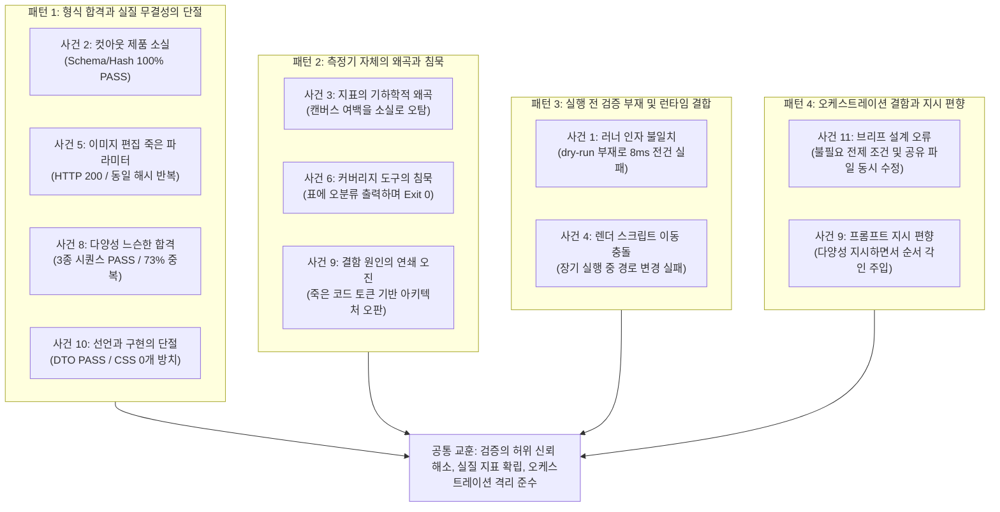

# 상세페이지 AI 시스템 개발·평가 에러 분석 보고서

- **문서 번호**: DELIVERABLE-02
- **작성일**: 2026-09-09
- **작성자**: agy2 (오케스트레이션 세션 지휘 하 작성)
- **대상 시스템**: Team3 E-Commerce Detail Page AI Generation Pipeline

---

## 1. 개요 및 목적

본 문서는 실제 데이터셋(`cma_real_v1`) 기반의 상세페이지 생성 파이프라인 개발 및 파일럿 평가, 그리고 이후의 구조 다양성 고도화 과정에서 발생한 **11대 주요 장애 및 결함 사건**을 체계적으로 분석한 보고서입니다.

단순한 장애 일지 나열을 넘어, 각 사건의 **증상 → 구체적 증거(저장소 내 파일 경로 및 실제 데이터 인용) → 근본 원인(Root Cause) → 조치 사항(Action Taken) → 재발 방지책(Prevention)**을 동일한 분석 틀로 규명합니다. 또한 오케스트레이터 지휘 세션 자체의 판단 및 브리프 결함도 가감 없이 기록하며, 문서 말미에는 개별 사건들을 관통하는 구조적·체계적 공통 패턴(Systemic Failure Patterns)을 도출하여 향후 시스템 고도화 및 품질 보증의 기반으로 삼습니다.

---

## 2. 11대 사건별 상세 분석

### 사건 1: 파일럿 6건 전건 즉각 실패 — 인터페이스 미정의 인자 전달

#### 1) 증상 (Symptom)
- 1차 파일럿 실행(`pilot-20260909-191258`) 시도 시, 6개 평가 대상 카테고리 전체가 시작 8ms 만에 단 한 건도 파이프라인 본체 및 모델 호출에 진입하지 못하고 전건 `TypeError`로 즉시 실패함 (`total_cases: 6, successful_cases: 0, failed_cases: 6`).

#### 2) 증거 (Evidence)
- **파일**: `generated/evaluation/pilot-20260909-191258/run_index.json` (`generated/evaluation/pilot-20260909-191258/run_index.json`)
- **실제 기록 인용**:
  ```json
  "started_at": "2026-09-09T19:12:58.681830+09:00",
  "ended_at": "2026-09-09T19:12:58.689715+09:00",
  "total_cases": 6,
  "completed_cases": 6,
  "successful_cases": 0,
  "failed_cases": 6,
  ...
  "case_id": "analysis-cma-102980",
  "duration_seconds": 0.01,
  "success": false,
  "error": "TypeError: DetailPagePipeline.run() got an unexpected keyword argument 'idempotency_key'",
  "error_trace": "Traceback (most recent call last):\n  File \"/Users/jmllem/PycharmProjects/Team3_EcommerceSystemAI/scripts/run_eval_pilot.py\", line 229, in run_pilot\n    result = pipeline.run(\n        job_id=str(uuid.uuid4()),\n    ...<7 lines>...\n        idempotency_key=meta.get(\"idempotency_key\"),\n    )\nTypeError: DetailPagePipeline.run() got an unexpected keyword argument 'idempotency_key'\n"
  ```

#### 3) 원인 (Root Cause)
- 평가 실행을 담당한 러너 스크립트(`scripts/run_eval_pilot.py`) 작성 과정에서 `DetailPagePipeline.run()` 메서드의 파라미터 시그니처에 존재하지 않는 `idempotency_key` 키워드 인자를 전달함.
- 실행 전 러너 스크립트 자체에 대한 단위 테스트나 dry-run 검증이 전혀 구비되어 있지 않아, 실제 실행 프로세스를 구동하고 나서야 인터페이스 불일치가 드러남.

#### 4) 조치 (Action Taken)
- `scripts/run_eval_pilot.py`의 `pipeline.run()` 호출부에서 유효하지 않은 `idempotency_key` 인자를 제거하고 정상 매개변수만 전달하도록 교정.
- 직후 신규 실행 `pilot-20260909-191344`를 구동하여 6건 모두 정상적으로 파이프라인 및 모델 추론에 착수함.

#### 5) 재발 방지 (Prevention)
- 배치 러너 및 진단 스크립트를 작성할 때 파이프라인의 mock 객체를 활용한 CLI 단위 테스트([`tests/test_eval_scripts.py`](../../../tests/test_eval_scripts.py))를 의무화하여 파라미터 불일치를 실행 전에 CI에서 자동 감지하도록 구성.
- 비용적 관점: 모델 호출 전에 실패하여 고비용 GPU 추론 낭비는 발생하지 않았으나, 실행 전 정적 인터페이스 검증의 부재를 확인한 계기가 됨.

---

### 사건 2: 컷아웃 마스크의 제품 본체 침식 및 자동 Gate 무력화 (Cutout Erosion)

#### 1) 증상 (Symptom)
- 1차 파일럿 실행(`pilot-20260909-191344`) 결과, Hero 대표 컷(`01-hero.*`)에서 원본 제품의 실루엣과 내부 본체가 배경으로 오인되어 심각하게 삭제됨.
- 특히 `ceramic`(cma-122443 백자 주전자/병)은 원본 대비 보존율이 **3.2%**에 불과하여 제품 본체가 투명하게 뚫리고 표면 문양 파편만 남음. `textile`(cma-102980) 역시 보존율이 **26.2%**로 떨어져 격자 조직이 심각하게 침식됨.
- **가장 중대한 문제**: 이 치명적 시각 결함이 기존의 자동 품질 게이트를 **100% PASS**로 통과함.

#### 2) 증거 (Evidence)
- **파일**: [`docs/phase3/runs/pilot-report-2026-09-09.md`](../runs/pilot-report-2026-09-09.md#L48-L82)
- **자동 게이트 통과 기록 인용**:
  ```markdown
  | 검증 영역 | 지표명 | 실측값 / 판정 | 기준 목표 | 결과 |
  |---|---|:---:|:---:|:---:|
  | 스키마 유효성 | React schema validity | 6 / 6 PASS (100%) | 100% | 합격 |
  | 트리 안전성 | React tree safety | 6 / 6 PASS (100%) | 100% | 합격 |
  | 직렬화 호환성 | camelCase alias 보존율 | 6 / 6 PASS (100%) | 100% | 합격 |
  | 자산 해석성 | imageId 해석률 | 48 / 48 PASS (100%) | 100% | 합격 |
  | 원본 무결성 | 원본 SHA-256 일치율 | 6 / 6 PASS (100%) | 100% | 합격 |
  | 보안 안전성 | executable field 누출 (HTML/script/JSX 등) | 0건 | 0건 | 합격 |
  ```
- **실제 픽셀 보존율 실측 인용**:
  ```markdown
  | 카테고리 | case_id | photo 역할 | 원본 잉크 비율 | 산출 잉크 비율 | 보존율 | 판정 |
  |---|---|---|---|---|---|---|
  | textile | analysis-cma-102980 | hero | 1.0000 (100.0%) | 0.2624 (26.2%) | 0.2624 (26.2%) | 부분 손실 |
  | ceramic | analysis-cma-122443 | hero | 0.9994 (99.9%) | 0.0324 (3.2%) | 0.0324 (3.2%) | 심각 손실 |
  ```

#### 3) 원인 (Root Cause)
- **추출 알고리즘 결함**: [`src/detail_page_ai/source_photos.py`](../../../src/detail_page_ai/source_photos.py)의 `SolidBackgroundCutoutExtractor`가 이미지 모서리 4개 픽셀의 평균 색상과 각 픽셀 간의 단순 유클리드 색거리(Color Distance) 임계값만으로 마스크 알파값을 결정함.
- **공간적 연결성 부재**: 외곽 배경과의 4-이웃 연결성(flood-fill) 검증이 없어, 밝은 배경 위에 놓인 밝은 제품(하얀 백자 도자기, 연색 직물)의 내부 본체까지 전부 배경으로 판단하여 투명화함.
- **게이트의 동어반복적 사각지대**: 기존의 `합성 fidelity` 검증은 "선언된 합성 변환이 전달받은 마스크를 수식 그대로 캔버스에 찍었는가"만 검증했음. 마스크 추출기가 97% 지워진 빈 마스크를 내놓아도, 합성기 자체는 수학적으로 정확하게 합성했으므로 게이트는 '적합(PASS)'으로 판단함.

#### 4) 조치 (Action Taken)
- 커밋 [`4204f6c`](../../../src/detail_page_ai/source_photos.py) 반영: 테두리로부터 4-이웃 flood fill로 연결된 영역만을 배경으로 마스킹하고 내부 픽셀은 보존하도록 전면 재구현.
- 마스크 파편화율(fragmentation)이 비정상적으로 높으면 추출을 포기하고 안전하게 원본 사진으로 fallback하는 안전 장치 추가.
- 산출물 비배경 픽셀 보존율을 직접 계측하는 [`scripts/check_cutout_fidelity.py`](../../../scripts/check_cutout_fidelity.py) 도구를 신설하여 회귀 게이트로 도입.

#### 5) 재발 방지 (Prevention)
- 구조/문법 검증(React Schema, JSON 타입)과 **시각적 실질 보존 검증(Pixel/Semantic Fidelity)**을 반드시 독립된 별도의 게이트로 분리 운영.
- 원본 이미지와 최종 산출물 간의 객체 잉크 보존율(Ink Retention Ratio)을 배포 및 평가 필수 차단 조건으로 확립.

---

### 사건 3: 품질 지표 자체의 오탐 (전체 캔버스 비율 vs 바운딩 박스 정규화)

#### 1) 증상 (Symptom)
- 컷아웃 flood-fill 마스크 알고리즘을 수정한 뒤 실행한 파일럿(`pilot-20260909-215715`)에서, `ceramic`(백자 도자기)이 육안상 결함 없이 온전하게 보존되었음에도 신규 지표 도구인 `scripts/check_cutout_fidelity.py`가 보존율을 **24.9%**로 계산하며 `심각 손실 [FAIL]`로 판정하는 오탐(False Positive)이 발생함.

#### 2) 증거 (Evidence)
- **파일**: `.orchestration/tasks/20260909-223712-agy2.md` (`.orchestration/tasks/20260909-223712-agy2.md`)
- **수정 전 (전체 캔버스 계측) 오탐 수치**:
  - `ceramic`: 원본 잉크 0.3887 (38.9%) → 산출 잉크 0.0967 (9.7%) → 보존율 0.2488 (24.9%) → **심각 손실** (오탐)
  - `textile`: 원본 잉크 0.8877 (88.8%) → 산출 잉크 0.3056 (30.6%) → 보존율 0.3443 (34.4%) → **부분 손실** (오탐)
- **수정 후 (경계 상자 바운딩 박스 정규화 계측) 수치**:
  - **1차 파일럿 (`pilot-20260909-191344`, 실제 병 소실 결함 산출물)**:
    - `ceramic`: 원본 0.9994 (99.9%) → 산출 0.0921 (9.2%) → 보존율 0.0921 (**9.2%**) → **심각 손실** (실제 결함 정확 감지)
  - **2차 파일럿 (`pilot-20260909-215715`, 정상 보존 산출물)**:
    - `ceramic`: 원본 0.9994 (99.9%) → 산출 0.6402 (64.0%) → 보존율 0.6406 (**64.1%**) → **OK** (오탐 완전 해소)
    - `textile`: 원본 1.0000 (100.0%) → 산출 0.9678 (96.8%) → 보존율 0.9678 (**96.8%**) → **OK** (오탐 완전 해소)

#### 3) 원인 (Root Cause)
- 원본 이미지는 제품이 프레임을 거의 꽉 채우고 있으나, 상세페이지 조립 파이프라인의 합성 단계에서 제품 컷아웃을 1200×1200 크기의 넓은 캔버스 중앙에 여백을 두고 배치함.
- 지표 도구가 **"캔버스 전체 면적 대비 비배경 픽셀 수"**를 단순 비교했기 때문에, 제품이 전혀 지워지지 않고 정상 보존되었더라도 "큰 캔버스에 여백을 두고 작게 배치된 것"만으로 잉크 비율이 급감함. 지표가 '지워진 것'과 '여백을 두고 배치된 것'을 구분하지 못함.

#### 4) 조치 (Action Taken)
- [`scripts/check_cutout_fidelity.py`](../../../scripts/check_cutout_fidelity.py)에 `calculate_bbox_ink_ratio`를 새로 도입.
- 제품 픽셀의 최소 경계 상자(Bounding Box)를 산출하여 해당 Bbox 영역만을 크롭(crop)한 뒤 리샘플링하여 잉크 비율을 계산하도록 알고리즘 재설계.
- 1차 파일럿의 실제 결함(ceramic 9.2%)은 엄격히 `심각 손실`로 차단하면서, 2차 파일럿의 정상 보존(ceramic 64.1%, textile 96.8%)은 `OK`로 판별하도록 정상화.

#### 5) 재발 방지 (Prevention)
- 공간 레이아웃 변환(여백 패딩, 캔버스 확장 등)이 개입되는 시각 메트릭은 절대 캔버스 기준이 아닌 국소 객체 좌표(Object-relative Bounding Box) 기준으로 정규화하여 설계.
- 품질 게이트 자체를 배포하기 전에 '불량품을 탈락시키는 참 양성(True Positive)'과 '양품을 통과시키는 참 음성(True Negative)' 양방향 대조군 검증을 필수화.

---

### 사건 4: 렌더 스크립트 디렉터리 이동과 동시 실행 충돌로 인한 2건 실패

#### 1) 증상 (Symptom)
- 재생성 파일럿(`pilot-20260909-215715`) 순차 실행 도중, 앞선 4개 케이스(`textile`, `metalware`, `ceramic`, `jewelry`)는 완벽히 생성되었으나 뒤이어 실행된 2개 케이스(`box`, `furniture`)에서 HTML 렌더링 subprocess 실패가 발생함 (`CalledProcessError`, exit status 1).

#### 2) 증거 (Evidence)
- **파일**: `generated/evaluation/pilot-20260909-215715/run_index.json` (`generated/evaluation/pilot-20260909-215715/run_index.json`) 및 L107-L111 (`generated/evaluation/pilot-20260909-215715/run_index.json`)
- **실제 실패 기록 인용**:
  ```json
  "case_id": "analysis-cma-101636",
  "category": "box",
  "duration_seconds": 359.38,
  "success": false,
  "error": "CalledProcessError: Command '['node', '/Users/jmllem/PycharmProjects/Team3_EcommerceSystemAI/scripts/render_detail_page.mjs', '/var/folders/_3/m30w_xjn27b2lbsx5br59qj00000gn/T/detail-page-render-qhrs0vs3/detail-page.html', '/var/folders/_3/m30w_xjn27b2lbsx5br59qj00000gn/T/detail-page-render-qhrs0vs3/detail-page.png', '--sections', '/var/folders/_3/m30w_xjn27b2lbsx5br59qj00000gn/T/detail-page-render-qhrs0vs3/sections']' returned non-zero exit status 1."
  ```
  ```json
  "case_id": "analysis-cma-110793",
  "category": "furniture",
  "duration_seconds": 296.80,
  "success": false,
  "error": "CalledProcessError: Command '['node', '/Users/jmllem/PycharmProjects/Team3_EcommerceSystemAI/scripts/render_detail_page.mjs', ...]' returned non-zero exit status 1."
  ```

#### 3) 원인 (Root Cause)
- 약 30분이 소요되는 대규모 파일럿 생성이 실행되고 있는 도중, 별도의 오케스트레이션 세션에서 `scripts/` 루트 디렉터리 정리 작업(`scripts/runtime/`, `scripts/dataset/`, `scripts/browser/` 분할)을 동시 진행함.
- `scripts/render_detail_page.mjs` 파일이 `scripts/runtime/render_detail_page.mjs`로 이동하고 기존 루트 경로의 파일이 삭제됨.
- 이미 메모리에 로드되어 구동 중이던 파이프라인 프로세스는 이전 경로인 `scripts/render_detail_page.mjs`를 호출하였고, 파일이 존재하지 않아 node 프로세스가 즉시 실패함.
- 이는 코드 로직의 결함이 아니라 **다중 워커 에이전트 환경에서 런타임 공유 자원을 변경하여 발생한 동시성 충돌(Concurrency Path Collision)**임.

#### 4) 조치 (Action Taken)
- [`src/detail_page_ai/html_renderer.py`](../../../src/detail_page_ai/html_renderer.py)를 수정하여 `scripts/runtime/render_detail_page.mjs`를 기본 참조하도록 경로를 갱신.
- [`scripts/check_cutout_fidelity.py`](../../../scripts/check_cutout_fidelity.py)에서 렌더 실패로 인한 산출물 미생성을 마스크 침식과 구별하기 위해 `산출물 누락(MISSING_OUTPUT)` 등급으로 명확히 분리 집계하도록 개편.

#### 5) 재발 방지 (Prevention)
- 장기 실행(long-running) 작업이 진행되는 동안에는 실행 중인 프로세스가 참조할 수 있는 스크립트나 엔드포인트의 물리적 경로 변경을 금지하거나, 과도기 동안 구 경로에 심볼릭 링크(symlink) 또는 포워딩 스크립트를 유지.
- 파이프라인 내부 경로는 작업 디렉터리 상대 경로 하드코딩 대신 설정(Config) 주입 및 모듈 리소스 탐색 방식으로 변경.

---

### 사건 5: 이미지 편집 경로의 죽은 파라미터(Dead Parameter) 및 무효 실험 (현재 다른 워커가 수정 진행 중)

#### 1) 증상 (Symptom)
- Flux 이미지 편집(`/v1/images/edits`) 파라미터 최적화를 위한 A/B 실험(`image-steps-ab-20260909-223049`)에서, 추론 스텝(`steps`: 4, 8, 16)과 노이즈 강도(`strength`: 0.25, 0.50, 0.75) 9개 조합을 전송했으나 **9장 모두 SHA-256 해시가 완전히 동일**하게 생성됨.
- 서버 로그상 9건 모두 기본값인 `steps=4`로만 고정 실행되었으며, 파라미터 변동이 전혀 반영되지 않은 채 GPU 자원과 시간이 낭비됨.

#### 2) 증거 (Evidence)
- **파일**: `generated/experiments/image-steps-ab-20260909-223049/results.json` (`generated/experiments/image-steps-ab-20260909-223049/results.json`)
- **대조군 (Phase 1 Probe - `/v1/images/generations` JSON 엔드포인트)**:
  - `steps: 8` 전송 시 서버 로그 `logged_steps: 8`, 소요 시간 `39.331s`로 정상 반영됨 (4스텝 약 19초 대비 정확히 2배).
- **실험군 (Phase 2 Grid - `/v1/images/edits` Multipart 엔드포인트)**:
  - `steps: 4, 8, 16` 및 `strength: 0.25, 0.50, 0.75`를 전송했으나 9건 모두 `logged_steps: 4`, 소요 시간 `28.1~31.8s`, 파일 크기 `1,848,502 bytes`로 고정됨.
- **실제 SHA-256 해시 전수 검증 결과 (9건 전건 동일)**:
  ```text
  e1b213380ceda0c545bb24e1dac0d4cb5bfc385f4958751bf71b2de163dbd617  steps04-strength025.png
  e1b213380ceda0c545bb24e1dac0d4cb5bfc385f4958751bf71b2de163dbd617  steps04-strength050.png
  e1b213380ceda0c545bb24e1dac0d4cb5bfc385f4958751bf71b2de163dbd617  steps04-strength075.png
  e1b213380ceda0c545bb24e1dac0d4cb5bfc385f4958751bf71b2de163dbd617  steps08-strength025.png
  e1b213380ceda0c545bb24e1dac0d4cb5bfc385f4958751bf71b2de163dbd617  steps08-strength050.png
  e1b213380ceda0c545bb24e1dac0d4cb5bfc385f4958751bf71b2de163dbd617  steps08-strength075.png
  e1b213380ceda0c545bb24e1dac0d4cb5bfc385f4958751bf71b2de163dbd617  steps16-strength025.png
  e1b213380ceda0c545bb24e1dac0d4cb5bfc385f4958751bf71b2de163dbd617  steps16-strength050.png
  e1b213380ceda0c545bb24e1dac0d4cb5bfc385f4958751bf71b2de163dbd617  steps16-strength075.png
  ```
- **파일**: [`src/local_detail_page_ai/clients.py`](../../../src/local_detail_page_ai/clients.py#L259-L296)
  - 259행 (`generate`): `"steps": self.steps` (정수 전송)
  - 295~296행 (`edit`): `"steps": str(self.steps)`, `"strength": f"{strength:.2f}"` (문자열 전송)

#### 3) 원인 (Root Cause 및 가설)
- 클라이언트 구현에서 JSON 본문을 보내는 `generate`는 정수형(`self.steps`)을 전달한 반면, multipart 본문을 보내는 `edit`에서는 문자열(`str(self.steps)`)로 직렬화하여 전송함.
- MLX Serve 백엔드의 `/v1/images/edits` 수신 핸들러가 multipart 폼 필드의 문자열 값을 정수형 파라미터로 자동 변환하지 못하고 무시하여, 파라미터가 유실된 채 서버 내부 기본값(4스텝)으로 동작함.
- 서버가 알 수 없거나 파싱 불가능한 폼 파라미터에 대해 오류(400 Bad Request)를 뱉지 않고 **침묵하며 기본값을 사용**함으로써, 클라이언트는 정상 동작하고 있다고 착각하게 됨.

#### 4) 조치 (Action Taken)
- **현재 진행 중(In-Progress)**: 다른 워커 에이전트가 `src/local_detail_page_ai/clients.py`의 multipart 인코딩 방식 수정 및 MLX Serve 백엔드 파라미터 파싱 규격 정합화 작업 진행 중.

#### 5) 재발 방지 (Prevention)
- 파라미터 그리드 탐색 및 튜닝 실험을 수행하기 전, 파라미터 2개(극단값)만으로 출력 해시나 실행 시간이 유의미하게 변화하는지 확인하는 **사전 감도 점검(Pre-flight Sensitivity Check)**을 실험 스크립트 진입점에 필수로 배치.
- API 통신 계층에서 타입 강제(Type coercion)를 가정한 묵시적 전송을 금지하고, 서버 측에도 미지원 폼 필드 유입 시 명시적 경고나 오류를 반환하도록 엔드포인트 계약 강화.

---

### 사건 6: 커버리지 도구가 오분류를 감지하고도 '성공(Exit Code 0)' 판정

#### 1) 증상 (Symptom)
- 씬 연출 방향 배정 진단 도구인 `scripts/check_scene_direction_coverage.py`를 실행했을 때, 목걸이(`jewelry`, cma-109609)가 전용 분기가 없어 `metal` 분기로 오분류된 현상을 터미널 표에는 정확하게 표시하면서도, 프로세스 종료 코드로는 `0 (PASS)`을 반환하여 CI 및 배포 게이트가 정상으로 오판함.

#### 2) 증거 (Evidence)
- **파일**: `.orchestration/tasks/20260909-213500-agy.md` (`.orchestration/tasks/20260909-213500-agy.md`)
- **지휘 기록 인용**:
  ```text
  네가 만든 scripts/check_scene_direction_coverage.py 는 정상 동작한다. 목걸이(cma-109609)가
  metal 분기로 가는 오분류를 표에서 정확히 짚어냈다. 확인했다.
  그런데 종료 코드가 0으로 나온다. 내가 준 브리프에 "기본값(default)으로 떨어진 건이
  있으면 종료 코드 1" 이라고만 써서 그렇다. 이번 사례는 기본값이 아니라 오분류라 조건에
  안 걸린다. 브리프의 판정 기준이 좁았던 것이니 네 잘못이 아니다.
  문제는 이 도구를 수정 전후 회귀 게이트로 쓸 거라는 점이다. 오분류를 발견하고도 0을
  반환하면 게이트 역할을 못 한다.
  ```
- **파일**: [`scripts/check_scene_direction_coverage.py`](../../../scripts/check_scene_direction_coverage.py#L318-L330)

#### 3) 원인 (Root Cause)
- 스크립트 작성 시 실패 판정 조건을 오직 `default_count > 0` (어떤 특정 분기에도 들어가지 못하고 최하단 기본 연출 fallback으로 떨어진 경우)로만 협소하게 정의함.
- "기대 분기와 다른 분기로 잘못 들어간 경우(Misclassification)"는 명시적 실패 조건에서 누락됨.
- 사람이 눈으로 표를 볼 때는 오분류를 인지할 수 있었으나, 자동화된 게이트(CI/CD) 관점에서는 종료 코드 0으로 인해 결함이 그대로 통과됨.

#### 4) 조치 (Action Taken)
- 카테고리별 기대 분기 대응표(`EXPECTED_BRANCHES`: textile→textile, box→box, ceramic→ceramic, metalware→metal, furniture→wood, jewelry→jewelry)를 상수로 명시.
- `misclassified_count > 0` 또는 `default_count > 0` 검출 시 즉시 종료 코드 `1`을 반환하는 strict 판정 로직을 기본값으로 구축.
- [`tests/test_eval_scripts.py`](../../../tests/test_eval_scripts.py)에 `test_check_scene_direction_coverage_fails_on_misclassification` 단위 테스트를 추가하여 게이트 판정 무결성을 검증.

#### 5) 재발 방지 (Prevention)
- 진단 및 검증 도구 설계 시 "부정적 케이스(default)가 없으면 합격"이라는 블랙리스트 방식의 안일한 가정을 지양하고, "정의된 기대 결과(expected match)와 100% 일치할 때만 합격"이라는 **화이트리스트 단언(Whitelist Assertion) 원칙**을 일관되게 적용.
- 검증 도구 자체에 대해 '오분류 상황'을 모의 입력하여 반드시 exit code 1이 반환되는지 단위 테스트로 사전에 보증.

---

### 사건 7: 생성 참고 컷의 `참고용` 표시 누락 (당시 관측, 현재 해소)

#### 1) 증상 (Symptom)
- `generated/evaluation/pilot-20260909-224737/*/react_document.json` 6건에서
  `grep -c '참고용'` 결과가 모두 `0`이다.
- 반면 각 `result_summary.json`의 `generated_scene` 1개와 `generated_view` 4개 자산에는
  `product_generated: true`가 기록되어 있다.
- 따라서 데이터 계약은 생성 참고 자산을 식별하지만, 고객이 보는 최종 렌더 화면에는
  `참고용` 표시가 노출되지 않는다.

#### 2) 증거 (Evidence)
- [`src/detail_page_ai/html_renderer.py`](../../../src/detail_page_ai/html_renderer.py)의
  513~518행은 `photo.product_generated`, `asset_mode == "generated_scene"`,
  `asset_mode == "generated_view"`를 URI 선택 조건으로만 사용한다.

  ```python
          if not photo.product_generated
          or (photo.photo_id == "lifestyle" and photo.asset_mode == "generated_scene")
          or (
              photo.photo_id in {"detail-02", "detail-03", "detail-04", "detail-05"}
              and photo.asset_mode == "generated_view"
          )
  ```
- [`README.md`](../../../README.md)는 `generated_scene`/`generated_view`를 참고용 이미지로
  표시한다고 선언하지만, 위 렌더러 분기에는 라벨을 만드는 코드가 없다.

#### 3) 원인 (Root Cause)
- `result_summary.json`과 사진 DTO에는 생성 여부와 자산 모드가 기록되지만,
  `html_renderer`는 이를 자산 허용/선택 조건으로만 소비하고 고객 화면용 캡션으로
  변환하지 않는다.

#### 4) 조치 (Action Taken)
- 당시 사이클에서는 **미수정**으로 결정했고, 배포 차단 조건 5로 기록했다.
- 후속 수정 방향은 `react_document_builder`가 생성 자산 라벨을 내보내고,
  `html_renderer`가 `AI 생성 활용 장면(참고용)`/`AI 생성 디테일(참고용)`을 렌더하는
  것이다. JSON 라벨 검증과 최종 PNG 표시 검증도 배포 gate에 추가해야 한다.

##### 5) 재발 방지 (Prevention)
- 생성 자산의 provenance 메타데이터 존재만 확인하지 말고, 고객 화면에 라벨이 실제로
  표시되는지 JSON·렌더 결과를 각각 검증한다.
- 원본 `hero`·`packshot`·대표 `detail`과 생성 참고 컷을 구분하는 표시를 사람 검수 및
  게시 gate의 필수 조건으로 둔다.

#### 6) 현재 상태 및 해소 경위
- 10차에 라벨 계약을 수정해 라벨 게이트가 60/60 PASS였다.
- 12차에 관리자 결정으로 화면의 `참고용` 표시 요구와 게이트를 제거했으며, 현재는
  `product_generated`로 생성 자산을 구분한다.

---

### 사건 8: 느슨한 다양성 합격 기준의 허위 통과 — '다름의 유무'만 세고 '다름의 정도'를 재지 않음

#### 1) 증상 (Symptom)
- 파일럿 6건 평가에서 "고유 시퀀스 3종 이상, 중간 블록 집합 3종 이상"이라는 다양성 기준을 충족하여 품질 검증을 통과(PASS) 판정함.
- 그러나 실제 산출물을 정밀 전수 검사한 결과, 전체 6개 페이지 중 **73% 이상의 블록이 완전히 동일한 종류**였으며, 6건 중 무려 5건(83.3%)이 정확히 10개 블록 동일 순서로 고착되어 있었고, 두 쌍은 블록 집합이 100% 일치했음.
- 즉, 육안과 실질에서는 극심하게 천편일률적인 출력이었음에도 기존 자동 게이트는 '적합'으로 통과시킴.

#### 2) 증거 (Evidence)
- **파일**: [`scripts/check_plan_diversity.py`](../../../scripts/check_plan_diversity.py), 커밋 [`7ee5cc5`](../../../scripts/check_plan_diversity.py)
- **커밋 기록 인용**:
  ```
  The acceptance bar for structural variety counted distinct sequences and distinct
  middle-block sets, and a run passed it while three quarters of every page held the
  same blocks and two pairs were identical. Counting whether anything differs says
  nothing about how much.
  ```
- **실측치**: 6건 중 5건이 `hero → statement → feature_grid → detail_split → usage_scene → gallery → recommendation → info_table → notice → closing` 10개 블록 완벽 일치. 쌍별 평균 Jaccard 유사도는 **96.7%**, 완전 일치 쌍은 **10쌍**에 달함.

#### 3) 원인 (Root Cause)
- **지표 설계의 치명적 결함**: "다른 것이 단 하나라도 존재하는가(고유 종수 카운팅)"만을 평가하고, "페이지 전체에서 얼마나 다르고 얼마나 겹치는가(집합 일치도 및 유사도)"를 측정하지 않음.
- 10개 블록 중 9개가 같고 사소한 1개 블록 위치만 달라도 '고유 시퀀스'가 1 증가하므로, 형식적 기준(3종 이상)은 쉽게 달성되면서 실질적 획일성을 포착하지 못함.

#### 4) 조치 (Action Taken)
- 다각도 정량 다양성 측정 전문 도구인 [`scripts/check_plan_diversity.py`](../../../scripts/check_plan_diversity.py) 및 단위 테스트([`tests/test_plan_diversity.py`](../../../tests/test_plan_diversity.py)) 신설.
- 단순 종수 대신 다차원 지표 도입:
  1) 전 케이스 공통 블록 종수 (Common Block Types)
  2) 쌍별 Jaccard 유사도 (Average Pairwise Jaccard Similarity)
  3) 100% 동일 집합 쌍 수 (Identical Pairs Count)
  4) 블록 길이 분포 및 위치별 고정도 (Positional Fixedness)
- 엄격한 품질 게이트 임계값 확립: **평균 집합 일치도 ≤ 60.0%, 공통 블록 종수 ≤ 4종, 완전 일치 0쌍**. (실측치 96.7%로 즉시 FAIL 판정 및 종료 코드 1 반환).

#### 5) 재발 방지 (Prevention)
- 다양성 평가 시 단순 카운팅(고유 시퀀스 수) 지표를 단독 합격 기준으로 사용하는 것을 금지.
- 집합 유사도(Jaccard), 위치 고정도, 교집합 종수 등 연속형 분포 지표를 결합한 복합 게이트를 의무화.

---

### 사건 9: 다양성 저하 원인의 연쇄 오진 — 코드 패딩 지목과 템플릿 죽은 코드 오해

#### 1) 증상 (Symptom)
- 상세페이지 블록 구성의 획일성 문제를 해결하는 과정에서, (1) 검증 코드의 패딩 로직(`ensure_editorial_page_plan`)을 주원인으로 지목하여 제거했으나 재생성 결과 획일성이 거의 개선되지 않았고, (2) 렌더러가 특정 고정 슬롯에 블록을 끼워 넣는 템플릿 방식이라고 단정했으나 실제 렌더러 동작 방식과 달랐음.

#### 2) 증거 (Evidence)
- **파일**: [`src/detail_page_ai/validation.py`](../../../src/detail_page_ai/validation.py), [`src/detail_page_ai/html_renderer.py`](../../../src/detail_page_ai/html_renderer.py), 커밋 [`2ec2842`](../../../src/detail_page_ai/validation.py), [`aed5f57`](../../../src/detail_page_ai/prompts.py)
- **커밋 `2ec2842` 인용**:
  ```
  Regenerating showed the padding was not the main cause: the sequence stayed
  fixed with the code out of the way. That pointed at the prompt instead.
  ```
- **죽은 코드 증거**: `src/detail_page_ai/html_renderer.py`의 585~586행에 정의된 `{{THREE_GALLERY}}`, `{{TWO_GALLERY}}` 토큰은 실제 적응형 에디토리얼 템플릿(`web/detail_page.html`)에는 플레이스홀더 자체가 존재하지 않는 **미사용 죽은 코드(Dead Code)**였음.

#### 3) 원인 (Root Cause)
- **코드 패딩 오진**: `validation.py`가 중간 블록을 9개로 채우는 코드가 있어 이를 다양성 파괴의 근본 원인으로 지목했으나, 실제로는 패딩을 완전히 걷어내도 모델이 프롬프트의 순서 각인(Copy Map 순서, 레시피 불릿)으로 인해 자발적으로 동일한 10블록을 반복 생성함.
- **렌더러 슬롯 오진**: 렌더러 소스코드의 딕셔너리에 남아 있던 레거시 토큰 치환 목록만을 보고 "렌더러가 정적 슬롯에 강제로 끼워 넣는다"고 속단함. 그러나 실제 적응형 렌더러(`_dynamic_sections`)는 `profile.page_plan`의 블록들을 순서대로 순회하는 순수 동적 루프였음.

#### 4) 조치 (Action Taken)
- `validation.py`는 중간 블록 6개 이상 시 모델 계획을 보존하도록 유지하되, 주원인이 프롬프트 편향에 있음을 규명하고 `prompts.py`의 순서 각인 요소들을 제거.
- 나아가 자연어 지시만으로는 모델의 기본 모드(Default Mode) 편향을 완전히 깰 수 없음을 확인하고, `src/detail_page_ai/layout_archetypes.py`를 통해 원본 이미지 해시 기반으로 25종 카탈로그에서 원형을 결정론적으로 주입하는 아키텍처로 전환.
- 렌더러 소스코드에서 실제 런타임 실행 경로(`_dynamic_sections`)와 레거시 잔재 코드를 명확히 분리하여 이해.

#### 5) 재발 방지 (Prevention)
- 결함 원인 분석 시 표면적인 코드 일부나 미사용 플레이스홀더를 바탕으로 속단하지 않고, 실제 런타임 콜스택과 데이터 흐름을 끝까지 추적하여 가설을 검증.
- 가설 검증용 수정 후 즉시 실측하여 가설이 기각되었을 때 이를 솔직하게 인정하고 방향을 전환하는 신속한 피드백 루프 준수.

---

### 사건 10: 계약 선언과 시각 구현의 단절 — DTO variant 4종 및 `editorial-split` CSS 0개 방치

#### 1) 증상 (Symptom)
- AI 모델이 DTO 스키마에 정의된 스타일 variant나 레이아웃 ID를 정상적으로 출력하더라도, 실제 생성된 웹 화면과 최종 PNG 이미지에서는 아무런 시각적 변화(좌우 반전, 색면 변경, 여백 축소 등)가 발생하지 않는 침묵 결함(Silent Defect)이 방치됨.

#### 2) 증거 (Evidence)
- **DTO 정의**: [`src/detail_page_ai/dto.py`](../../../src/detail_page_ai/dto.py)의 `PageBlockVariant` 8종(`paper`, `light`, `sand`, `dark`, `image-left`, `image-right`, `full-bleed`, `compact`) 중 `sand`, `image-left`, `image-right`, `compact` 4종의 `web/detail_page.css` 내 CSS 규칙 수가 **정확히 0개**였음.
- **레이아웃 ID 정의**: `LayoutId` 3종(`"editorial-split"`, `"image-first"`, `"catalog-grid"`) 중 대표값인 `"editorial-split"`의 CSS 클래스(`.detail-page--editorial-split`) 규칙 수가 **0개**였음.
- 모델이 `variant: "image-left"`를 출력해도 이미지는 좌우 반전되지 않고, `variant: "compact"`를 출력해도 여백과 폰트가 전혀 줄어들지 않았음.

#### 3) 원인 (Root Cause)
- 데이터 모델(DTO Pydantic 스키마)과 프롬프트 계약에는 어휘를 선언해 두었으나, 프론트엔드 스타일시트(`web/detail_page.css`)와의 end-to-end 연계 검증이 누락됨.
- Pydantic 스키마 검증과 JSON AST 검증은 계약에 선언된 값이 들어왔으므로 100% PASS를 띄웠고, 브라우저 렌더러 역시 매칭되는 CSS 규칙이 없으면 에러를 뱉지 않고 기본 스타일로 조용히 렌더링(Silent Fallback)했기 때문에 결함이 장기간 은폐됨.

#### 4) 조치 (Action Taken)
- 비어 있던 4종 variant에 대해 공예 테이블웨어 실사용 맥락을 반영한 CSS 규칙을 완전 구현 (`web/variants-agy.css`, `web/detail_page.css`):
  - `image-left + dark`: 310px:464px(약 40%:60%) 비대칭 분할, 좌측 미디어 스택, 우측 세리프(`Noto Serif KR`) 및 악센트 넘버링.
  - `full-bleed`: 전면 이미지 위 중앙 정렬 흰색 세리프 문구 및 스크림 오버레이.
  - `sand`: 따뜻한 흙/모래 색면(`#EAE1D6`) 기반 마무리 섹션 중앙 정렬 카피.
  - `compact`: `info-section` 2x2 명세 그리드 변환 및 밀도 축소.
- Playwright 기반 시각적 렌더링 검증 스크립트를 통해 계산된 스타일(Computed Style)과 지오메트리 바운딩 박스를 직접 측정하여 스타일 반영을 전수 검증.

#### 5) 재발 방지 (Prevention)
- DTO나 설정에 새로운 시각적 토큰(variant, layout_id 등)을 추가할 때, 스키마 단위 테스트뿐만 아니라 해당 토큰에 대응하는 CSS 선택자의 실존 여부를 검증하는 정적 연계 테스트를 구축.
- "값이 전달되었는가"를 넘어 "화면이 실제로 다르게 보이는가"를 확인하는 시각적 회귀 검증(Visual Regression Test)을 파이프라인 품질 계약에 포함.

---

### 사건 11: 오케스트레이터 브리프 오류로 인한 워커 작업 차단 및 동시 수정 충돌 위기

#### 1) 증상 (Symptom)
- 오케스트레이션 세션의 작업 브리프(Task Brief) 작성 오류로 인해 (1) 오프라인 정적 게이트 점검 워커가 불필요한 모델 서버 확인 조건에 가로막혀 작업이 중단되었고, (2) 독립 교차검증을 수행하는 두 워커에게 동일한 단일 파일(`web/detail_page.css`)을 동시에 직접 수정하도록 지시하여 git 충돌 및 상호 작업 덮어쓰기 위기가 발생함 (진행 중 긴급 정정 발행).

#### 2) 증거 (Evidence)
- **오케스트레이션 태스크 지시서**: `.orchestration/tasks/20260910-143502-agy.md` 및 긴급 정정 브리프
- **지휘 세션 정정 기록 인용**:
  ```
  정정입니다. 두 워커가 같은 web/detail_page.css 를 동시에 고치게 브리프를 잘못 냈습니다.
  제 실수입니다. detail_page.css 를 직접 수정하지 말고, 추가할 규칙만 별도 파일
  web/variants-agy.css 에 작성해 주세요. 기존 파일은 읽기만 하고 그대로 두세요.
  ```

#### 3) 원인 (Root Cause)
- **지시하는 쪽(Orchestrator)의 의존성 사전 검토 부재 및 자원 격리 실패**:
  - 모델 호출이 없는 순수 오프라인 정적 검사 작업임에도 관성적으로 "모델 서버 정상 동작 확인"을 필수 선행 조건으로 지정하여 워커 작업 진행을 차단함.
  - 복수의 독립 워커가 병렬로 교차검증을 수행할 때 필수적인 작업 공간/산출물 파일 격리(File Isolation)를 설계하지 않고, 단일 공유 파일의 직접 수정을 지시함.

#### 4) 조치 (Action Taken)
- 지휘 세션에서 즉시 오류를 인정하고 정정 브리프를 발행하여 `web/detail_page.css`를 원상태로 보존하고 워커별 독립 산출물(`web/variants-agy.css`, `web/variants-codex.css`)로 분리하도록 조치.
- 오프라인 작업과 모델 의존 작업의 사전 조건을 분리하여 불필요한 블로킹 해소.

#### 5) 재발 방지 (Prevention)
- **"지휘 세션의 지시서(Brief) 결함 역시 시스템 전체의 중대한 결함 원인"**임을 명시하고 작업 지시서 발행 전 사전 체크리스트 준수:
  1) 선행 조건이 작업의 실제 물리적 필요조건인가? (불필요한 외부 의존성 제거)
  2) 복수 워커 투입 시 산출물 파일 경로가 완전히 격리(Namespacing)되어 충돌 가능성이 없는가?
  3) 교차검증의 독립성이 유지되도록 파일 시스템 레벨의 분리가 설계되었는가?

---

## 3. 관통하는 패턴: 체계적 실패의 네 가지 축 (Systemic Patterns)

상기 11개 사건을 심층 분석하면, 단순한 개별 코딩 실수나 환경 문제를 넘어 **네 가지 본질적인 시스템 설계, 검증, 지휘의 허점**이 반복적으로 작용했음을 발견할 수 있습니다.



### 패턴 1: '형식(Syntax) 검증'이 '실질(Semantics) 무결성'을 보장한다는 착각 (사건 2, 사건 5, 사건 8, 사건 10)

가장 중대한 시스템적 위험은 **"모든 자동 테스트와 게이트가 완벽한 초록불(Green)을 띄우고 있는데, 실제 산출물은 치명적으로 파괴되어 있거나 전혀 바뀌지 않는 상태"**였습니다.
- **사건 2**: 마스크가 제품을 97% 지워버린 텅 빈 마스크였음에도, 절차적으로 완벽했기에 게이트는 아무런 경고도 울리지 못했습니다.
- **사건 5**: HTTP 200 응답을 받았으나 백엔드가 파라미터를 무시하여 9개 실험 조건이 동일한 결과만을 반환했습니다.
- **사건 8**: "고유 시퀀스 3종"이라는 형식적 카운팅 조건을 만족하여 통과했으나, 실제로는 페이지의 73%가 동일 블록이었고 5건이 완전히 똑같은 시퀀스였습니다.
- **사건 10**: DTO 스키마와 프롬프트 계약에 variant와 layout_id를 정의하여 스키마 검증은 100% 통과했으나, CSS 구현이 0개여서 화면에는 아무런 시각적 변화가 반영되지 않았습니다.
- **교훈**: 규격 통과와 상태 코드는 최소한의 전제일 뿐입니다. **실질 픽셀 잔존량, 분포 유사도(Jaccard), 실제 렌더링 스타일 반영** 등 도메인 실질을 확인하는 독립 검증이 반드시 수반되어야 합니다.

### 패턴 2: '측정기 자체의 결함'으로 인한 참/거짓 판단 왜곡 (사건 3, 사건 6, 사건 8, 사건 9)

두 번째 패턴은 **"결함을 잡기 위해 도입한 검증 장치나 분석 도구 자체가 잘못 설계되어 정상 시스템을 가로막거나, 결함을 포착하고도 방류하는 현상"**입니다.
- **사건 3**: 캔버스 전체 기준이라는 잘못된 좌표계로 정상 도자기를 '심각 손실'로 오탐했습니다.
- **사건 6**: 진단 표에 오분류를 명확히 찍으면서도 단언 조건 부실로 종료 코드 0을 뱉는 허위 합격을 유발했습니다.
- **사건 8**: "다른 게 하나라도 있는가"만 묻고 "얼마나 다른가"를 묻지 않는 지표 설계로 획일적 출력을 합격 처리했습니다.
- **사건 9**: 템플릿에 존재하지도 않는 레거시 죽은 코드(`{{THREE_GALLERY}}`)를 근거로 삼아 렌더러가 슬롯을 고정한다고 원인을 오진했습니다.
- **교훈**: 측정기와 분석 도구 역시 검증의 대상(Meta-testing)어야 합니다. 측정 지표가 의도된 참/거짓을 정밀하게 가려내는지 엄격히 입증해야 합니다.

### 패턴 3: '실행 전 검증 부재'와 '동시성 결합도' (사건 1, 사건 4)

세 번째 패턴은 **"충분히 가벼운 사전 검사로 차단할 수 있었던 인터페이스 오류 및 분산 작업 환경에서의 경로 결합"**입니다.
- **사건 1**: `mypy` 정적 검사나 단 0.1초짜리 mock 단위 테스트 하나만 있었어도 실제 실행 전에 완전히 차단할 수 있었습니다.
- **사건 4**: 30분 동안 돌고 있는 프로세스가 접근 중인 스크립트 파일을 예고 없이 이동시키고 심볼릭 링크를 두지 않아 발생했습니다.
- **교훈**: 장기 실행 프로세스 전에는 가벼운 사전 검증(dry-run)을 거쳐야 하며, 런타임 공유 자원의 변경 시 하위 호환 심볼릭 링크나 경로 격리를 의무화해야 합니다.

### 패턴 4: '오케스트레이션 지휘 결함'과 '프롬프트 주입 편향' (사건 9, 사건 11)

네 번째 패턴은 **"시스템 외부에서 작업을 지휘하고 모델을 유도하는 오케스트레이터 및 프롬프트 레벨의 구조적 편향"**입니다.
- **사건 11**: 지휘 세션(Orchestrator)이 작업의 성격을 정확히 파악하지 않고 불필요한 모델 서버 확인 조건을 걸거나, 복수 워커에게 동일 파일 수정을 지시하여 자원 충돌 위기를 자초했습니다.
- **사건 9**: 모델에게 자연어로 "다양하게 구성하라"고 지시하면서도, 정작 프롬프트 내부에서는 알파벳순이 아닌 특정 블록 순서로 역할을 나열하고 예시를 노출하여 모델에게 순서를 무의식적으로 각인시켰습니다.
- **교훈**: 지시하는 쪽의 지휘서(Brief) 결함 역시 파이프라인의 중대한 장애 유발 요인입니다. 자연어 유도의 한계를 인식하고 코드 레벨의 결정론적 제어(`layout_archetypes.py`)를 도입해야 하며, 워커 작업 설계 시 쓰기 자원의 완전한 격리 원칙을 준수해야 합니다.

---

## 4. 결론 및 향후 시스템 운영 지침

본 개발·평가 과정에서 마주친 에러들은 단순히 "버그를 고쳤다"는 수준을 넘어, **상세페이지 AI 파이프라인의 품질 게이트 설계 철학과 오케스트레이션 원칙을 근본적으로 전환하는 계기**가 되었습니다.

1. **절차적 검증에서 실질적 검증으로**: React AST 구조와 HTTP 성공 코드에 안주하지 않고, 픽셀 단위 보존율(`check_cutout_fidelity`), 카테고리 씬 분기 적합률(`check_scene_direction_coverage`), 섹션 구성 다양성(`check_plan_diversity`), 실제 시각 variant 렌더링이라는 최종 사용자 가치 지표를 배포 게이트로 정착시켰습니다.
2. **지표 설계의 객관적 기준화**: 단순 고유 종수 카운팅의 맹점을 극복하고, 쌍별 Jaccard 유사도, 공통 블록 종수, 완전 일치 쌍 수를 기준으로 하는 통계적 게이트를 구축했습니다.
3. **엄격한 화이트리스트 차단 원칙**: 기본값 탈락만 막는 소극적 방어에서 벗어나, 기대 결과와 불일치하는 모든 이상 징후를 명시적 실패(Exit Code 1)로 다루는 단호한 품질 기준을 구축했습니다.
4. **오케스트레이션 지휘 무결성 확립**: 워커 간 작업 격리(Namespacing), 불필요한 런타임 전제 조건 제거, 자연어 지시 편향을 방지하는 코드 결정론적 아키텍처 결합을 기본 운영 지침으로 확립했습니다.
